🧠 𝗠𝗼𝗱𝘂𝗹𝗲: 𝗕𝗶𝘁 𝗠𝗮𝗻𝗶𝗽𝘂𝗹𝗮𝘁𝗶𝗼𝗻 🧠
🔹 𝗤𝟭𝟬. 𝗕𝗶𝘁-𝗦𝗹𝗶𝗰𝗲𝗱 𝗠𝗲𝗺𝗼𝗿𝘆 𝗢𝗽𝘁𝗶𝗺𝗶𝘇𝗮𝘁𝗶𝗼𝗻
You have 64 2-bit flags that represent states of 64 devices.

👉 Write efficient get_state(index) and set_state(index, value) functions with:
No branching
No multiplication/division
Only shifts and masks

-----
🧠 𝗠𝗼𝗱𝘂𝗹𝗲: 𝗕𝗶𝘁 𝗠𝗮𝗻𝗶𝗽𝘂𝗹𝗮𝘁𝗶𝗼𝗻 🧠
🔹 𝗤𝟵. 𝗕𝗶𝘁𝗳𝗶𝗲𝗹𝗱 𝗔𝗹𝗶𝗮𝘀 𝗧𝗿𝗮𝗽
You're accessing a memory-mapped register like this.

❓ Can this cause undefined behavior on a 32-bit RISC microcontroller?
🔍 Bonus: Explain how alignment and volatile interact here. Would accessing FLAG_B ever issue a full-word read? Why is that dangerous in some MCUs?

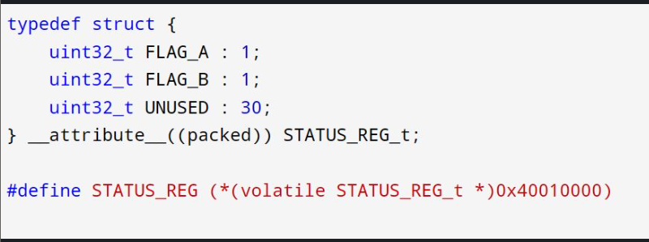

-----

🧠 𝗠𝗼𝗱𝘂𝗹𝗲: 𝗕𝗶𝘁 𝗠𝗮𝗻𝗶𝗽𝘂𝗹𝗮𝘁𝗶𝗼𝗻 🧠

🔹 𝗤𝟴. 𝗣𝗮𝗰𝗸/𝗨𝗻𝗽𝗮𝗰𝗸 𝟰-𝗯𝗶𝘁 𝗙𝗶𝗲𝗹𝗱𝘀
Implement this function.
🎯 Each input is 4 bits. Use only shifts and masks.
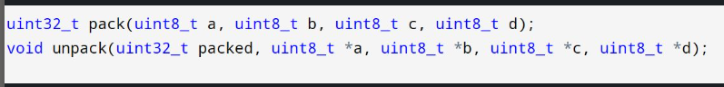
-----

🧠 𝗠𝗼𝗱𝘂𝗹𝗲: 𝗕𝗶𝘁 𝗠𝗮𝗻𝗶𝗽𝘂𝗹𝗮𝘁𝗶𝗼𝗻 🧠
🔹 𝗤𝟳. 𝗘𝘅𝗮𝗰𝘁 𝗕𝗶𝘁𝗺𝗮𝘀𝗸 𝗠𝗮𝘁𝗰𝗵
Write a macro to check if only bits 3, 5, and 7 are set in a 32-bit register:

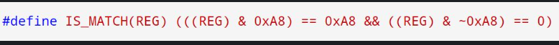

-----
🧠 𝗠𝗼𝗱𝘂𝗹𝗲: 𝗕𝗶𝘁 𝗠𝗮𝗻𝗶𝗽𝘂𝗹𝗮𝘁𝗶𝗼𝗻 🧠
🔹 𝗤𝟲. 𝗕𝗶𝘁𝗳𝗶𝗲𝗹𝗱𝘀 𝗶𝗻 𝗣𝗲𝗿𝗶𝗽𝗵𝗲𝗿𝗮𝗹 𝗔𝗰𝗰𝗲𝘀𝘀
✅ How would you:
Enable the peripheral
Set speed = "Fast" (binary 10)
Toggle direction bit safely?

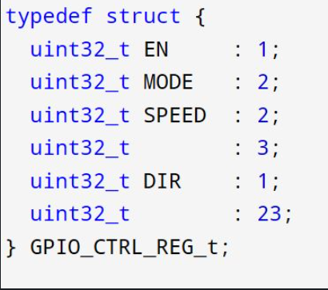
-----
🧠 𝗠𝗼𝗱𝘂𝗹𝗲: 𝗕𝗶𝘁 𝗠𝗮𝗻𝗶𝗽𝘂𝗹𝗮𝘁𝗶𝗼𝗻 🧠

🔹 𝗤𝟱. 𝗥𝗼𝘁𝗮𝘁𝗲 𝗟𝗲𝗳𝘁 𝗮𝗻𝗱 𝗥𝗶𝗴𝗵𝘁
Implement this function.
🔁 No loops or libraries – just pure bitwise logic 💡
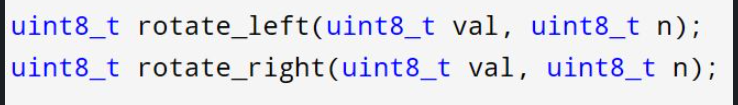

-----
🧠 𝗠𝗼𝗱𝘂𝗹𝗲: 𝗕𝗶𝘁 𝗠𝗮𝗻𝗶𝗽𝘂𝗹𝗮𝘁𝗶𝗼𝗻 🧠

🔹 𝗤𝟰. 𝗖𝗼𝘂𝗻𝘁 𝗦𝗲𝘁 𝗕𝗶𝘁𝘀 𝗘𝗳𝗳𝗶𝗰𝗶𝗲𝗻𝘁𝗹𝘆
✔️ Use Brian Kernighan’s Algorithm
⚡ Optional: Try a lookup table method for performance!

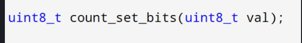

-----

🧠 𝗠𝗼𝗱𝘂𝗹𝗲: 𝗕𝗶𝘁 𝗠𝗮𝗻𝗶𝗽𝘂𝗹𝗮𝘁𝗶𝗼𝗻 🧠

🔹 𝗤𝟯. 𝗥𝗲𝘃𝗲𝗿𝘀𝗲 𝗕𝗶𝘁𝘀 𝗶𝗻 𝗮 𝗕𝘆𝘁𝗲
Write a function to reverse bits in an 8-bit value without using a loop.
🧠 Bonus: Can you optimize it using bitwise operations only?
-----

🧠 𝗠𝗼𝗱𝘂𝗹𝗲: 𝗕𝗶𝘁 𝗠𝗮𝗻𝗶𝗽𝘂𝗹𝗮𝘁𝗶𝗼𝗻 🧠

🔹 𝗤𝟮. 𝗔𝘁𝗼𝗺𝗶𝗰 𝗕𝗶𝘁 𝗦𝗲𝘁/𝗖𝗹𝗲𝗮𝗿 𝗼𝗻 𝗠𝗠𝗜𝗢
You're given this code.

📌 How would you atomically set and clear bit 2 using register-safe operations (CMSIS-like)?
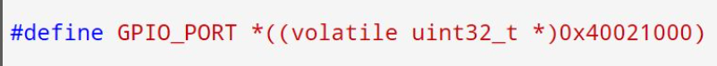
-----

🧠 𝗠𝗼𝗱𝘂𝗹𝗲: 𝗕𝗶𝘁 𝗠𝗮𝗻𝗶𝗽𝘂𝗹𝗮𝘁𝗶𝗼𝗻 🧠

🔹 𝗤𝟭. 𝗦𝗲𝘁 / 𝗖𝗹𝗲𝗮𝗿 / 𝗧𝗼𝗴𝗴𝗹𝗲 𝗮 𝗕𝗶𝘁
🛠️ Write macros to:
Set bit 3 of a 16-bit register
Clear bit 5
Toggle bit 7

𝗖𝗼𝗻𝘀𝘁𝗿𝗮𝗶𝗻𝘁𝘀:
No branching
Use only bitwise operators

👉 𝗖𝗮𝗻 𝘆𝗼𝘂 𝘄𝗿𝗶𝘁𝗲 𝗮 𝗺𝗮𝗰𝗿𝗼 𝘁𝗼 𝗰𝗵𝗲𝗰𝗸 𝗶𝗳 𝗮 𝗯𝗶𝘁 𝗶𝘀 𝘀𝗲𝘁 𝗮𝗻𝗱 𝗿𝗲𝘁𝘂𝗿𝗻 𝟬 𝗼𝗿 𝟭?
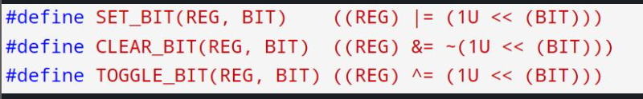
-----
🧠 𝗨𝗻𝗮𝗹𝗶𝗴𝗻𝗲𝗱 𝗠𝗲𝗺𝗼𝗿𝘆 𝗔𝗰𝗰𝗲𝘀𝘀 — 𝗛𝗮𝗿𝗱 𝗖 𝗤𝘂𝗲𝘀𝘁𝗶𝗼𝗻

📌 Question:
Why might this memcpy() cause a crash or corrupted value on some architectures, even if it “works” on x86?

⚠️ 𝗛𝗶𝗻𝘁: Many MCUs (like ARM Cortex-M) cannot perform unaligned 32-bit accesses.
🧠 Even with memcpy(), alignment assumptions matter for performance and correctness.
🎯 Bonus: How would you rewrite this to guarantee safety and portability across platforms?
💬 Let’s hear your answers, especially if you've debugged this kind of crash on real hardware!
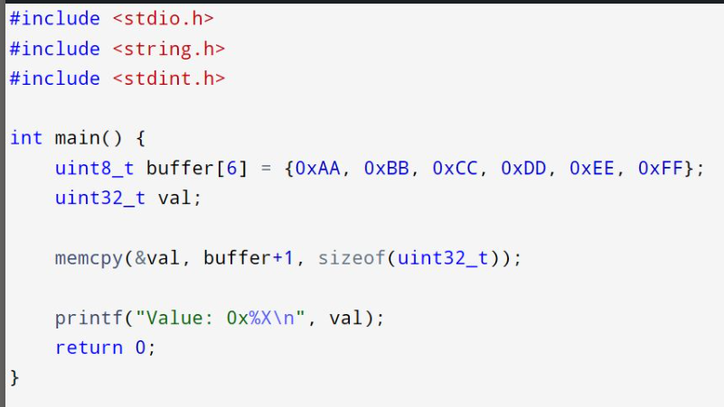

-----
🧠 𝗦𝘁𝗿𝗶𝗰𝘁 𝗔𝗹𝗶𝗮𝘀𝗶𝗻𝗴 𝗧𝗿𝗮𝗽 — 𝗣𝗿𝗼 𝗖 𝗤𝘂𝗲𝘀𝘁𝗶𝗼𝗻

📌 Question:
Why might this memcpy() and cast result in different behavior on different compilers or optimization levels—even though the values look “bit-identical”?

🧨 𝗛𝗶𝗻𝘁: The line *(int *)&f might violate the strict aliasing rule in C, while memcpy() doesn’t.

🧪 Bonus: Can you explain how this relates to type-punning and how to do it safely?

💬 Let’s hear your thoughts on undefined behavior and compiler black magic!

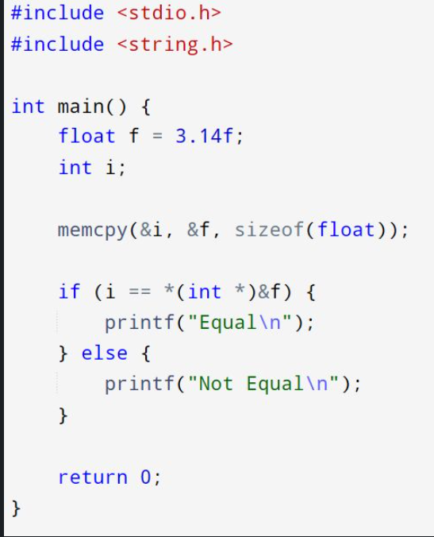
-----
🧠 𝗖 𝗦𝗵𝗮𝗹𝗹𝗼𝘄 𝗼𝗿 𝗗𝗲𝗲𝗽? – 𝗔 𝗠𝗲𝗺𝗼𝗿𝘆 𝗣𝘂𝘇𝘇𝗹𝗲

📌 Question:
Is this memcpy() safe and portable across platforms?
What hidden risks might arise when using memcpy() for structures like this?

🔍 𝗛𝗶𝗻𝘁: Think about alignment, padding, and platform-specific structure layouts.

🛡️ Would you still use memcpy() or prefer a field-wise copy? When and why?
💬 Drop your insights and experiences—especially from bare-metal or cross-compiler development!

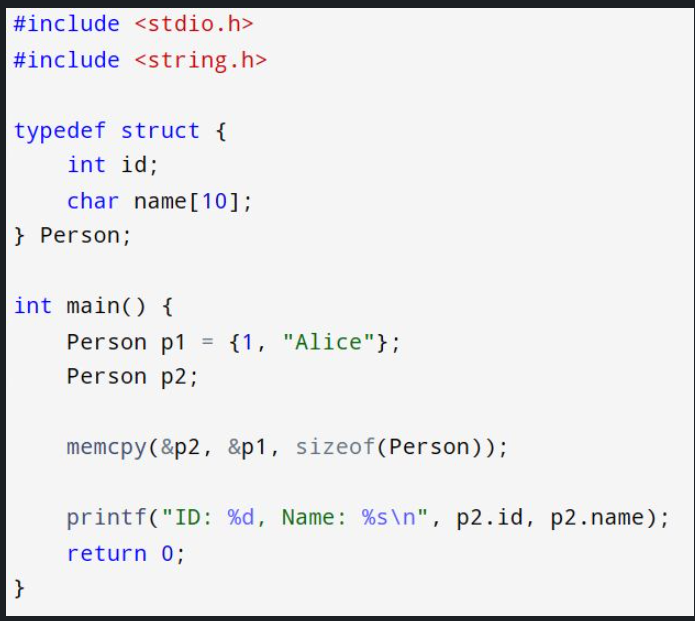

-----
🧠 𝗠𝗲𝗺𝗼𝗿𝘆 𝗠𝘆𝘀𝘁𝗲𝗿𝗶𝗲𝘀 𝗶𝗻 𝗖 — 𝗪𝗵𝗮𝘁’𝘀 𝗪𝗿𝗼𝗻𝗴 𝗛𝗲𝗿𝗲?

📌 Question:
What undefined behavior might occur here, and how can you fix it while preserving the intent of the copy?

⚙️ 𝗛𝗶𝗻𝘁: memcpy() is fast, but not always safe—especially when buffers overlap.
What's the correct alternative function and why?

💬 Drop your answers or real-world debugging war stories in the comments!
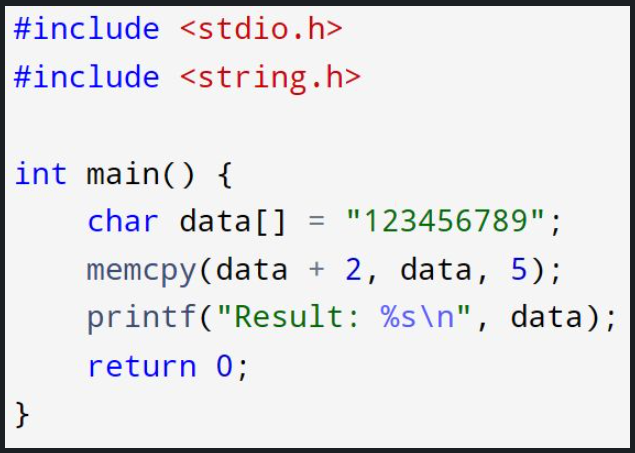
-----

🧠 𝗖 𝗠𝗲𝗺𝗼𝗿𝘆 𝗕𝗮𝘀𝗲𝗱 𝗜𝗻𝘁𝗲𝗿𝘃𝗶𝗲𝘄 𝗖𝗵𝗮𝗹𝗹𝗲𝗻𝗴𝗲
🚨 Spot the Bug: What’s wrong with this code?

📌 Question:
What is the bug in this memcpy() usage?
What might happen at runtime and why?

🧩 𝗛𝗶𝗻𝘁: memcpy() doesn't care about null terminators, but your destination sure should!

💬 𝗟𝗲𝘁 𝗺𝗲 𝗸𝗻𝗼𝘄 𝗶𝗳 𝘆𝗼𝘂'𝗱 𝗱𝗲𝗯𝘂𝗴 𝗶𝘁 𝗱𝗶𝗳𝗳𝗲𝗿𝗲𝗻𝘁𝗹𝘆 𝗼𝗿 𝗵𝗼𝘄 𝘆𝗼𝘂 𝘄𝗼𝘂𝗹𝗱 𝗳𝗶𝘅 𝗶𝘁!
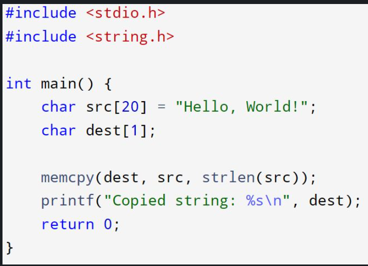
-----

-----

-----

-----

-----

-----

-----

-----

-----

-----

-----

-----

-----

-----

-----

-----

-----

-----

-----

-----

-----

-----

-----

-----

-----

-----

-----

-----

-----

-----

-----

-----

-----

-----

-----

-----

-----

-----

-----

-----

-----

-----

-----

-----

-----

-----

-----

-----

-----

-----

-----

-----

-----

-----

-----

-----

-----

-----

-----

-----

-----

-----

-----

-----

-----

-----

-----

-----

-----

-----

-----

-----

-----

-----

-----

-----

-----

-----

-----

-----

-----

-----

-----

-----

-----

-----

-----

-----

-----

-----

-----

-----

-----

-----

-----

-----

-----

-----

-----

-----

-----

-----

-----

-----

-----

-----

-----

-----

-----

-----

-----

-----

-----

-----

-----

-----

-----

-----

-----

-----

-----

-----

-----

-----

-----

-----

-----

-----

-----

-----

-----

-----

-----

-----

-----

-----

-----

-----

-----

-----

-----

-----

-----

-----

-----

-----

-----

-----

-----

-----

-----

-----

-----

-----

-----

-----

-----

-----

-----

-----

-----

-----

-----

-----

-----

-----

-----

-----

-----

-----

-----

-----

-----

-----

-----

-----

-----

-----

-----

-----

-----

-----

-----

-----

-----

-----

-----

-----

-----

-----

-----

-----

-----

-----

-----

-----

-----

-----

-----

-----

-----

-----

-----

-----

-----

-----

-----

-----

-----

-----

-----

-----

-----

-----

-----

-----

-----

-----

-----

-----

-----

-----

-----

-----

-----

-----

-----

-----

-----

-----

-----

-----

-----

-----

-----

-----

-----

-----

-----

-----

-----

-----

-----

-----

-----

-----

-----

-----

-----

-----

-----

-----

-----

-----

-----

-----

-----

-----

-----

-----

-----

-----

-----

-----

-----

-----

-----

-----

-----

-----

-----

-----

-----

-----

-----

-----

-----

-----

-----

-----

-----

-----

-----

-----

-----

-----

-----

-----

-----

-----

-----

-----

-----

-----

-----

-----

-----

-----

-----

-----

-----

-----

-----

-----

-----

-----

-----

-----

-----

-----

-----

-----

-----

-----

-----

-----

-----

-----

-----

-----

-----

-----

-----

-----

-----

-----

-----

-----

-----

-----

-----

-----

-----

-----

-----

-----

-----

-----

-----

-----

-----

-----

-----

-----

-----

-----

-----

-----

-----

-----

-----

-----

-----

-----

-----

-----

-----

-----

-----

-----

-----

-----

-----

-----

-----

-----

-----

-----

-----

-----

-----

-----

-----

-----

-----

-----

-----

-----

-----

-----

-----

-----

-----

-----

-----

-----

-----

-----

-----

-----

-----

-----

-----

-----

-----

-----

-----

-----

-----

-----

-----

-----

-----

-----

-----

-----

-----

-----

-----

-----

-----

-----

-----

-----

-----

-----

-----

-----

-----

-----

-----

-----

-----

-----

-----

-----

-----

-----

-----

-----

-----

-----

-----

-----

-----

-----

-----

-----

-----

-----

-----

-----

-----

-----

-----

-----

-----

-----

-----

-----

-----

-----

-----

-----

-----

-----

-----

-----

-----

-----

-----

-----

-----

-----

-----

-----

-----

-----

-----

-----

-----

-----

-----

-----

-----

-----

-----

-----

-----

-----

-----

-----

-----

-----

-----

-----

-----

-----

-----

-----

-----

-----

-----

-----

-----

-----

-----

-----

-----

-----

-----

-----

🧠 𝗠𝗲𝗺𝗼𝗿𝘆-𝗠𝗮𝘀𝗸𝗲𝗱 𝗕𝗶𝘁 𝗘𝘅𝘁𝗿𝗮𝗰𝘁𝗶𝗼𝗻 — 𝗪𝗵𝗮𝘁’𝘀 𝘁𝗵𝗲 𝗢𝘂𝘁𝗽𝘂𝘁?

💡 𝗤𝘂𝗲𝘀𝘁𝗶𝗼𝗻: What does this print on a little-endian system?
 A) 0x35
 B) 0x53
 C) 0xF3
 D) 0x3F

🔍 𝗪𝗵𝗮𝘁 𝘁𝗼 𝗰𝗼𝗻𝘀𝗶𝗱𝗲𝗿:
Byte layout of a uint32_t in memory
How pointer p accesses individual bytes
Bit masking and cross-byte nibble recombination

𝗔 𝘁𝗲𝗰𝗵𝗻𝗶𝗾𝘂𝗲 𝘂𝘀𝗲𝗱 𝗶𝗻:
Peripheral decoding
Bitfield slicing
Communication protocol unpacking

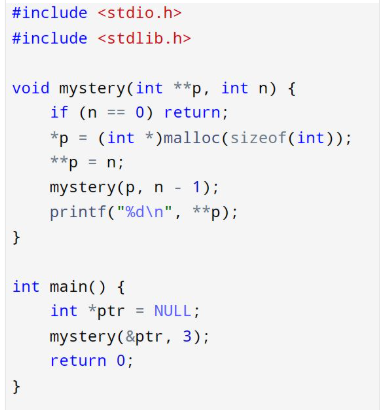

-----

🧠 𝗕𝗶𝘁𝘄𝗶𝘀𝗲 𝗖𝗵𝗮𝗹𝗹𝗲𝗻𝗴𝗲 — 𝗗𝗲𝗰𝗼𝗱𝗲 𝘁𝗵𝗲 𝗢𝘂𝘁𝗽𝘂𝘁!

💡 𝗤𝘂𝗲𝘀𝘁𝗶𝗼𝗻: What does this print?
 A) 0x6B
 B) 0xB6
 C) 0x5D
 D) 0xD5

💬 Think you nailed it? Drop your answer and explanation!
 Follow for more puzzles that test your embedded bitwise skills 🔥
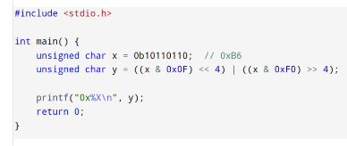
-----
𝗔𝗱𝘃𝗮𝗻𝗰𝗲𝗱 𝗕𝗶𝘁𝘄𝗶𝘀𝗲 𝗣𝘂𝘇𝘇𝗹𝗲 — 𝗪𝗵𝗮𝘁’𝘀 𝘁𝗵𝗲 𝗢𝘂𝘁𝗽𝘂𝘁?

💡 𝗤𝘂𝗲𝘀𝘁𝗶𝗼𝗻: What is the output of this program?
 A) 0x0F0F0F0F, 0x00000000
 B) 0xFFFFFFFF, 0x0F0F0F0F
 C) 0xF0F0F0F0, 0xF0F0F0F0
 D) 0x00000000, 0xF0F0F0F0

💬 Got the answer? Explain your reasoning below!
Follow me for more deep-dive bitwise puzzles straight from embedded firmware challenges.

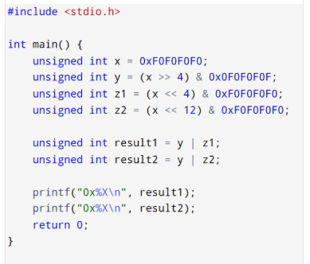

-----
🔍 𝗣𝗼𝗶𝗻𝘁𝗲𝗿 𝗖𝗮𝘀𝘁𝗶𝗻𝗴 & 𝗔𝗹𝗶𝗴𝗻𝗺𝗲𝗻𝘁 𝗣𝘂𝘇𝘇𝗹𝗲 — 𝗪𝗵𝗮𝘁 𝗛𝗮𝗽𝗽𝗲𝗻𝘀 𝗛𝗲𝗿𝗲?

💡 𝗤𝘂𝗲𝘀𝘁𝗶𝗼𝗻:
 𝗪𝗵𝗮𝘁 𝗵𝗮𝗽𝗽𝗲𝗻𝘀 𝘄𝗵𝗲𝗻 𝘁𝗵𝗶𝘀 𝗰𝗼𝗱𝗲 𝗿𝘂𝗻𝘀?
 A) Prints first two bytes of x and then q dereferenced correctly
 B) Causes a runtime crash due to unaligned access
 C) Outputs unexpected values due to endianness
 D) Behavior is undefined according to the C standard

💬 Drop your answer and reasoning below!
 Follow Uttam Basu for more brain teasers drawn from real embedded systems issues.
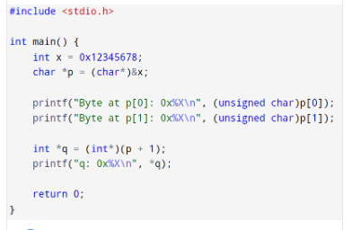
-----
🧠 𝗕𝗶𝘁-𝗙𝗶𝗲𝗹𝗱 𝗣𝘂𝘇𝘇𝗹𝗲: 𝗪𝗵𝗮𝘁’𝘀 𝘁𝗵𝗲 𝗢𝘂𝘁𝗽𝘂𝘁?
 Can you predict how this tiny struct packs bits — and what prints?

💡 𝗤𝘂𝗲𝘀𝘁𝗶𝗼𝗻:
1) What will this print?
 A) 7 31
 B) 0 31
 C) 7 0
 D) Undefined behavior

2) What if you assign 8 to f.a or 32 to f.b?
3) How does that change the behavior?

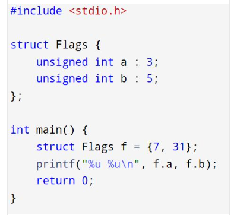
-----

🧠 𝗕𝗶𝘁𝘄𝗶𝘀𝗲 𝗧𝗿𝗮𝗽 𝗧𝗵𝗮𝘁 𝗕𝗿𝗲𝗮𝗸𝘀 𝗙𝗶𝗿𝗺𝘄𝗮𝗿𝗲 𝗶𝗻 𝘁𝗵𝗲 𝗪𝗶𝗹𝗱
 This tiny line looks harmless — until your device misbehaves. 😵‍💫

💡 𝗤𝘂𝗲𝘀𝘁𝗶𝗼𝗻: What does this print — and is it portable?
 A) -4
 B) 64
 C) -16
 D) ❗ Implementation-defined / Undefined behavior

🧠 𝗪𝗵𝗮𝘁’𝘀 𝗴𝗼𝗶𝗻𝗴 𝗼𝗻 𝗵𝗲𝗿𝗲?
x is a signed char with value -16
x >> 2 performs a right shift
Is it an arithmetic shift (sign-extended)?
Or a logical shift (zeros filled in)?
Does C guarantee the behavior across platforms?

💬 𝗖𝗮𝗻 𝘆𝗼𝘂 𝗲𝘅𝗽𝗹𝗮𝗶𝗻 𝘄𝗵𝗮𝘁 𝘁𝗵𝗲 𝘀𝗵𝗶𝗳𝘁 𝗮𝗰𝘁𝘂𝗮𝗹𝗹𝘆 𝗱𝗼𝗲𝘀 — 𝗮𝗻𝗱 𝘄𝗵𝘆 𝘁𝗵𝗶𝘀 𝗶𝘀 𝗱𝗮𝗻𝗴𝗲𝗿𝗼𝘂𝘀?

👉 Drop your answer + reasoning in the comments.
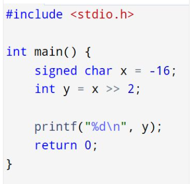

-----
🧠 𝗕𝗶𝘁𝘄𝗶𝘀𝗲 𝗣𝘂𝘇𝘇𝗹𝗲 — 𝗖𝗮𝗻 𝗬𝗼𝘂 𝗣𝗿𝗲𝗱𝗶𝗰𝘁 𝘁𝗵𝗲 𝗢𝘂𝘁𝗽𝘂𝘁?
 🔍 Real-world embedded engineers should master this.

💡 𝗤𝘂𝗲𝘀𝘁𝗶𝗼𝗻: What does this program print?
 A) 0xAA
 B) 0xA0
 C) 0x0A
 D) 0xA5
 E) Something else?

🧠 𝗪𝗵𝗮𝘁'𝘀 𝘁𝗵𝗲 𝘁𝘄𝗶𝘀𝘁?
0xAA = 10101010
& 0xF0 masks the upper nibble
& 0x0F masks the lower nibble, then << 4 shifts it left
| recombines the nibbles... but flipped?

💬 Think you’ve got the right answer?
 👉 Post your reasoning below — show your bitwise mastery.
🔁 Follow Uttam Basu for more brain-bending C puzzles from the front lines of bare-metal embedded development.

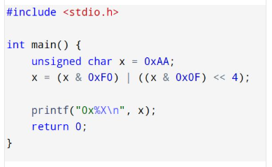
-----

🧠 𝗕𝗶𝘁𝘄𝗶𝘀𝗲 𝗣𝘂𝘇𝘇𝗹𝗲 — 𝗪𝗵𝗮𝘁’𝘀 𝘁𝗵𝗲 𝗢𝘂𝘁𝗽𝘂𝘁?

🔍 𝗪𝗵𝗮𝘁 𝗶𝘁 𝘁𝗲𝘀𝘁𝘀:
Bitwise mirror of an 8-bit value
Smart use of masks and shifts to reverse the bit order
Found in bit-banged protocols, graphics, and DSP

💬 Think you know the answer? Explain your logic!
👇 Drop it in the comments and follow for more elite-level puzzles every week.
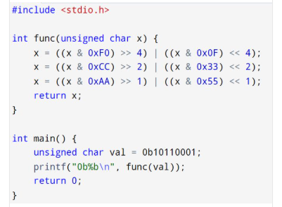
-----

🔒 𝗩𝗼𝗹𝗮𝘁𝗶𝗹𝗲 𝗕𝗶𝘁-𝗙𝗶𝗲𝗹𝗱 𝗣𝘂𝘇𝘇𝗹𝗲 — 𝗖𝗮𝗻 𝗬𝗼𝘂 𝗦𝗽𝗼𝘁 𝘁𝗵𝗲 𝗜𝘀𝘀𝘂𝗲?

💡 𝗤𝘂𝗲𝘀𝘁𝗶𝗼𝗻:
Is this code guaranteed to behave consistently on all compilers and architectures?
Why or why not?

𝗪𝗵𝗮𝘁 𝘁𝗼 𝘁𝗵𝗶𝗻𝗸 𝗮𝗯𝗼𝘂𝘁:
Interaction of volatile with bit-fields
Possible read-modify-write hazards on single-bit flags
How packed affects memory alignment
Can compilers generate atomic bit manipulations here?

💬 Share your thoughts on the pitfalls of volatile bit-fields.
 If you’ve debugged bugs caused by this, tell us your story!

🔔 Follow for more embedded systems deep dives and real-world C traps.

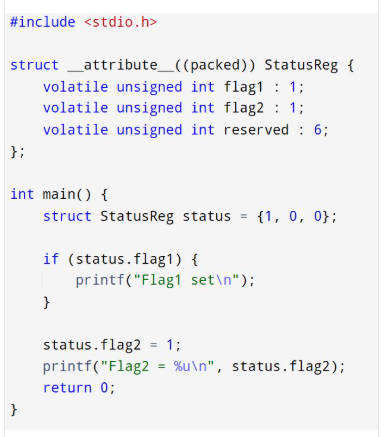
-----
🎯 𝗬𝗼𝘂 𝗞𝗻𝗼𝘄 𝗣𝗼𝗶𝗻𝘁𝗲𝗿𝘀? 𝗣𝗿𝗼𝘃𝗲 𝗜𝘁.
 🔍 Function Pointers + Arrays = Brain Twister 🧠⚙️

🚨 𝗤𝘂𝗲𝘀𝘁𝗶𝗼𝗻: What will this code print?
 A) Hello 1
 B) Hello 2
 C) Hello 3
 D) ❗ Undefined behavior

🧠 𝗪𝗵𝗮𝘁’𝘀 𝗿𝗲𝗮𝗹𝗹𝘆 𝗴𝗼𝗶𝗻𝗴 𝗼𝗻 𝗵𝗲𝗿𝗲?
🚨  funcs is an array of function pointers
🚨  p is a pointer to a function pointer
🚨  We’re using (++p)[1]() — but what does that even mean?!
🚨  What’s the difference between p[1]() and (*p)[1]()?

🎁 Bonus: Can you write a version using pointer-to-array-of-function-pointers?

🚀 If this made you pause… you're exactly the kind of developer I love connecting with.
I post 🔍 real-world, interview-grade, and bare-metal puzzles every week to level up embedded engineers.

👇 Drop your answer + explain your reasoning in the comments.
 And don’t forget to follow me for more pro-level C insights!

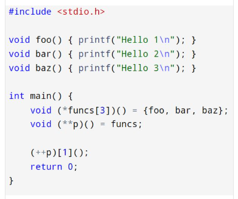
-----
🔧💡 𝗣𝗼𝗶𝗻𝘁𝗲𝗿 𝗣𝘂𝘇𝘇𝗹𝗲 𝗼𝗳 𝘁𝗵𝗲 𝗗𝗮𝘆: 𝗢𝗻𝗹𝘆 𝗳𝗼𝗿 𝘁𝗵𝗲 𝗕𝗿𝗮𝘃𝗲! 🧠🔍

🔥 𝗤𝘂𝗲𝘀𝘁𝗶𝗼𝗻:
 What will be the output of this code?
 A) x = 30
 B) x = 31
 C) x = 41
 D) Undefined behavior

💬 𝗖𝗵𝗮𝗹𝗹𝗲𝗻𝗴𝗲:
What is the value of *p at the end?
What exactly happens in ++*p++ + *++p?
Which operations are performed first?
Would -O2 or -O3 optimization flags affect this?

🎯 Think you’ve mastered pointers?
 Let’s see you break this down line by line.

👇 Drop your answer and your reasoning in the comments.
 Let’s spark a real C-level conversation! 😉
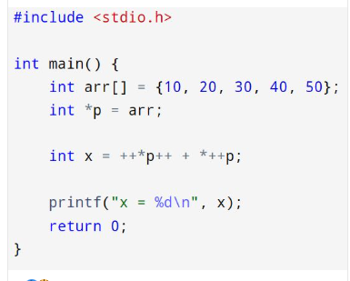

-----

🚀 𝗔𝗱𝘃𝗮𝗻𝗰𝗲𝗱 𝗖 𝗖𝗼𝗻𝗰𝗲𝗽𝘁𝘀: 𝘃𝗼𝗹𝗮𝘁𝗶𝗹𝗲, 𝗿𝗲𝘀𝘁𝗿𝗶𝗰𝘁 & 𝗶𝗻𝗹𝗶𝗻𝗲 — 𝗗𝗼 𝗬𝗼𝘂 𝗞𝗻𝗼𝘄 𝗪𝗵𝗲𝗻 𝗮𝗻𝗱 𝗪𝗵𝘆 𝘁𝗼 𝗨𝘀𝗲 𝗧𝗵𝗲𝗺?
❓ What do the keywords volatile, restrict, and inline mean in C? How do they impact:
🔥 Compiler optimizations?
🔥 Code safety and correctness?
🔥 Performance in embedded or system-level programming?

𝗞𝗲𝘆 𝗽𝗼𝗶𝗻𝘁𝘀 𝘁𝗼 𝗰𝗼𝗻𝘀𝗶𝗱𝗲𝗿:
When should you declare a pointer or variable as volatile?
How does restrict help the compiler optimize pointer usage?
What’s the purpose of inline and how does it affect linkage and code size?

🔍 𝗠𝗮𝘀𝘁𝗲𝗿𝗶𝗻𝗴 𝘁𝗵𝗲𝘀𝗲 𝗰𝗮𝗻 𝗺𝗮𝗸𝗲 𝗮 𝗵𝘂𝗴𝗲 𝗱𝗶𝗳𝗳𝗲𝗿𝗲𝗻𝗰𝗲 𝗶𝗻 𝘄𝗿𝗶𝘁𝗶𝗻𝗴:
🔥 Bug-free, interrupt-safe embedded code
🔥 Highly optimized systems code
🔥 Clean, maintainable, and efficient APIs

👇 Share your best use case or example where one of these keywords saved your project or avoided a nasty bug.

-----
🧠 𝗖 𝗧𝗿𝗶𝘃𝗶𝗮 — 𝗖𝗮𝗻 𝗬𝗼𝘂 𝗔𝗻𝘀𝘄𝗲𝗿 𝗧𝗵𝗶𝘀 𝗪𝗶𝘁𝗵𝗼𝘂𝘁 𝗟𝗼𝗼𝗸𝗶𝗻𝗴 𝗜𝘁 𝗨𝗽?
❓ What is the difference between static and extern in C?

📌 𝗖𝗼𝗻𝘀𝗶𝗱𝗲𝗿 𝘁𝗵𝗶𝘀:
How does static behave inside a function vs outside a function?
What does extern actually do — and when do you truly need it?
What are the linkage and storage duration implications of each?

💬 Can you explain the difference with a real-world example (not just theory)?

 👇 Let’s see who really understands the C compilation and linking model.

-----
🔍 𝗗𝗲𝗲𝗽 𝗗𝗶𝘃𝗲: 𝗪𝗵𝗮𝘁 𝗘𝘅𝗮𝗰𝘁𝗹𝘆 𝗶𝘀 𝗦𝗲𝗾𝘂𝗲𝗻𝗰𝗲 𝗣𝗼𝗶𝗻𝘁 𝗶𝗻 𝗖, 𝗮𝗻𝗱 𝗪𝗵𝘆 𝗗𝗼𝗲𝘀 𝗜𝘁 𝗠𝗮𝘁𝘁𝗲𝗿?
❓ Can you explain what a sequence point is in C?
🔥 How does it affect the order in which expressions are evaluated?
🔥 Why do expressions like i = i++ + ++i; cause undefined behavior?
🔥 How do sequence points help prevent such pitfalls?

👇 Share your explanation or example of where misunderstanding sequence points caused a bug in your code!

-----

🔍 𝗖 𝗟𝗮𝗻𝗴𝘂𝗮𝗴𝗲 𝗧𝗿𝗮𝗽: 𝗦𝗮𝗺𝗲 𝗖𝗼𝗱𝗲, 𝗗𝗶𝗳𝗳𝗲𝗿𝗲𝗻𝘁 𝗢𝘂𝘁𝗰𝗼𝗺𝗲?
Let's dissect this interesting snippet 👇

⚠️ 𝗧𝗲𝗰𝗵𝗻𝗶𝗰𝗮𝗹 𝗖𝗵𝗮𝗹𝗹𝗲𝗻𝗴𝗲:
🤔 Both fptr declarations look similar — but do they behave the same?
Which one compile and run correctly?

Why does other one cause a compilation error like:
🚫 "function 'fptr' is initialized like a variable"

👇 Can you explain why fails and how to fix it?
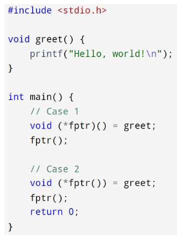
-----
🔍 𝗔𝗱𝘃𝗮𝗻𝗰𝗲𝗱 𝗖 𝗣𝗼𝗶𝗻𝘁𝗲𝗿 𝗣𝘂𝘇𝘇𝗹𝗲 — 𝗔𝗿𝗲 𝗬𝗼𝘂 𝗕𝗿𝗮𝘃𝗲 𝗘𝗻𝗼𝘂𝗴𝗵 𝗳𝗼𝗿 𝗧𝗵𝗶𝘀 𝗢𝗻𝗲?
❓ Without running it — can you predict the output and explain exactly why this works?

🧠 𝗖𝗵𝗮𝗹𝗹𝗲𝗻𝗴𝗲:
 1️⃣ What is the expression &a + 1 really pointing to?
 2️⃣ What is the type of &a? How is it different from a or a + 1?
 3️⃣ Why does *(p - 1) land exactly on a[4]?

👇 Have a theory? Comment with your explanation — let’s test and expand our mastery of C pointers.
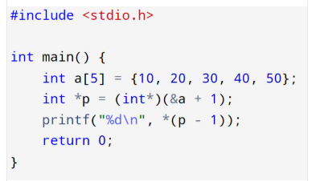
-----

What is intptr_t and uintptr_t in C?
Can you have an array of pointers to structures?

-----

How does const char* differ from char const*?
How do you toggle a bit through a pointer?
How do you check a bit using a pointer?
-----
🚀 𝗔𝗱𝘃𝗮𝗻𝗰𝗲𝗱 𝗖 𝗖𝗵𝗮𝗹𝗹𝗲𝗻𝗴𝗲: 𝗨𝗻𝗱𝗲𝗿𝘀𝘁𝗮𝗻𝗱𝗶𝗻𝗴 𝗣𝗼𝗶𝗻𝘁𝗲𝗿𝘀 𝘁𝗼 𝗔𝗿𝗿𝗮𝘆𝘀 𝗮𝗻𝗱 𝗣𝗼𝗶𝗻𝘁𝗲𝗿 𝗔𝗿𝗶𝘁𝗵𝗺𝗲𝘁𝗶𝗰 🚀
Consider this snippet involving multi-dimensional arrays and pointer-to-array return types.

🔥 𝗤𝘂𝗲𝘀𝘁𝗶𝗼𝗻𝘀:
1️⃣ Explain the type returned by getRow. Why does it return int (*)[3] instead of something simpler?
2️⃣ What output do you expect from the two pointer arithmetic print statements? Why do they differ?
3️⃣ What does the subtraction of pointers mean in each case, and why is casting to (long) necessary for the first print?
4️⃣ How does pointer arithmetic behave when performed on pointers to array elements versus raw addresses?

Share your answers and insights below and let’s elevate our understanding of C pointers.
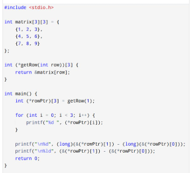

-----

Why must you check if a file pointer is NULL after fopen()?

-----

🚀 𝗗𝗲𝗲𝗽 𝗗𝗶𝘃𝗲 𝗶𝗻𝘁𝗼 𝗖𝗼𝗺𝗽𝗹𝗲𝘅 𝗖 𝗗𝗲𝗰𝗹𝗮𝗿𝗮𝘁𝗶𝗼𝗻𝘀: 𝗣𝗼𝗶𝗻𝘁𝗲𝗿 𝘁𝗼 𝗔𝗿𝗿𝗮𝘆 𝗳𝗿𝗼𝗺 𝗙𝘂𝗻𝗰𝘁𝗶𝗼𝗻 🚀
Consider the following code snippet demonstrating a function returning a pointer to an array.

🔥 𝗖𝗵𝗮𝗹𝗹𝗲𝗻𝗴𝗲 𝗤𝘂𝗲𝘀𝘁𝗶𝗼𝗻𝘀:
1️⃣ Explain what int (*f())[5] means — what exactly does f return?
2️⃣ Why do we use (*ptr)[i] instead of ptr[i] inside the loop? What’s the difference?
3️⃣ What will the output of the subtraction (*ptr)[1] - (*ptr)[0] be, and why?
4️⃣ How would the behavior differ if f() returned int * instead of int (*)[5]?

Drop your answers and explanations below! Let's sharpen our pointer skills together.
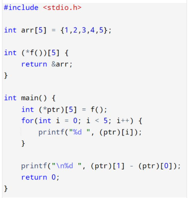

-----
1) What does *++𝗽𝘁𝗿 do?
2) What does ++*𝗽𝘁𝗿 do?
3) What does *𝗽𝘁𝗿++ do?

Why should you check malloc() return value?

What is the difference between NULL, 0, and nullptr?

How do you use typedef with pointers?

What’s the difference between char* str = "Hello"; and char str[] = "Hello";?

-----

🚀 𝗠𝗮𝘀𝘁𝗲𝗿𝗶𝗻𝗴 𝗙𝘂𝗻𝗰𝘁𝗶𝗼𝗻 𝗣𝗼𝗶𝗻𝘁𝗲𝗿𝘀 𝗶𝗻 𝗖: 𝗔 𝗦𝘂𝗯𝘁𝗹𝗲 𝗣𝘂𝘇𝘇𝗹𝗲 🚀
Here's a concise snippet demonstrating a pointer to a function returning a pointer — a concept that often confuses even experienced C developers.

💡 𝗖𝗵𝗮𝗹𝗹𝗲𝗻𝗴𝗲 𝗳𝗼𝗿 𝘆𝗼𝘂:
1️⃣ Why must value be declared static in myFunc? What would go wrong if it was a regular local variable?
2️⃣ How would the program behave if funcPtr was mistakenly declared as int (*funcPtr)(float) instead?
3️⃣ What subtleties should you consider when returning pointers from functions in C to avoid undefined behavior?

🔍 𝗪𝗵𝘆 𝘁𝗵𝗶𝘀 𝗺𝗮𝘁𝘁𝗲𝗿𝘀:
Function pointers and pointer-returning functions are foundational for writing dynamic dispatch, callback systems, and plugin architectures in C. Misunderstanding these leads to elusive bugs and unstable software.

Drop your answers and thoughts below! Let’s deepen our C mastery together.
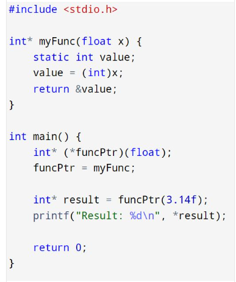
-----

🔍 𝗖 𝗣𝗿𝗼𝗴𝗿𝗮𝗺𝗺𝗶𝗻𝗴 𝗜𝗻𝘁𝗲𝗿𝘃𝗶𝗲𝘄 𝗣𝘂𝘇𝘇𝗹𝗲 – 𝗪𝗵𝗮𝘁’𝘀 𝗠𝗶𝘀𝘀𝗶𝗻𝗴?
Here's a short snippet from a C program involving a struct and a pointer.

💡 𝗤𝘂𝗲𝘀𝘁𝗶𝗼𝗻:
Will this program compile? What happens if it runs?
Are the two commented lines necessary? Why or why not?

🧠 𝗞𝗲𝘆 𝗖𝗼𝗻𝗰𝗲𝗽𝘁𝘀 𝗜𝗻𝘃𝗼𝗹𝘃𝗲𝗱:
Pointer dereferencing
Structure memory layout
Uninitialized pointers
Segmentation faults / undefined behavior

✅ 𝗛𝗶𝗻𝘁:
You’re assigning values through a pointer that doesn’t yet point to valid memory.
This is a common trap in C interviews — subtle, but deadly in production code.

👇 𝗬𝗼𝘂𝗿 𝘁𝘂𝗿𝗻:
 What would you change to make this safe and valid? Would you use static memory (s) or dynamic (malloc)?
 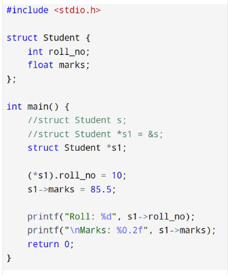

-----

𝗪𝗵𝗮𝘁 𝗱𝗼 𝘆𝗼𝘂 𝘁𝗵𝗶𝗻𝗸 𝗮𝗯𝗼𝘂𝘁 𝘁𝗵𝗶𝘀 𝗰𝗼𝗱𝗲?

int x[] = {10, 20, (int)NULL};

-----

-----

Can we do int a = *(&a);?

-----

Can you assign NULL to an integer variable?
-----

Is it okay to use free(p) where p is already NULL?
-----

What is p[i] in terms of pointer arithmetic?
-----

What does *&x mean?
-----
How to declare pointer to 3D array?

-----

What is the difference between int a[3][4] and int *a[3]?

-----
🔥 𝗖 𝗣𝘂𝘇𝘇𝗹𝗲 – 𝗧𝗿𝗶𝗽𝗹𝗲 𝗣𝗼𝗶𝗻𝘁𝗲𝗿 𝗧𝗿𝗮𝗽

💡 𝗤𝘂𝗲𝘀𝘁𝗶𝗼𝗻:
What will this program print, and what are the risks or behaviors associated with pointer assignment and de-referencing at this depth?

👇 Can you trace the value and relationships of all 3 pointer levels by the end of execution?
 ✅ Follow for more complex C pointer puzzles and elite-level debugging challenges.

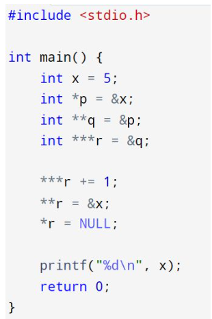
-----
🔥 𝗙𝘂𝗻𝗰𝘁𝗶𝗼𝗻 𝗣𝗼𝗶𝗻𝘁𝗲𝗿 𝗦𝗲𝗹𝗳-𝗠𝘂𝘁𝗮𝘁𝗶𝗼𝗻 𝗣𝘂𝘇𝘇𝗹𝗲

💡 𝗤𝘂𝗲𝘀𝘁𝗶𝗼𝗻:
 What will this program print, and how does the XOR-based function switching actually work?

🧠 𝗪𝗵𝘆 𝗜𝘁’𝘀 𝗛𝗮𝗿𝗱:
Requires understanding that function pointers are just addresses, and XOR can toggle between two known values.
Involves manual bitwise manipulation of function pointers, something almost never used outside very low-level or obfuscated code.
You must reason through how XOR can toggle and why this works symmetrically.

👇 Can you explain how the XOR trick toggles the function pointer? Would you dare write this in production code?

✅ Follow for more deeply technical C puzzles, memory tricks, and interview-level mind-benders.
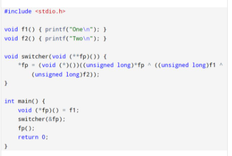

-----

🔥 𝗨𝗹𝘁𝗶𝗺𝗮𝘁𝗲 𝗣𝗼𝗶𝗻𝘁𝗲𝗿 & 𝗠𝗲𝗺𝗼𝗿𝘆 𝗠𝗮𝗻𝗶𝗽𝘂𝗹𝗮𝘁𝗶𝗼𝗻 𝗣𝘂𝘇𝘇𝗹𝗲

💡 𝗤𝘂𝗲𝘀𝘁𝗶𝗼𝗻:
What will this program output, and why?

𝗞𝗲𝘆 𝗖𝗼𝗻𝗰𝗲𝗽𝘁𝘀 𝘁𝗼 𝗖𝗼𝗻𝘀𝗶𝗱𝗲𝗿:
𝟭. 𝗣𝗼𝗶𝗻𝘁𝗲𝗿 𝗺𝗮𝗻𝗶𝗽𝘂𝗹𝗮𝘁𝗶𝗼𝗻:
A pointer to an unsigned int is cast to a char * (q), and then passed to foo as an int *.
The foo function modifies the value pointed to by p using an XOR operation.

𝟮. 𝗧𝘆𝗽𝗲 𝗽𝘂𝗻𝗻𝗶𝗻𝗴:
The code performs type punning: casting a pointer to an unsigned int * into an unsigned char *, and then back to an int * in foo. This can lead to undefined behavior on some platforms, especially if the alignment requirements are violated.

𝟯. 𝗠𝗲𝗺𝗼𝗿𝘆 𝗮𝗹𝗶𝗴𝗻𝗺𝗲𝗻𝘁 𝗮𝗻𝗱 𝘀𝘆𝘀𝘁𝗲𝗺 𝗮𝗿𝗰𝗵𝗶𝘁𝗲𝗰𝘁𝘂𝗿𝗲:
Depending on the platform, the memory address of a may not be properly aligned for 32-bit integer access (if accessing via unsigned char *).
This could lead to stack corruption or faults on some systems.

𝟰. 𝗫𝗢𝗥 𝗼𝗽𝗲𝗿𝗮𝘁𝗶𝗼𝗻:
The operation *p = *p ^ 0xF0F0F0F0 modifies the 32-bit integer by performing an exclusive OR (XOR) with the mask 0xF0F0F0F0. This is a bitwise operation that will flip specific bits in the integer value.

𝟱. 𝗘𝗻𝗱𝗶𝗮𝗻𝗻𝗲𝘀𝘀:
The behavior of the XOR operation depends on how the system stores integers in memory. Specifically, whether the system is little-endian or big-endian affects how the mask 0xF0F0F0F0 interacts with the original value 0x12345678.

𝗖𝗼𝗻𝘀𝗶𝗱𝗲𝗿𝗮𝘁𝗶𝗼𝗻𝘀:
What happens when q (the unsigned char *) is cast back to int * and passed to foo?
How does the endianness of the system affect the XOR operation and the resulting value of a?
What is the final value of a after the foo function modifies it?

👇 Drop your answers and reasoning below!
✅ Follow for more advanced C programming challenges and interview prep!
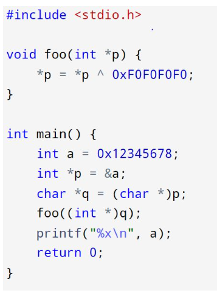
-----

🔥 𝗔𝗱𝘃𝗮𝗻𝗰𝗲𝗱 𝗗𝗼𝘂𝗯𝗹𝗲 𝗣𝗼𝗶𝗻𝘁𝗲𝗿 𝗣𝘂𝘇𝘇𝗹𝗲

💡 𝗤𝘂𝗲𝘀𝘁𝗶𝗼𝗻:
What will this program output, and why?

👇 Share your thoughts below!
✅ Follow for more deep dives into advanced C programming, pointers, and system-level programming.
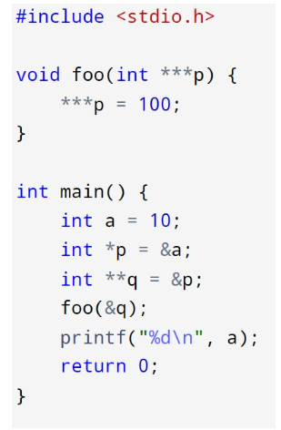
-----

⚡️ 𝗔𝗱𝘃𝗮𝗻𝗰𝗲𝗱 𝗖 𝗖𝗵𝗮𝗹𝗹𝗲𝗻𝗴𝗲 — 𝗖𝗮𝗻 𝗬𝗼𝘂 𝗦𝗼𝗹𝘃𝗲 𝗧𝗵𝗶𝘀?

💡 𝗤𝘂𝗲𝘀𝘁𝗶𝗼𝗻:
 This code seems like it’s doing a bit of pointer magic.
 What will be printed when it runs, and why? Hint: It's all about how char* arithmetic interacts with void* pointers and function pointer arrays!

👇 Comment your answer below.
✅ Follow for more deep dives into C and pointer tricks.

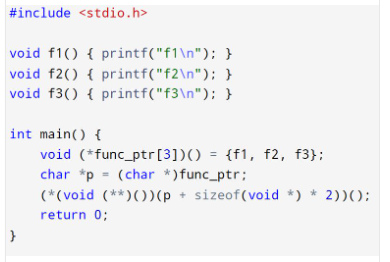

-----
🔥 𝗨𝗹𝘁𝗿𝗮 𝗔𝗱𝘃𝗮𝗻𝗰𝗲𝗱 𝗖 𝗣𝘂𝘇𝘇𝗹𝗲

💡 𝗤𝘂𝗲𝘀𝘁𝗶𝗼𝗻:
What will the program output, and why?

What would happen if you ran this on a 64-bit system with stricter memory alignment rules, and how could you modify the code to avoid potential issues with padding?

👇 Share your answers in the comments below.
✅ Follow for more complex C puzzles and interview prep!
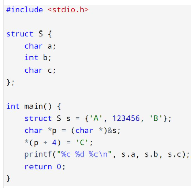
-----
🔍 𝗖 𝗣𝘂𝘇𝘇𝗹𝗲 — 𝗖𝗮𝗻 𝗬𝗼𝘂 𝗖𝗿𝗮𝗰𝗸 𝗜𝘁?

💡 𝗤𝘂𝗲𝘀𝘁𝗶𝗼𝗻:
 What will this print on a little-endian system, and why?
⚠️ Byte-level manipulation is powerful, but subtle. Can you reason through the result?

👇 Share your thoughts in the comments.
✅ Follow for more advanced C insights and puzzles.
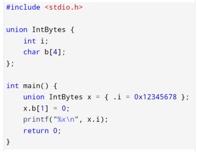

-----
🚀 𝗖 𝗣𝗿𝗼𝗴𝗿𝗮𝗺𝗺𝗲𝗿𝘀, 𝗛𝗲𝗿𝗲'𝘀 𝗮 𝗖𝗵𝗮𝗹𝗹𝗲𝗻𝗴𝗲 𝗳𝗼𝗿 𝗬𝗼𝘂 🧠
Think you know C inside and out? Let's test that with a mind-bending snippet.

👀 At first glance, this might look simple. But there's some deep pointer-level magic and bit-level manipulation going on here.

💡 𝗤𝘂𝗲𝘀𝘁𝗶𝗼𝗻:
What exactly does the line u.i += 1 << 23; do to the float value?
Why does this produce the output it does?

Drop your answers in the comments ⬇️
Let’s see who’s got the sharpest C skills!
🔁 Like & Follow for more thought-provoking code puzzles.

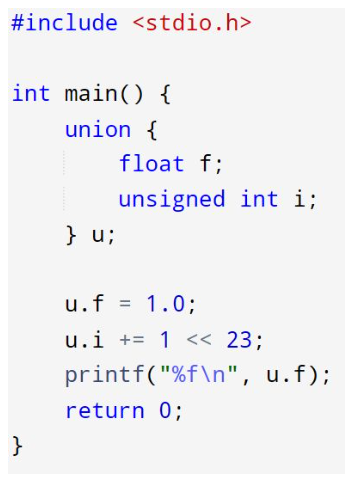
-----
🔍 𝗨𝗻𝗱𝗲𝗿𝘀𝘁𝗮𝗻𝗱𝗶𝗻𝗴 𝗠𝗲𝗺𝗼𝗿𝘆 𝗔𝗹𝗶𝗴𝗻𝗺𝗲𝗻𝘁 𝗶𝗻 𝗖: 𝗧𝗵𝗲 𝗣𝗼𝘄𝗲𝗿 𝗼𝗳 hashtag#𝗽𝗿𝗮𝗴𝗺𝗮 𝗽𝗮𝗰𝗸
When it comes to memory management in C, alignment and padding are key factors that impact performance and memory usage. Here's a quick challenge showcasing how hashtag#pragma pack can drastically affect the size of your structures.

💡 𝗤𝘂𝗲𝘀𝘁𝗶𝗼𝗻𝘀:
What are the expected sizes of struct P and struct Q?
How does the hashtag#pragma pack directive control the alignment of structure members?
How do different hashtag#pragma pack values impact memory usage and alignment?

💬 Let’s Discuss! How do you use memory alignment in your projects? Have you encountered scenarios where hashtag#pragma pack made a noticeable impact?

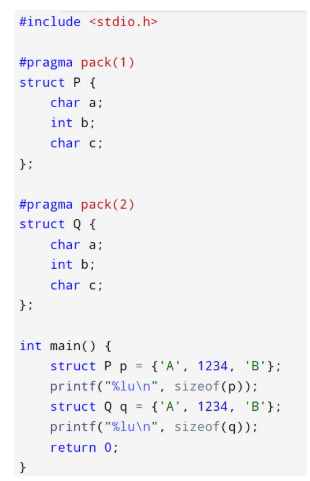

-----

⚡ 𝗖 𝗖𝗵𝗮𝗹𝗹𝗲𝗻𝗴𝗲: 𝗗𝗶𝗴𝗴𝗶𝗻𝗴 𝗜𝗻𝘁𝗼 𝗠𝗲𝗺𝗼𝗿𝘆 𝗔𝗹𝗶𝗴𝗻𝗺𝗲𝗻𝘁 & 𝗣𝗮𝗱𝗱𝗶𝗻𝗴 #2
This C code leverages structure padding, pointer arithmetic, and alignment quirks. Can you predict what will happen under the hood?

🧠 𝗤𝘂𝗲𝘀𝘁𝗶𝗼𝗻𝘀:
What will be printed for the size of the structure S and why?
How are the addresses of s.a, s.b, and s.c related to the structure’s memory alignment?
How does the compiler pad the structure to ensure proper alignment of int types?

💬 Drop your thoughts on the output and the implications of structure padding.
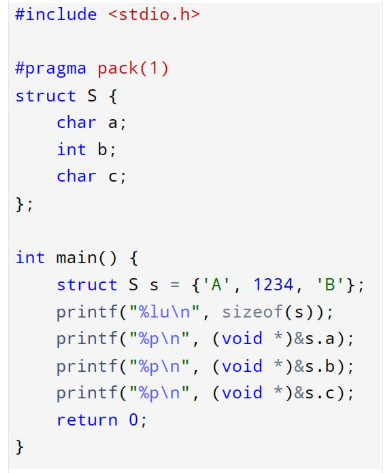
-----
⚡ 𝗖 𝗖𝗵𝗮𝗹𝗹𝗲𝗻𝗴𝗲: 𝗗𝗶𝗴𝗴𝗶𝗻𝗴 𝗜𝗻𝘁𝗼 𝗠𝗲𝗺𝗼𝗿𝘆 𝗔𝗹𝗶𝗴𝗻𝗺𝗲𝗻𝘁 & 𝗣𝗮𝗱𝗱𝗶𝗻𝗴
This C code leverages structure padding, pointer arithmetic, and alignment quirks. Can you predict what will happen under the hood?

🧠 𝗤𝘂𝗲𝘀𝘁𝗶𝗼𝗻𝘀:
What will be printed for the size of the structure S and why?
How are the addresses of s.a, s.b, and s.c related to the structure’s memory alignment?
How does the compiler pad the structure to ensure proper alignment of int types?

💬 Drop your thoughts on the output and the implications of structure padding.

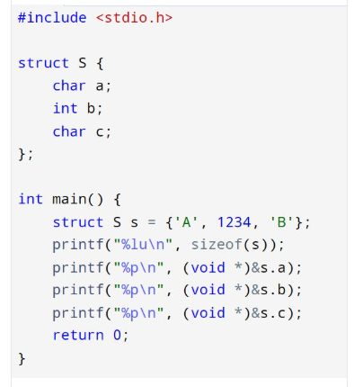

-----

🚧 𝗧𝗵𝗶𝘀 𝗖 𝗰𝗼𝗱𝗲 𝗰𝗼𝗺𝗽𝗶𝗹𝗲𝘀 𝗳𝗶𝗻𝗲. 𝗕𝘂𝘁 𝗰𝗮𝗻 𝘆𝗼𝘂 𝗲𝘅𝗽𝗹𝗮𝗶𝗻 𝘄𝗵𝘆 𝗶𝘁 𝗯𝗲𝗵𝗮𝘃𝗲𝘀 𝘁𝗵𝗶𝘀 𝘄𝗮𝘆?
C’s preprocessor is powerful—but when used creatively (or dangerously), it can do things like this.

🧠 𝗖𝗮𝗻 𝘆𝗼𝘂 𝗮𝗻𝘀𝘄𝗲𝗿:
What does this actually print—and why?
How do the macros affect the control flow and parsing of the else?
Would this pass code review in your team?

This is more than a curiosity—it’s a reminder that readability > cleverness. But knowing how it works is part of becoming a better C developer.

💬 Let me know what you think this outputs—and if you’d ever allow this in production?
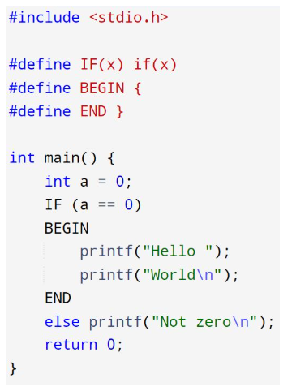
-----

🧠 𝗠𝗮𝘅𝗶𝗺𝘂𝗺 𝗖𝗼𝗻𝗳𝘂𝘀𝗶𝗼𝗻. 𝗠𝗶𝗻𝗶𝗺𝘂𝗺 𝗗𝗲𝗯𝘂𝗴𝗴𝗶𝗻𝗴 𝗖𝗹𝘂𝗲𝘀.
This C code compiles cleanly—but will surprise most developers when executed.

📌 𝗤𝘂𝗲𝘀𝘁𝗶𝗼𝗻𝘀:
What will this program print—and in what order?
How do the commas, post-increments, and function pointer calls interact?
Why is this a cautionary tale about writing “clever” C?

💬 This is a great reminder: just because something is legal in C doesn’t mean it’s readable, predictable, or maintainable. Still, it’s fun to explore!

👀 Have an interpretation? Share your thoughts below.
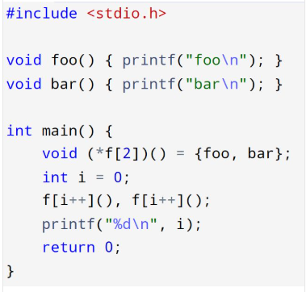

-----
🚨 𝗖𝗮𝗻 𝘆𝗼𝘂 𝗲𝘅𝗽𝗹𝗮𝗶𝗻 𝘁𝗵𝗶𝘀 𝗯𝗲𝗵𝗮𝘃𝗶𝗼𝗿 𝗶𝗻 𝗖 ?
Here’s a compact C puzzle that seems harmless—but hides multiple layers of complexity around types, overflow, and control flow.

🧩 𝗪𝗵𝗮𝘁'𝘀 𝗿𝗲𝗮𝗹𝗹𝘆 𝗴𝗼𝗶𝗻𝗴 𝗼𝗻 𝗵𝗲𝗿𝗲?
Why doesn’t x = x + 10; behave like you'd expect in other languages?
What value does i end up with—and why doesn’t the loop run as intended?

⚙️ 𝗗𝗿𝗼𝗽 𝘆𝗼𝘂𝗿 𝗲𝘅𝗽𝗹𝗮𝗻𝗮𝘁𝗶𝗼𝗻 (𝗻𝗼𝘁 𝗷𝘂𝘀𝘁 𝘁𝗵𝗲 𝗮𝗻𝘀𝘄𝗲𝗿!) 𝗶𝗻 𝘁𝗵𝗲 𝗰𝗼𝗺𝗺𝗲𝗻𝘁𝘀.

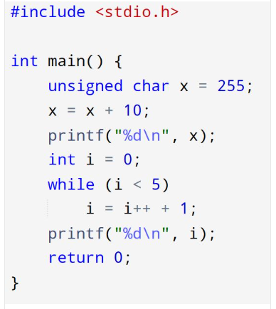
-----
🔍 𝗖𝗮𝗻 𝗬𝗼𝘂 𝗥𝗲𝗮𝗹𝗹𝘆 𝗧𝗿𝘂𝘀𝘁 𝗪𝗵𝗮𝘁 𝗬𝗼𝘂 𝗦𝗲𝗲 𝗶𝗻 𝗖?
This C snippet challenges assumptions about recursion, side effects, and evaluation order.

🧠 At first glance, it looks like a clean recursive sum function—but there's a subtle twist. The mutation of n inside the recursive call hides a deeper question:
✅ 𝗪𝗵𝗮𝘁 𝘄𝗶𝗹𝗹 𝘁𝗵𝗶𝘀 𝗽𝗿𝗼𝗴𝗿𝗮𝗺 𝗮𝗰𝘁𝘂𝗮𝗹𝗹𝘆 𝗽𝗿𝗶𝗻𝘁?
 ❓ 𝗠𝗼𝗿𝗲 𝗶𝗺𝗽𝗼𝗿𝘁𝗮𝗻𝘁𝗹𝘆—𝘄𝗵𝘆?

This is a great reminder that even in well-known languages like C, small changes in how expressions are evaluated can produce surprising results. It’s not just about writing code—it’s about understanding what the compiler really sees.

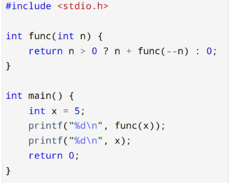
-----
💡 𝗖 𝗣𝗿𝗼𝗴𝗿𝗮𝗺𝗺𝗶𝗻𝗴 𝗖𝗵𝗮𝗹𝗹𝗲𝗻𝗴𝗲: 𝗦𝗶𝗴𝗻𝗲𝗱 𝘃𝘀 𝗨𝗻𝘀𝗶𝗴𝗻𝗲𝗱 𝗜𝗻𝘁𝗲𝗴𝗲𝗿 𝗢𝘃𝗲𝗿𝗳𝗹𝗼𝘄
Even seasoned C developers can be caught off guard by subtle issues like signed integer overflow. Consider the following code.

🧠 𝗖𝗵𝗮𝗹𝗹𝗲𝗻𝗴𝗲:
What will this program print, and why is its behavior technically undefined according to the C standard?

🔍 𝗞𝗲𝘆 𝗖𝗼𝗻𝗰𝗲𝗽𝘁𝘀:
Signed vs unsigned integer behavior
The impact of integer promotion in C and how type casting affects the result.
The pitfalls of signed integer overflow and the undefined behavior that arises when combining signed and unsigned types.

While the code looks straightforward, it illustrates a critical area where C's undefined behavior can lead to unpredictable results. It’s a great reminder to be cautious when mixing signed and unsigned types in arithmetic operations.

🔧 This is a perfect example of why it's important to understand the C standard and how different compilers handle edge cases. It’s also a strong case for writing safer, more predictable code.

💬 Thoughts? What’s your experience with signed/unsigned overflow or dealing with undefined behavior in low-level C? Share your thoughts in the comments below!

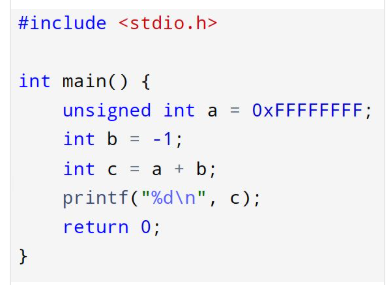

-----
🔧 𝗔𝗱𝘃𝗮𝗻𝗰𝗲𝗱 𝗖 𝗖𝗵𝗮𝗹𝗹𝗲𝗻𝗴𝗲: 𝗘𝘅𝗽𝗿𝗲𝘀𝘀𝗶𝗼𝗻 𝗘𝘃𝗮𝗹𝘂𝗮𝘁𝗶𝗼𝗻 𝗨𝗻𝗱𝗲𝗿 𝘁𝗵𝗲 𝗠𝗶𝗰𝗿𝗼𝘀𝗰𝗼𝗽𝗲
In the world of systems programming, subtle behaviors in C can expose gaps in even seasoned developers' understanding. Here's a concise yet non-trivial snippet that illustrates just how nuanced pointer manipulation and expression evaluation can be.

🧠 𝗖𝗵𝗮𝗹𝗹𝗲𝗻𝗴𝗲:
 Can you accurately determine the output of this program?
 More importantly—can you explain the evaluation sequence of the expression
 (*p) += (*q) += (*p = *q);
 in terms of operator precedence, associativity, and side effects?

This is a great exercise in understanding how C handles compound assignments and the potential pitfalls of writing non-obvious expressions.

💬 I’d love to hear how you approach reasoning through this. Share your thought process or your final answer in the comments below.

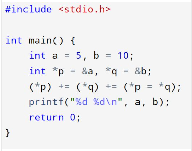

-----
💡 𝗢𝗽𝘁𝗶𝗺𝗶𝘇𝗶𝗻𝗴 𝗠𝗲𝗺𝗼𝗿𝘆 & 𝗣𝗲𝗿𝗳𝗼𝗿𝗺𝗮𝗻𝗰𝗲 𝗶𝗻 𝗖 𝗣𝗿𝗼𝗴𝗿𝗮𝗺𝗺𝗶𝗻𝗴
As C programmers working in low-level development or embedded systems, we are constantly exploring ways to optimize memory usage and improve performance.
Pointer aliasing and bitfields are powerful techniques that can drastically enhance memory efficiency and processing speed, but they come with their own set of challenges.

🔍 𝗤𝘂𝗲𝘀𝘁𝗶𝗼𝗻:
What will print this code?
How do you leverage pointer aliasing and bitfields in your C programming projects to achieve optimal memory utilization and improved performance? What best practices or pitfalls should be considered when applying these techniques in systems programming or embedded systems?

👥 Let’s discuss: Share your experiences, strategies, and insights in the comments below. I’d love to hear your thoughts on how these techniques have helped your projects.

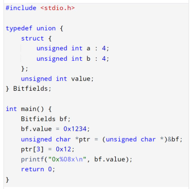

-----
🧠 𝗔𝗱𝘃𝗮𝗻𝗰𝗲𝗱 𝗖 𝗣𝗿𝗼𝗴𝗿𝗮𝗺𝗺𝗶𝗻𝗴 𝗖𝗵𝗮𝗹𝗹𝗲𝗻𝗴𝗲:
In this example, I combine unions, bitfields, pointer aliasing, and type punning to demonstrate low-level memory optimization and efficient data manipulation. These techniques allow us to access specific bytes of a structure and manipulate them with bitwise operations, offering great flexibility in systems programming.

🔍 𝗤𝘂𝗲𝘀𝘁𝗶𝗼𝗻:
What will print this code?
How do you manage bitfields, pointer aliasing, and type punning in your C projects?
Have you faced any challenges regarding memory alignment or optimizing memory usage?

Share your experiences and insights in the comments!

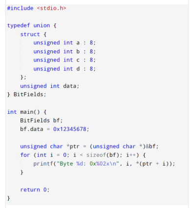

-----

💡 𝗠𝗲𝗺𝗼𝗿𝘆 𝗘𝗳𝗳𝗶𝗰𝗶𝗲𝗻𝗰𝘆 𝗶𝗻 𝗖: 𝗕𝗶𝘁𝗳𝗶𝗲𝗹𝗱𝘀 & 𝗔𝗹𝗶𝗴𝗻𝗺𝗲𝗻𝘁 𝗣𝗶𝘁𝗳𝗮𝗹𝗹𝘀
In systems programming, especially for embedded systems, memory optimization is key. But how do you ensure minimal memory usage while avoiding pitfalls like struct padding and alignment issues?
Consider this advanced example using bitfields in C.

🧠 𝗧𝗵𝗲 𝗞𝗲𝘆 𝗖𝗵𝗮𝗹𝗹𝗲𝗻𝗴𝗲:
𝗠𝗲𝗺𝗼𝗿𝘆 𝗣𝗮𝗰𝗸𝗶𝗻𝗴: The structure uses bitfields to store small data values (5 bits, 3 bits, and 7 bits). This packing optimizes memory usage. But the result can be compiler-dependent due to alignment constraints.

𝗦𝘁𝗿𝘂𝗰𝘁𝘂𝗿𝗲 𝗣𝗮𝗱𝗱𝗶𝗻𝗴: Even though the bitfields sum up to 15 bits, the compiler might insert padding to align the structure’s size to a certain boundary (e.g., 4 or 8 bytes).

𝗣𝗼𝗶𝗻𝘁𝗲𝗿 𝗔𝗹𝗶𝗮𝘀𝗶𝗻𝗴: When accessing the structure byte-by-byte, alignment can cause unexpected results unless handled carefully.

🧩 𝗪𝗵𝗮𝘁 𝗬𝗼𝘂 𝗡𝗲𝗲𝗱 𝘁𝗼 𝗞𝗻𝗼𝘄:
Bitfields allow packing multiple small values into a single integer, which can be a huge memory saver in embedded systems.
However, struct padding and compiler-specific memory optimizations can result in larger memory footprints than expected.
Using pointer aliasing and accessing memory directly via byte manipulation can expose alignment issues if the structure is not correctly packed.

🔧 𝗕𝗲𝘀𝘁 𝗣𝗿𝗮𝗰𝘁𝗶𝗰𝗲𝘀 𝗳𝗼𝗿 𝗠𝗲𝗺𝗼𝗿𝘆 𝗘𝗳𝗳𝗶𝗰𝗶𝗲𝗻𝗰𝘆:
Be aware of platform-specific alignment rules and use hashtag#pragma directives or __attribute__((packed)) to enforce a consistent memory layout if needed.
Consider using bitwise operations to further optimize memory when bitfields introduce overhead.
Always check the sizeof() result to understand the actual memory footprint of your structures.

📝 𝗧𝗮𝗸𝗲𝗮𝘄𝗮𝘆: Always weigh the tradeoffs between performance and memory efficiency. In tightly constrained environments, bitfields can save memory, but it's essential to understand the underlying behavior of compilers and platform-specific quirks.

🔍 𝗤𝘂𝗲𝘀𝘁𝗶𝗼𝗻:
What strategies have you used to manage bitfield packing, alignment, and memory optimization in your own projects? Have you encountered any challenges with struct padding or platform-dependent behavior? Share your insights or experiences in the comments!

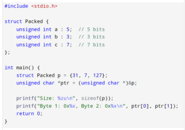

-----
🧠 𝗗𝗲𝗲𝗽 𝗖: 𝗨𝗻𝗱𝗲𝗳𝗶𝗻𝗲𝗱 𝗕𝗲𝗵𝗮𝘃𝗶𝗼𝗿 𝗛𝗶𝗱𝗱𝗲𝗻 𝗶𝗻 𝗣𝗹𝗮𝗶𝗻 𝗦𝗶𝗴𝗵𝘁
Even in just a few lines, C can reveal profound complexities. Consider the following snippet—valid syntax, surprising behavior.

🔍 𝗖𝗵𝗮𝗹𝗹𝗲𝗻𝗴𝗲:
 What does this code print—and more importantly, why is the result technically undefined according to the C standard?

📌 𝗞𝗲𝘆 𝗖𝗼𝗻𝗰𝗲𝗽𝘁𝘀:
Strict aliasing rules
Type-based memory access
Undefined behavior due to accessing memory via incompatible types

This example is a real-world reminder of how low-level optimizations and compiler assumptions can lead to unpredictable results—especially when violating aliasing rules.

📣 If you're writing performance-critical or embedded C code, these are not just academic concerns—they're critical to correctness.

💬 Curious to hear: How would your compiler interpret this?

-----

🧬 𝗖 𝗣𝘂𝘇𝘇𝗹𝗲: 𝗣𝗲𝗲𝗸 𝗜𝗻𝘁𝗼 𝗠𝗲𝗺𝗼𝗿𝘆 🧬
Understanding how data is stored in memory is crucial in systems programming. Here's a subtle and tricky example.

𝗤𝘂𝗲𝘀𝘁𝗶𝗼𝗻:
What will this code print on your system?
What does it reveal about endianness?

This snippet is a classic way to test whether a system is little-endian or big-endian — and it’s also a great example of how unions can give direct access to raw memory.

Try it out. What does your machine say? 🖥️

-----

🧩 𝗜𝗻𝘀𝗮𝗻𝗲𝗹𝘆 𝗧𝗿𝗶𝗰𝗸𝘆 𝗖 𝗣𝘂𝘇𝘇𝗹𝗲 – 𝗠𝗮𝗰𝗿𝗼 𝗠𝗮𝘆𝗵𝗲𝗺 🧩
Ready for something that twists your brain? This compact snippet uses macro magic and operator chaos to test how well you really know the C preprocessor and evaluation logic.

𝗤𝘂𝗲𝘀𝘁𝗶𝗼𝗻:
What is the output of this program?
Why does the result differ from what you'd expect with (a + 1)²?

This challenge highlights why macro hygiene matters and how careless macro definitions can lead to unexpected and subtle bugs in production code. 🔍

If you've ever underestimated the C preprocessor, this might change your mind!

-----
🔥 𝗛𝗮𝗿𝗱𝗰𝗼𝗿𝗲 𝗖 𝗣𝘂𝘇𝘇𝗹𝗲 – 𝗢𝗻𝗹𝘆 𝗳𝗼𝗿 𝘁𝗵𝗲 𝗕𝗿𝗮𝘃𝗲 🔥
If you think you've mastered pointers, function calls, and evaluation order in C, here’s a real challenge for you.

𝗤𝘂𝗲𝘀𝘁𝗶𝗼𝗻:
What will be the output of this code — and why?
What undefined behavior might be lurking here?

This one digs deep into sequence points, side effects, and compiler-dependent behavior. It’s short, but it can stump even seasoned C programmers. 👀

Think you’ve got the answer? Let’s discuss.

-----
🚀 𝗖 𝗣𝗿𝗼𝗴𝗿𝗮𝗺𝗺𝗶𝗻𝗴 𝗖𝗵𝗮𝗹𝗹𝗲𝗻𝗴𝗲 🚀
As developers, we often come across interesting and tricky problems that test our understanding of algorithms and data manipulation. Here's one that involves an intriguing use of the XOR bitwise operator. Check out this C code snippet.

𝗤𝘂𝗲𝘀𝘁𝗶𝗼𝗻:
What does this code do?

-----

🔍 𝗧𝗵𝗲 𝗜𝗺𝗽𝗮𝗰𝘁 𝗼𝗳 hashtag#𝗽𝗿𝗮𝗴𝗺𝗮 𝗗𝗶𝗿𝗲𝗰𝘁𝗶𝘃𝗲𝘀 𝗼𝗻 𝗢𝗽𝘁𝗶𝗺𝗶𝘇𝗮𝘁𝗶𝗼𝗻 ⚡
Consider this C code where hashtag#pragma is used to control optimization behavior.

In this example, we're using hashtag#pragma GCC optimize("O3") to instruct the compiler to apply maximum optimization to the my_function function.

❓ 𝗪𝗵𝗮𝘁 𝗱𝗼 𝘆𝗼𝘂 𝘁𝗵𝗶𝗻𝗸 𝘁𝗵𝗶𝘀 𝗰𝗼𝗱𝗲 𝗱𝗼𝗲𝘀, 𝗮𝗻𝗱 𝗵𝗼𝘄 𝗱𝗼𝗲𝘀 𝘁𝗵𝗲 hashtag#𝗽𝗿𝗮𝗴𝗺𝗮 𝗚𝗖𝗖 𝗼𝗽𝘁𝗶𝗺𝗶𝘇𝗲 𝗱𝗶𝗿𝗲𝗰𝘁𝗶𝘃𝗲 𝗶𝗺𝗽𝗮𝗰𝘁 𝗽𝗲𝗿𝗳𝗼𝗿𝗺𝗮𝗻𝗰𝗲?

𝗪𝗵𝗮𝘁’𝘀 𝘁𝗵𝗲 𝗱𝗶𝗳𝗳𝗲𝗿𝗲𝗻𝗰𝗲 𝗯𝗲𝘁𝘄𝗲𝗲𝗻 𝘃𝗮𝗿𝗶𝗼𝘂𝘀 𝗹𝗲𝘃𝗲𝗹𝘀 𝗼𝗳 𝗼𝗽𝘁𝗶𝗺𝗶𝘇𝗮𝘁𝗶𝗼𝗻, 𝗮𝗻𝗱 𝗵𝗼𝘄 𝗰𝗮𝗻 𝘁𝗵𝗲𝘆 𝗮𝗳𝗳𝗲𝗰𝘁 𝗲𝘅𝗲𝗰𝘂𝘁𝗶𝗼𝗻 𝘁𝗶𝗺𝗲 𝗼𝗿 𝗯𝗶𝗻𝗮𝗿𝘆 𝘀𝗶𝘇𝗲?

-----

🔧 𝗘𝘅𝗽𝗹𝗼𝗿𝗶𝗻𝗴 hashtag#𝗽𝗿𝗮𝗴𝗺𝗮 𝗶𝗻 𝗖 – 𝗪𝗵𝗮𝘁’𝘀 𝘁𝗵𝗲 𝗢𝘂𝘁𝗽𝘂𝘁? 🧠
Take a look at this C code involving hashtag#pragma.

In this code, we are using hashtag#pragma pack(push, 1) to specify 1-byte alignment for the structure. But how does it affect the size of the structure?

❓ 𝗪𝗵𝗮𝘁 𝘄𝗶𝗹𝗹 𝘁𝗵𝗶𝘀 𝗽𝗿𝗼𝗴𝗿𝗮𝗺 𝗽𝗿𝗶𝗻𝘁, 𝗮𝗻𝗱 𝘄𝗵𝘆?
 How does the hashtag#pragma pack directive impact the alignment of the structure members, and how is memory layout influenced?

 

-----
⚡ 𝗦𝗶𝗴𝗻𝗲𝗱 𝘃𝘀 𝗨𝗻𝘀𝗶𝗴𝗻𝗲𝗱 – 𝗦𝘂𝗯𝘁𝗹𝗲 𝗣𝗶𝘁𝗳𝗮𝗹𝗹𝘀 𝗶𝗻 𝗖 🔍
Consider this C code that demonstrates the nuances of signed and unsigned comparisons.

In this code, we’re comparing unsigned and signed integers. The signed comparison in the first if statement can lead to unexpected behavior due to integer promotion rules. Meanwhile, the bitwise operation in the second comparison might surprise you with its result!

❓ 𝗪𝗵𝗮𝘁 𝘄𝗶𝗹𝗹 𝘁𝗵𝗶𝘀 𝗽𝗿𝗼𝗴𝗿𝗮𝗺 𝗽𝗿𝗶𝗻𝘁, 𝗮𝗻𝗱 𝘄𝗵𝘆?
 What are the dangers of comparing signed and unsigned integers in C, and how do you prevent errors in critical code?
🔍 How do you manage these types of edge cases in embedded systems, where handling low-level data correctly is crucial?

-----
🔧 𝗘𝗻𝗱𝗶𝗮𝗻𝗻𝗲𝘀𝘀 𝗮𝗻𝗱 𝗕𝗶𝘁𝘄𝗶𝘀𝗲 𝗢𝗽𝗲𝗿𝗮𝘁𝗶𝗼𝗻𝘀 – 𝗪𝗵𝗮𝘁'𝘀 𝘁𝗵𝗲 𝗢𝘂𝘁𝗰𝗼𝗺𝗲? ⚡
Consider this C code, which deals with endianness and bitwise rotation.

Assuming a little-endian system, what will be the output of this program? 

𝗘𝘅𝗽𝗹𝗮𝗶𝗻 𝗲𝗮𝗰𝗵 𝘀𝘁𝗲𝗽:
How the pointer ptr is initialized and incremented?
How the result is formed by reading a uint16_t from the memory pointed to by ptr?
What the bitwise left shift (<<) and right shift (>>) operations do to the bits in result?
How the bitwise OR (|) combines the results of the shifts?

This requires a strong understanding of endianness, pointer arithmetic, type casting, and bitwise operations with fixed-width integers.

-----
🔧 𝗧𝘆𝗽𝗲 𝗣𝘂𝗻𝗻𝗶𝗻𝗴 𝗶𝗻 𝗖 – 𝗗𝗮𝗻𝗴𝗲𝗿𝗼𝘂𝘀 𝗖𝗮𝘀𝘁𝗶𝗻𝗴 𝗼𝗿 𝗣𝗼𝘄𝗲𝗿𝗳𝘂𝗹 𝗧𝗲𝗰𝗵𝗻𝗶𝗾𝘂𝗲? ⚡
Take a look at this C snippet.

Here, we’re casting a float to an int pointer, then calling a function that expects an int with the address of the float. This is a classic example of type punning. ⚡

❓ 𝗪𝗵𝗮𝘁 𝗱𝗼 𝘆𝗼𝘂 𝘁𝗵𝗶𝗻𝗸 𝘁𝗵𝗶𝘀 𝗽𝗿𝗶𝗻𝘁𝘀, 𝗮𝗻𝗱 𝘄𝗵𝘆?
 What are the risks and potential issues with this type of casting in low-level C programming?
🔍 Have you ever encountered bugs caused by unsafe casts or pointer aliasing in your embedded systems code?

-----
🔧 𝗠𝗲𝗺𝗼𝗿𝘆 𝗔𝗰𝗰𝗲𝘀𝘀 𝗶𝗻 𝗖 – 𝗕𝘆𝘁𝗲-𝗟𝗲𝘃𝗲𝗹 𝗠𝗮𝗻𝗶𝗽𝘂𝗹𝗮𝘁𝗶𝗼𝗻 𝗶𝗻 𝗔𝗰𝘁𝗶𝗼𝗻 🧠
Here’s a snippet that dives into the guts of memory layout in a typical C program.

We’re casting an int[] to unsigned char*, moving the pointer 7 bytes ahead, and modifying a single byte in memory. But what part of the integer array does that really affect? 🤔

❓ 𝗪𝗵𝗮𝘁 𝗱𝗼 𝘆𝗼𝘂 𝗲𝘅𝗽𝗲𝗰𝘁 𝘁𝗵𝗶𝘀 𝘁𝗼 𝗽𝗿𝗶𝗻𝘁, 𝗮𝗻𝗱 𝘄𝗵𝘆?
 How does system endianness and byte alignment influence the observed result?
🔍 Have you ever debugged a corrupted value due to unintended byte-level access?

-----
🔧 𝗔𝗱𝘃𝗮𝗻𝗰𝗲𝗱 𝗨𝘀𝗲 𝗼𝗳 hashtag#𝗽𝗿𝗮𝗴𝗺𝗮 – 𝗖𝗼𝗻𝘁𝗿𝗼𝗹𝗹𝗶𝗻𝗴 𝗔𝗹𝗶𝗴𝗻𝗺𝗲𝗻𝘁 𝗮𝗻𝗱 𝗣𝗮𝗱𝗱𝗶𝗻𝗴 🔍
Take a look at this C code that uses hashtag#pragma to

-----
🧠 𝗨𝗻𝘀𝗶𝗴𝗻𝗲𝗱 𝘃𝘀 𝗦𝗶𝗴𝗻𝗲𝗱 𝗶𝗻 𝗖 – 𝗪𝗵𝗶𝗰𝗵 𝗦𝗶𝗱𝗲 𝗪𝗶𝗻𝘀? ⚖️
Consider the following C code.
This comparison looks innocent, but mixing signed and unsigned types can introduce subtle, and sometimes unexpected, behavior. 🧩

❓ 𝗪𝗵𝗮𝘁 𝘄𝗶𝗹𝗹 𝘁𝗵𝗶𝘀 𝗽𝗿𝗶𝗻𝘁, 𝗮𝗻𝗱 𝘄𝗵𝘆?
How does the interaction between signed and unsigned integers affect the result?
🔍 How do you handle mixed-type arithmetic in safety-critical or performance-sensitive code?

-----

🔧 𝗘𝗺𝗯𝗲𝗱𝗱𝗲𝗱 𝗖 𝗕𝘆𝘁𝗲 𝗠𝗮𝗻𝗶𝗽𝘂𝗹𝗮𝘁𝗶𝗼𝗻 – 𝗖𝗮𝗻 𝗬𝗼𝘂 𝗣𝗿𝗲𝗱𝗶𝗰𝘁 𝘁𝗵𝗲 𝗢𝘂𝘁𝗽𝘂𝘁? ⚙️
Here’s a snippet that plays at the boundary of memory layout and architecture.

We're directly modifying one byte of a 32-bit word using a unsigned char* cast—classic low-level technique. 🧠
 But here's the twist: the final value of val will depend entirely on system endianness.

❓ 𝗪𝗵𝗮𝘁 𝗼𝘂𝘁𝗽𝘂𝘁 𝘄𝗶𝗹𝗹 𝘁𝗵𝗶𝘀 𝗽𝗿𝗼𝗱𝘂𝗰𝗲 𝗼𝗻 𝗮 𝗹𝗶𝘁𝘁𝗹𝗲-𝗲𝗻𝗱𝗶𝗮𝗻 𝘃𝘀. 𝗯𝗶𝗴-𝗲𝗻𝗱𝗶𝗮𝗻 𝘀𝘆𝘀𝘁𝗲𝗺?
 How would you write this in a portable way for embedded platforms?

-----
🔍 𝗣𝗼𝗶𝗻𝘁𝗲𝗿 𝗕𝗲𝗵𝗮𝘃𝗶𝗼𝗿 𝗶𝗻 𝗖 – 𝗪𝗵𝗮𝘁'𝘀 𝘁𝗵𝗲 𝗢𝘂𝘁𝗽𝘂𝘁? 🧵
Here’s a short C program. Take a moment and try to predict the output.

This code combines post-increment operators with pointer dereferencing—a subtle area that often trips up even experienced C developers. 🧠

❓ 𝗪𝗵𝗮𝘁 𝘄𝗶𝗹𝗹 𝘁𝗵𝗶𝘀 𝗽𝗿𝗼𝗴𝗿𝗮𝗺 𝗽𝗿𝗶𝗻𝘁, 𝗮𝗻𝗱 𝘄𝗵𝘆?
 What’s the value of a[1] at the end, and how did it get there? 💭

-----

🔍 𝗖𝘂𝗿𝗶𝗼𝘂𝘀 𝗕𝗲𝗵𝗮𝘃𝗶𝗼𝗿 𝗶𝗻 𝗖: 𝗦𝗶𝗴𝗻𝗲𝗱 𝗢𝘃𝗲𝗿𝗳𝗹𝗼𝘄 𝗼𝗿 𝗝𝘂𝘀𝘁 𝗧𝘆𝗽𝗲 𝗟𝗶𝗺𝗶𝘁𝘀? 🤔
Take a look at this simple C snippet.

At first glance, this looks straightforward, but the actual output may be unexpected. 😮

❓ 𝗪𝗵𝗮𝘁 𝗱𝗼 𝘆𝗼𝘂 𝘁𝗵𝗶𝗻𝗸 𝘁𝗵𝗶𝘀 𝗽𝗿𝗶𝗻𝘁𝘀, 𝗮𝗻𝗱 𝘄𝗵𝘆?

How does the type of char affect the result in this comparison? ⚙️
Looking forward to your insights!

-----

🚀 𝗕𝗶𝘁𝘄𝗶𝘀𝗲 𝗢𝗣 𝗖𝗵𝗮𝗹𝗹𝗲𝗻𝗴𝗲! 🚀
How comfortable are you with bitwise operations in C? 
🧠⚡ Check out this quick test.

📢 𝗤𝘂𝗲𝘀𝘁𝗶𝗼𝗻:
 👉 𝗪𝗵𝗮𝘁 𝘄𝗶𝗹𝗹 𝘁𝗵𝗲 𝘃𝗮𝗹𝘂𝗲 𝗼𝗳 𝗿𝗲𝘀𝘂𝗹𝘁 𝗯𝗲?
(Hint: The & operator keeps only the bits that are set in both numbers! 🧩🔍)

💬 Share your answer below — and let's talk about the magic of bit manipulation! 🚀🛠️

-----
🚀 𝗙𝘂𝗻𝗰𝘁𝗶𝗼𝗻 𝗖𝗵𝗮𝗹𝗹𝗲𝗻𝗴𝗲: 𝗣𝗮𝘀𝘀𝗶𝗻𝗴 𝗔𝗿𝗿𝗮𝘆𝘀 𝗯𝘆 𝗥𝗲𝗳𝗲𝗿𝗲𝗻𝗰𝗲! 🚀
Let’s take a closer look at how arrays behave when passed to functions in C 🧠💡

📢 𝗤𝘂𝗲𝘀𝘁𝗶𝗼𝗻:
 👉 𝗪𝗵𝗮𝘁 𝘄𝗶𝗹𝗹 𝗯𝗲 𝘁𝗵𝗲 𝗳𝗶𝗻𝗮𝗹 𝗼𝘂𝘁𝗽𝘂𝘁 𝗼𝗳 𝘁𝗵𝗶𝘀 𝗽𝗿𝗼𝗴𝗿𝗮𝗺?
(Hint: Arrays are passed by reference in C! 🔥)

💬 Share your answers below — and let’s discuss how C handles memory and function arguments! 🎯🧠

-----
🚀 𝗣𝗼𝗶𝗻𝘁𝗲𝗿 𝗔𝗿𝗶𝘁𝗵𝗺𝗲𝘁𝗶𝗰 𝗶𝗻 𝗔𝗰𝘁𝗶𝗼𝗻! 🚀
Here’s a simple but powerful C code snippet that tests your understanding of pointer movement 🔥🧠

📢 𝗤𝘂𝗲𝘀𝘁𝗶𝗼𝗻:
 👉 𝗪𝗵𝗮𝘁 𝘃𝗮𝗹𝘂𝗲 𝘄𝗶𝗹𝗹 𝗯𝗲 𝗽𝗿𝗶𝗻𝘁𝗲𝗱?
(Hint: Each pointer increment moves you to the next array element, not just the next byte! 🧩)

💬 Drop your answers in the comments — let's see who can reason it out correctly! 💬✨

-----
🚀 𝗣𝗼𝗶𝗻𝘁𝗲𝗿 𝗗𝗶𝘀𝘁𝗮𝗻𝗰𝗲 𝗖𝗵𝗮𝗹𝗹𝗲𝗻𝗴𝗲! 🚀
Let’s test your C pointer skills with this small but tricky code snippet 🧠✨

📢 𝗤𝘂𝗲𝘀𝘁𝗶𝗼𝗻:
 👉 𝗪𝗵𝗮𝘁 𝘃𝗮𝗹𝘂𝗲 𝘄𝗶𝗹𝗹 𝘁𝗵𝗲 𝗽𝗿𝗶𝗻𝘁𝗲𝗱 𝗼𝘂𝘁𝗽𝘂𝘁 𝗯𝗲?
(Hint: Pointer subtraction doesn't give byte difference — it gives element difference! 📏)

💬 Drop your answer in the comments! Let’s see who can reason it out correctly! 🧠💬

-----
🚀 𝗠𝘂𝗹𝘁𝗶-𝗱𝗶𝗺𝗲𝗻𝘀𝗶𝗼𝗻𝗮𝗹 𝗔𝗿𝗿𝗮𝘆 𝗖𝗵𝗮𝗹𝗹𝗲𝗻𝗴𝗲! 🚀
Here’s a quick C snippet to test your knowledge about how arrays are laid out in memory 🧠🔍:

📢 𝗤𝘂𝗲𝘀𝘁𝗶𝗼𝗻:
 👉 𝗪𝗵𝗮𝘁 𝘃𝗮𝗹𝘂𝗲 𝘄𝗶𝗹𝗹 𝗯𝗲 𝗽𝗿𝗶𝗻𝘁𝗲𝗱?

💬 Think about how 2D arrays are stored in C — it’s not as complicated as it seems! Drop your answer in the comments! 👇

-----
🔹 𝘾 𝘾𝙝𝙖𝙡𝙡𝙚𝙣𝙜𝙚 🔹
Here’s a short but tricky piece of C code that plays with function pointers and arrays — a real brain workout.

💬 𝘾𝙝𝙖𝙡𝙡𝙚𝙣𝙜𝙚 𝙛𝙤𝙧 𝙮𝙤𝙪:
What will be the final value printed? And can you explain exactly how function pointers are working inside the for loop?

This one is a great warm-up for interviews and system-level programming! 🚀

Feel free to share your thoughts in the comments — let's see how many people get it right on the first try! 👏

-----------------

🚀 Today I’d like to share a small snippet of C code that demonstrates an interesting use of pointers and bitwise operations.

This simple-looking mystery_function performs a powerful operation — but what exactly is happening under the hood?

🔍 𝙌𝙪𝙚𝙨𝙩𝙞𝙤𝙣 𝙛𝙤𝙧 𝙮𝙤𝙪:
What is the final output of this program, and can you explain how the mystery_function achieves it without using any temporary variables?

Feel free to drop your answers in the comments! Let’s learn together. 🚀

----
🔹 𝘾 𝙋𝙧𝙤𝙜𝙧𝙖𝙢𝙢𝙞𝙣𝙜 𝘾𝙝𝙖𝙡𝙡𝙚𝙣𝙜𝙚 🔹
Time to really test your deep C knowledge! Here’s a code snippet that looks simple at first glance — but there's much more happening under the hood.

💬 𝙎𝙚𝙧𝙞𝙤𝙪𝙨 𝘾𝙝𝙖𝙡𝙡𝙚𝙣𝙜𝙚 𝙛𝙤𝙧 𝙮𝙤𝙪:
 ✅ What will this program output?
 ✅ Will there be any memory leaks or segmentation faults? Why or why not?
 ✅ How would you rewrite it to make it safer and more efficient?

This challenge is excellent for those who want to master dynamic memory, pointer-to-pointer concepts, and recursive memory handling. 🚀

💬 Drop your answers and explanations in the comments! Let's raise the bar together. 👇

---

🔹 𝘾 𝙋𝙧𝙤𝙜𝙧𝙖𝙢𝙢𝙞𝙣𝙜 𝘾𝙝𝙖𝙡𝙡𝙚𝙣𝙜𝙚: 𝙈𝙖𝙨𝙩𝙚𝙧𝙞𝙣𝙜 𝘽𝙞𝙩𝙬𝙞𝙨𝙚 𝙊𝙥𝙚𝙧𝙖𝙩𝙤𝙧𝙨 🔹
Are you ready for an advanced-level bitwise operator challenge in C?
Check out this interesting problem that tests your understanding of bitwise manipulations and the concept of swapping bits within an integer.

Consider the following C code snippet.

𝙆𝙚𝙮 𝙌𝙪𝙚𝙨𝙩𝙞𝙤𝙣𝙨:
What will be the output of the printf statement in the main function when n = 29 and i = 1, j = 3?
How does the swap_bits function work? What exactly happens to the binary representation of n during execution?
What happens if the bits at positions i and j are already the same? How does the program handle this case?

Drop your answers below and let’s discuss how these powerful operators work under the hood!

---
🔹 𝙏𝙚𝙨𝙩 𝙔𝙤𝙪𝙧 𝘾 𝙎𝙠𝙞𝙡𝙡𝙨 🔹
Here’s a compact piece of C code that plays with recursion and pointer arithmetic.

💬 𝙌𝙪𝙚𝙨𝙩𝙞𝙤𝙣 𝙛𝙤𝙧 𝙮𝙤𝙪:
 What will be the output of this program? Can you explain why it behaves that way?

Challenge yourself — and feel free to comment your answer or tag a friend to solve it with you! 🚀

---
🔹 𝑩𝒊𝒕𝒘𝒊𝒔𝒆 𝑪𝒉𝒂𝒍𝒍𝒆𝒏𝒈𝒆 🔹
This one will push your skills in bitwise operations and help you think about how to solve problems more efficiently at the binary level.

𝑻𝒉𝒆 𝑷𝒓𝒐𝒃𝒍𝒆𝒎:
Given two integers a and b, find the minimum number of bit flips required to convert a to b.

𝑲𝒆𝒚 𝑸𝒖𝒆𝒔𝒕𝒊𝒐𝒏𝒔:
What is the output when a = 29 and b = 15? 🤔
How does the XOR operation (^) help in identifying differing bits? 🔍
What role does the right shift (>>) play in this problem? 🔄

𝑾𝒉𝒚 𝑻𝒉𝒊𝒔 𝑴𝒂𝒕𝒕𝒆𝒓𝒔:
Bitwise operations like XOR and right shifts are essential tools in performance optimizations, cryptography, and error detection. 💡
Mastering these operations can significantly improve your ability to tackle complex programming challenges in low-level development. 🚀

💬 𝑻𝒂𝒌𝒆 𝒐𝒏 𝒕𝒉𝒆 𝑪𝒉𝒂𝒍𝒍𝒆𝒏𝒈𝒆:
🧠 Share your answers or thoughts in the comments! 
How would you approach this problem differently? 
Let's talk about how bitwise operations are used in real-world applications!

---

🔹 𝘾 𝙋𝙧𝙤𝙜𝙧𝙖𝙢𝙢𝙞𝙣𝙜 𝘽𝙧𝙖𝙞𝙣 𝙏𝙚𝙖𝙨𝙚𝙧 🔹
Let's dive into a short piece of C code that tests your understanding of arrays, pointers, and memory.

💬 𝙌𝙪𝙚𝙨𝙩𝙞𝙤𝙣 𝙛𝙤𝙧 𝙮𝙤𝙪:
What will be the final contents of the data array after running this program? And why?

Feel free to share your thought process below — it’s a great way to deepen your understanding and help others too! 🚀

----

🔹 𝑩𝒊𝒕𝒘𝒊𝒔𝒆 𝑪𝒉𝒂𝒍𝒍𝒆𝒏𝒈𝒆: 𝑼𝒏𝒗𝒆𝒊𝒍𝒊𝒏𝒈 𝒕𝒉𝒆 𝑴𝒚𝒔𝒕𝒆𝒓𝒚 𝒐𝒇 𝒐𝒑𝒆𝒓𝒂𝒕𝒊𝒐𝒏() 🔹
Here's a code snippet using bitwise operations. Can you determine what the operation() function is doing based on its implementation? 👇

𝙏𝙝𝙚 𝙏𝙖𝙨𝙠:
What does the operation() function do with the given integer n? 🤔
With n = 8 and n = 31, what will be the result of the operation() function? 📊
How does the bitwise AND (&) combined with subtraction help in identifying certain properties of numbers? 🔍

---

🚀 𝗣𝗼𝗶𝗻𝘁𝗲𝗿 𝗔𝗿𝗶𝘁𝗵𝗺𝗲𝘁𝗶𝗰 𝗖𝗵𝗮𝗹𝗹𝗲𝗻𝗴𝗲! 🚀
Here’s another C snippet to test your understanding of arrays and pointers 🧠

📢 𝗤𝘂𝗲𝘀𝘁𝗶𝗼𝗻:
 👉 𝗪𝗵𝗮𝘁 𝘄𝗶𝗹𝗹 𝘁𝗵𝗲 𝗽𝗿𝗶𝗻𝘁𝗲𝗱 𝗼𝘂𝘁𝗽𝘂𝘁 𝗯𝗲?
(Think carefully about how pointer subtraction works and what happens when you dereference ptr2! 🧮🔍)

