⚠️🌀 𝗘𝗺𝗯𝗲𝗱𝗱𝗲𝗱 𝗖 𝗖𝗵𝗮𝗼𝘀: 𝗩𝗼𝗹𝗮𝘁𝗶𝗹𝗲 𝗗𝗼𝗲𝘀𝗻’𝘁 𝗦𝗮𝘃𝗲 𝗬𝗼𝘂 🌀⚠️
This one looks correct… until your firmware randomly freezes or breaks under stress.

🧠 𝗤𝘂𝗲𝘀𝘁𝗶𝗼𝗻:
❓ Why might 𝘵𝘢𝘴𝘬_𝘈() see stale value of flag == 0 even after 𝘵𝘢𝘴𝘬_B() sets it to 1?
🛑 Why is volatile not enough here?
🔧 What’s the correct way to ensure visibility and ordering in a multi-core or multi-threaded system?

🧵 Hint: Embedded isn't just about code. It's also about compiler behavior, instruction reordering, and hardware barriers.

If you've never debugged this bug, you're lucky. If you have — you'll never forget.

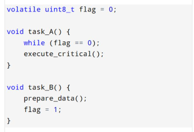

-----

⚔️ 𝗘𝗺𝗯𝗲𝗱𝗱𝗲𝗱 𝗖 𝗚𝗹𝗮𝗱𝗶𝗮𝘁𝗼𝗿 𝗣𝘂𝘇𝘇𝗹𝗲: 𝗦𝘁𝗮𝗰𝗸, 𝗜𝗦𝗥 & 𝗙𝘂𝗻𝗰𝘁𝗶𝗼𝗻 𝗣𝗼𝗶𝗻𝘁𝗲𝗿 𝗖𝗹𝗮𝘀𝗵! ⚔️
 Only for those who've faced random reboots and ghost bugs in production!

🧠 𝗤𝘂𝗲𝘀𝘁𝗶𝗼𝗻:
💀 What if check_condition() returns false?
😱 Why might this lead to a HardFault or undefined jump, even if the code compiles fine?
🔍 Under what build configuration or optimization level might this break silently?
🔐 What robust fix would you recommend to avoid such crashes in critical interrupt contexts?

💬 hashtag#Share your analysis or hashtag#tag that firmware expert who eats function pointers for breakfast.

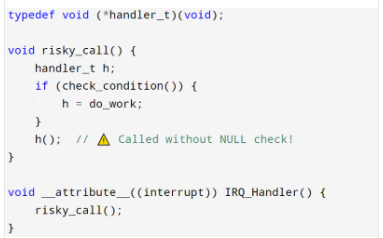
-----
🚀💥 𝗘𝗺𝗯𝗲𝗱𝗱𝗲𝗱 𝗖 𝗘𝗹𝗶𝘁𝗲 𝗖𝗵𝗮𝗹𝗹𝗲𝗻𝗴𝗲: 𝗗𝗠𝗔 + 𝗖𝗮𝗰𝗵𝗲 𝗖𝗼𝗵𝗲𝗿𝗲𝗻𝗰𝘆 𝗕𝘂𝗴 💥🚀
This one’s for those working on ARM Cortex-M7 or similar platforms with data cache enabled:

🧠 𝗤𝘂𝗲𝘀𝘁𝗶𝗼𝗻:
⚠️ Why might rx_buffer[0] still contain stale data even though DMA completed successfully?
🧩 What CPU hardware feature is causing this?
🛠️ How would you fix it properly without disabling the cache?

📌 Hint: If you're working with DMA on a cached system and haven’t used memory barriers or cache maintenance, you're probably already in trouble.

Let’s see who’s ready for real embedded warfare.
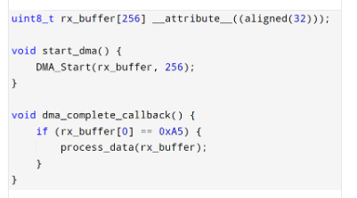

-----

🧠🧨 𝗘𝗺𝗯𝗲𝗱𝗱𝗲𝗱 𝗖 𝗣𝘂𝘇𝘇𝗹𝗲: 𝗦𝘁𝗮𝘁𝗶𝗰 𝗧𝗿𝗮𝗽 𝗶𝗻 𝗜𝗦𝗥 𝗪𝗼𝗿𝗹𝗱! 🧨🧠
Here’s a short snippet that seems harmless—but can break your embedded system in subtle, painful ways:

🧠 𝗤𝘂𝗲𝘀𝘁𝗶𝗼𝗻:
👀 Why could this cause unexpected behavior or missed events, especially under heavy interrupt load?
🧵 Is static really safe inside functions called by ISRs?
🔧 What’s the safer approach to preserve counter state without risking timing bugs?

⏱️ Interrupts don't forgive poor state handling.
 Comment your thoughts or challenge your team to solve this 🔐
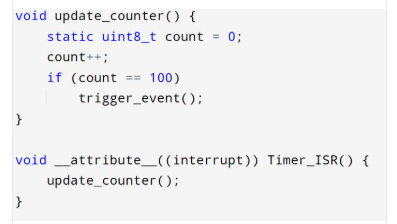
-----

⚡🐞 𝗘𝗺𝗯𝗲𝗱𝗱𝗲𝗱 𝗖 𝗧𝗿𝗮𝗽: 𝗨𝗻𝗱𝗲𝗳𝗶𝗻𝗲𝗱 𝗕𝗲𝗵𝗮𝘃𝗶𝗼𝗿 𝗶𝗻 𝗣𝗹𝗮𝗶𝗻 𝗦𝗶𝗴𝗵𝘁! 🐞⚡
Let’s see if you can spot the silent killer in this short code:

🧠 𝗤𝘂𝗲𝘀𝘁𝗶𝗼𝗻:
✅ What values are written to buffer, and where?
❌ What's dangerously wrong with the write_data() logic?
🚑 How would you rewrite it safely?

Most won’t notice the subtle pointer bug until it hits production.
🔥 Prove you're not most engineers.
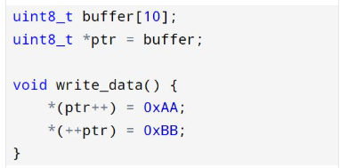
-----

🚨🔍 𝗘𝗺𝗯𝗲𝗱𝗱𝗲𝗱 𝗖 𝗗𝗲𝗲𝗽-𝗗𝗶𝘃𝗲: 𝗖𝗼𝗻𝗰𝘂𝗿𝗿𝗲𝗻𝗰𝘆 𝗖𝗵𝗮𝗼𝘀! 🔍🚨
Ready for another real-world embedded bug in disguise?
Check out this snippet that looks safe but can break your firmware in surprising ways:

🧠 𝗤𝘂𝗲𝘀𝘁𝗶𝗼𝗻:
Can this code miss an interrupt signal or behave unpredictably?
➡️ If yes, explain why, and how would you make it bulletproof?

⚙️ Real embedded systems don’t forgive race conditions.
💬 Comment your answer or tag a friend who should see this!
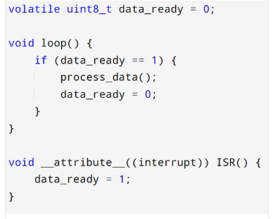
-----

🔧💡 𝗘𝗺𝗯𝗲𝗱𝗱𝗲𝗱 𝗖 𝗖𝗵𝗮𝗹𝗹𝗲𝗻𝗴𝗲 — 𝗢𝗻𝗹𝘆 𝗳𝗼𝗿 𝗛𝗮𝗿𝗱𝗰𝗼𝗿𝗲 𝗘𝗻𝗴𝗶𝗻𝗲𝗲𝗿𝘀! 💡🔧
 Let’s test how deep your embedded system knowledge goes.
 👇 Here's a Embedded C snippet that looks simple — but hides a big trap:

🧠 𝗤𝘂𝗲𝘀𝘁𝗶𝗼𝗻:
Why might check_flag() never exit the loop, even though ISR_Handler() clears the flag correctly?
➡️ Bonus: How would you fix it without removing volatile?

🔥 Think you got it? 
Drop your answers below or challenge your team!

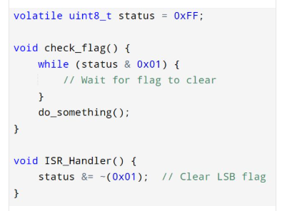

-----
A) How does this abstraction bind a timer base and channel together?
B) What is the role of CCR() and how is it calculated?
C) Why is this safer than using raw TIMx->CCR1 macros?
D) How would you extend this to include ARR (auto-reload) and PSC (prescaler) setup?
E) How can this be combined with a Pin<'A', 8> to validate the correct AF mapping for PWM output?

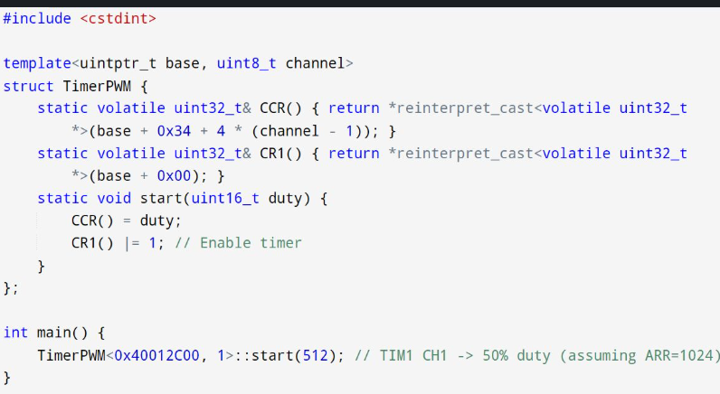
-----

A) How does this abstraction eliminate hardcoding UART pins and AFs?
B) What are the benefits of binding pins to peripherals using type metadata?
C) Could you add static_asserts to verify valid AF combinations for specific peripherals?
D) How would you make this cross-platform (i.e., STM32F1 vs F4) using traits or constexpr detection?
E) How can you extend this to configure full GPIO speed, mode, and pull-ups?
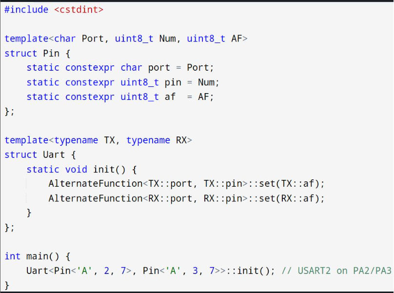
-----

A) What is the purpose of splitting AFRL and AFRH using Pin < 8?
B) How does this approach minimize bugs compared to writing direct AFRL/H bitfields manually?
C) What are the limitations of this code when used across different STM32 families (e.g., L4 vs F1)?
D) Could you use constexpr if or concepts to restrict invalid AF combinations?
E) How would you integrate this into a full PinConfig abstraction (mode, speed, pull-up, etc.)?
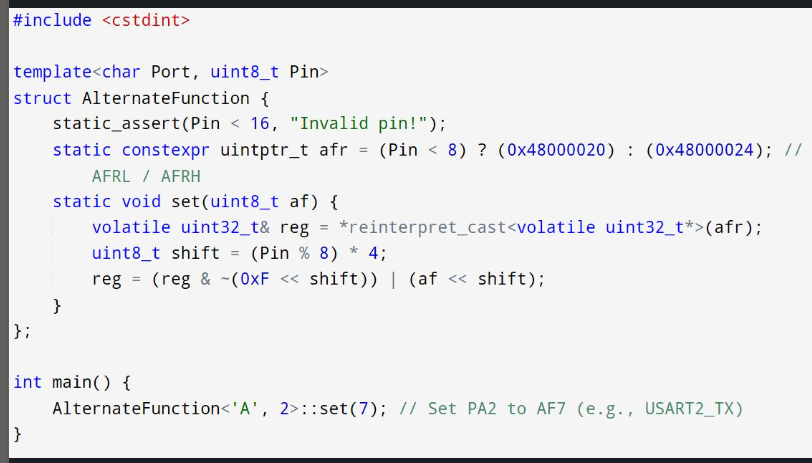
-----

A) How does this design enforce type safety and valid port selection at compile-time?
B) Why is static_assert(odr_addr) a safe fallback?
C) How would you extend this to support clear, toggle, and input read?
D) What are the performance implications of this abstraction on embedded targets like Cortex-M0?
E) Could you integrate constexpr lambdas or concepts to make the interface more robust?
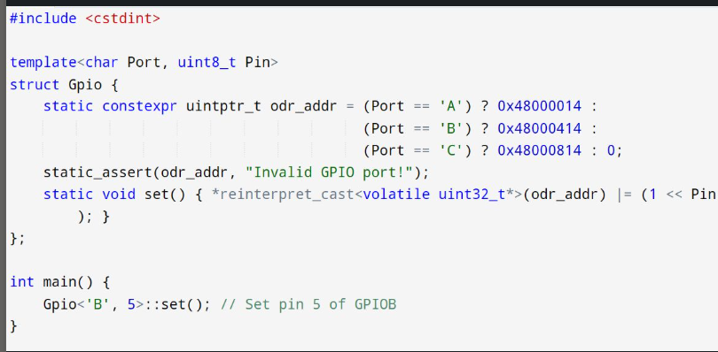

-----

A) What role does the Peripheral struct (here, USART1) play in this design?
B) Why is Enable<T> better than using raw RCC register macros or magic numbers directly?
C) Can this pattern scale to multiple peripherals (e.g., GPIO, TIM, ADC)? How?
D) How would you add compile-time validation that rcc_enr is within a safe address range?
E) Could this be combined with concepts or constexpr checks to generate peripheral-safe code?
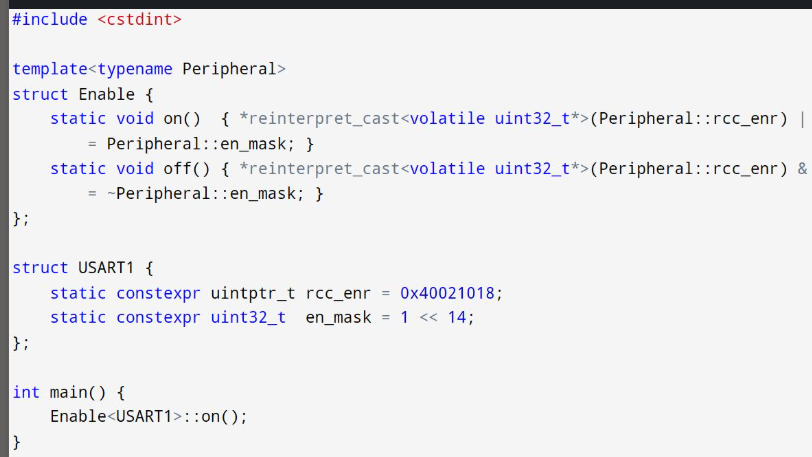
-----

A) What is the purpose of the alias calculation? What hardware feature is this using?
B) Why is this method more efficient and atomic than traditional read-modify-write GPIO setting?
C) What happens if you try this on a non-bit-band capable memory region?
D) Could this technique be extended for GPIO toggles, bitfield peripherals, or interrupt flags?
E) How would you integrate this into a broader GpioPin abstraction without runtime cost?

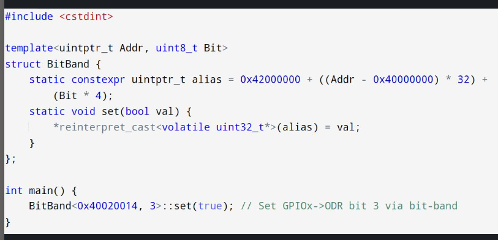

-----

A) What’s the role of static_assert(Bit < 32) here, and how does it improve safety?
B) Could this be extended to allow alternate function modes, pull-ups, or direction config?
C) What happens if a developer writes GpioPin<0x48000014, 35>::set();?
D) Would this generate any code if set() and clear() are not called? Why?
E) How can this be made constexpr safe or even consteval-guarded in C++20+?

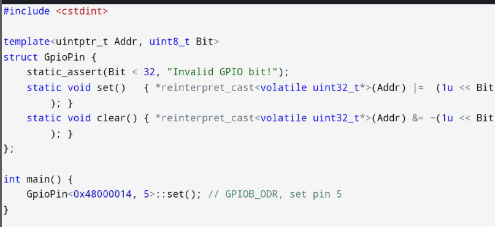

-----

A) What is the purpose of using CRTP (Peripheral<Timer1>) here?
B) Why is this pattern more efficient than virtual functions in embedded systems?
C) What happens if Timer1 forgets to define reg()? Will it compile?
D) How can you use this pattern to implement GPIO, SPI, UART drivers with shared behaviors?
E) Is this pattern compatible with constexpr logic or template metaprogramming for ultra-safe HALs?

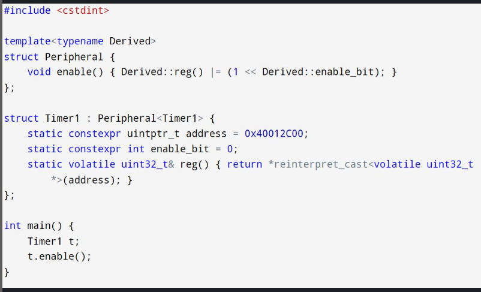

-----

A) What is the purpose of static_assert((Addr & 0x3) == 0) in this context?
B) Why is reg declared constexpr volatile uint32_t&? What does that mean for code generation?
C) Is this approach zero-cost abstraction? Why or why not?
D) What happens if someone tries Register<0x40021001>?
E) Could this pattern be extended to support bitfield manipulation, and how?

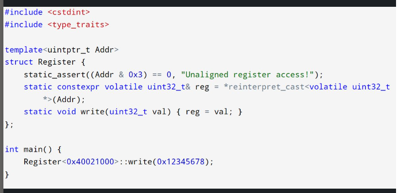
-----

A) What hardware concept is being abstracted here?
B) How does this design allow type-safe access to register bit fields at compile time?
C) What are the risks of using template<uintptr_t, uint32_t> for MMIO access?
D) How would you extend this to allow writing a field with a value, not just a single bit?
E) Would this pattern still be safe in multi-core embedded systems with shared registers?
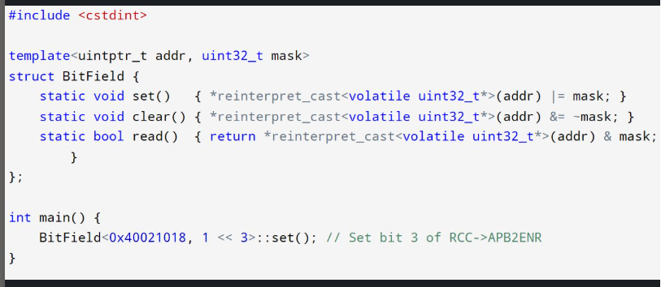

-----
A) What does this code do in an embedded context?
B) Is this approach safe and portable? Why or why not?
C) What are the benefits of using a templated MMIO (memory-mapped I/O) register abstraction like this over traditional macros or raw pointers?
D) What compile-time optimizations might the compiler apply here, and what dangers are introduced if someone accidentally writes to a wrong address?
E) What happens if value() is inlined and used in an ISR (interrupt service routine)? Any special caution?

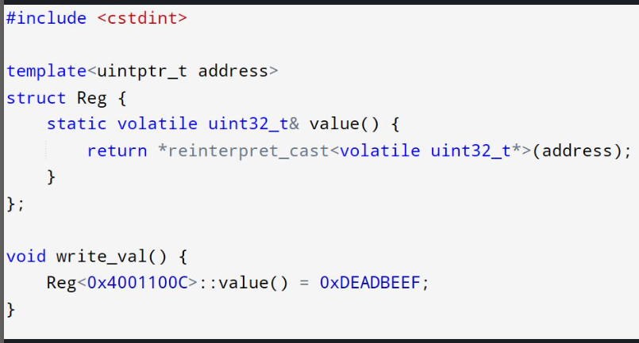
-----

A) What does this code do in the context of embedded systems?
B) Why is REG declared volatile uint8_t* const and not just uint8_t* or volatile uint8_t*?
C) Will the compiler optimize out the register read in read_reg()? Why or why not?
D) Can read_reg() be safely marked constexpr in this case?

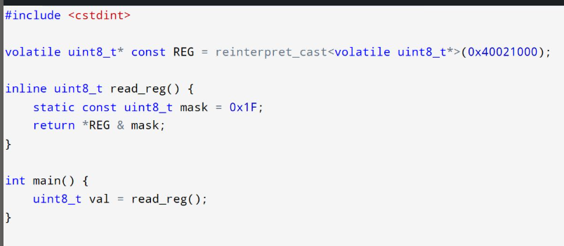
-----

What will this code print and why?
Even though we pass a float, there is no template or overload for float. So which version is chosen, and why doesn't the template get instantiated?

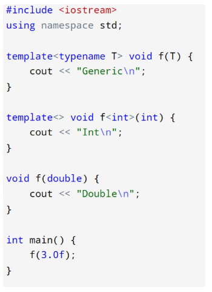

-----

What will be the output of this program and why?
Explain step-by-step how static data members and constructors interact here.

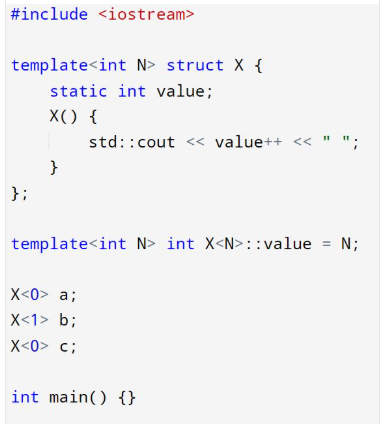

-----

On an STM32-based low-power device, your main loop uses __WFI() to enter sleep until an interrupt occurs.

𝗬𝗼𝘂 𝗻𝗼𝘁𝗶𝗰𝗲 𝘁𝗵𝗮𝘁 𝘁𝗵𝗲 𝘀𝘆𝘀𝘁𝗲𝗺 𝗿𝗮𝗻𝗱𝗼𝗺𝗹𝘆 𝘀𝘁𝗼𝗽𝘀 𝗿𝗲𝘀𝗽𝗼𝗻𝗱𝗶𝗻𝗴 𝗮𝗻𝗱 𝗿𝗲𝗺𝗮𝗶𝗻𝘀 𝗶𝗻 𝘀𝗹𝗲𝗲𝗽 𝗳𝗼𝗿𝗲𝘃𝗲𝗿, 𝗲𝘃𝗲𝗻 𝘁𝗵𝗼𝘂𝗴𝗵 𝗶𝗻𝘁𝗲𝗿𝗿𝘂𝗽𝘁𝘀 𝗮𝗿𝗲 𝗳𝗶𝗿𝗶𝗻𝗴 (𝘃𝗲𝗿𝗶𝗳𝗶𝗲𝗱 𝘃𝗶𝗮 𝘀𝗰𝗼𝗽𝗲). 𝗪𝗵𝗮𝘁'𝘀 𝘁𝗵𝗲 𝗺𝗼𝘀𝘁 𝗹𝗶𝗸𝗲𝗹𝘆 𝗿𝗼𝗼𝘁 𝗰𝗮𝘂𝘀𝗲?

A) __WFI() disables all interrupts, so system cannot wake again.
B) The ISR does not clear the interrupt flag, so the interrupt remains pending but not re-triggered.
C) The main loop does not call __SEV(), so WFI doesn't observe the interrupt.
D) You must write to SCB->SCR before calling __WFI() to unlock sleep functionality.
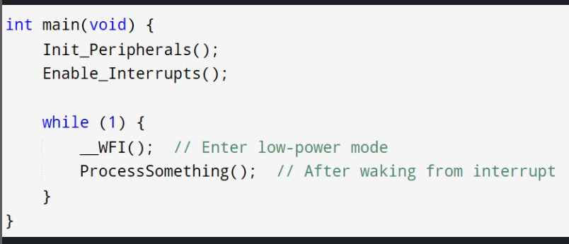
-----
You define a peripheral register map for a device as follows:

𝗕𝘂𝘁 𝘄𝗵𝗲𝗻 𝗰𝗼𝗺𝗽𝗶𝗹𝗲𝗱 𝘄𝗶𝘁𝗵 𝗚𝗖𝗖 𝗳𝗼𝗿 𝗖𝗼𝗿𝘁𝗲𝘅-𝗠𝟰, 𝘁𝗵𝗲 𝘀𝘆𝘀𝘁𝗲𝗺 𝘁𝗿𝗶𝗴𝗴𝗲𝗿𝘀 𝗮 𝗵𝗮𝗿𝗱 𝗳𝗮𝘂𝗹𝘁 𝗱𝘂𝗿𝗶𝗻𝗴 𝗲𝘅𝗲𝗰𝘂𝘁𝗶𝗼𝗻 𝗼𝗳 𝗪𝗿𝗶𝘁𝗲𝗧𝗼𝗣𝗲𝗿𝗶𝗽𝗵𝗲𝗿𝗮𝗹(). 𝗪𝗵𝘆?

A) __attribute__((packed)) causes STATUS and DATA to be misaligned, leading to a bus fault during access.
B) The compiler ignores packed when used with volatile pointers.
C) volatile must be applied to each field in the struct to prevent undefined behavior.
D) CTRL being uint8_t requires padding to align DATA, and without it the pointer becomes null.

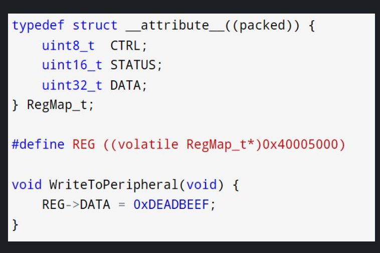
-----

You write the following code for a critical buffer that must retain its value across soft resets (e.g., watchdog-triggered resets).

𝗬𝗼𝘂 𝗱𝗲𝗳𝗶𝗻𝗲 .𝗻𝗼𝗶𝗻𝗶𝘁 𝗶𝗻 𝘆𝗼𝘂𝗿 𝗹𝗶𝗻𝗸𝗲𝗿 𝘀𝗰𝗿𝗶𝗽𝘁 𝘁𝗼 𝗻𝗼𝘁 𝗯𝗲 𝘇𝗲𝗿𝗼𝗲𝗱 𝗼𝗿 𝗰𝗼𝗽𝗶𝗲𝗱 𝗱𝘂𝗿𝗶𝗻𝗴 𝘀𝘁𝗮𝗿𝘁𝘂𝗽, 𝗯𝘂𝘁 𝘆𝗼𝘂 𝗻𝗼𝘁𝗶𝗰𝗲 𝘁𝗵𝗮𝘁 𝗰𝗿𝗶𝘁𝗶𝗰𝗮𝗹_𝗯𝘂𝗳𝗳𝗲𝗿 𝘀𝘁𝗶𝗹𝗹 𝗴𝗲𝘁𝘀 𝘇𝗲𝗿𝗼𝗲𝗱 𝗼𝗻 𝗿𝗲𝘀𝗲𝘁. 𝗪𝗵𝘆?

A) The section(".noinit") is ignored by the compiler and placed in .bss anyway.
B) The startup code calls memset() on the whole RAM, including .noinit.
C) The .noinit section is not excluded from zeroing in the startup assembly (startup.s) file.
D) The reset vector overwrites the RAM, so persistence is impossible across resets.
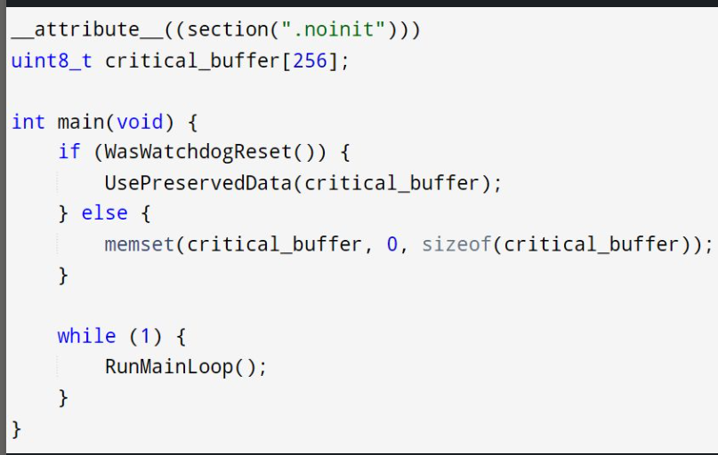
-----
You're working on an STM32H7 (Cortex-M7) system with D-cache enabled. You configure DMA to fill a buffer from a high-speed ADC peripheral.

But 𝗨𝘀𝗲𝗕𝘂𝗳𝗳𝗲𝗿() 𝘀𝗼𝗺𝗲𝘁𝗶𝗺𝗲𝘀 𝗽𝗿𝗼𝗰𝗲𝘀𝘀𝗲𝘀 𝘀𝘁𝗮𝗹𝗲 𝗼𝗿 𝗴𝗮𝗿𝗯𝗮𝗴𝗲 𝘃𝗮𝗹𝘂𝗲𝘀, 𝗲𝘃𝗲𝗻 𝘁𝗵𝗼𝘂𝗴𝗵 𝘁𝗵𝗲 𝗗𝗠𝗔 𝗰𝗼𝗺𝗽𝗹𝗲𝘁𝗲𝘀 𝘀𝘂𝗰𝗰𝗲𝘀𝘀𝗳𝘂𝗹𝗹𝘆. 𝗪𝗵𝗮𝘁 𝗶𝘀 𝘁𝗵𝗲 𝗺𝗼𝘀𝘁 𝗮𝗰𝗰𝘂𝗿𝗮𝘁𝗲 𝗿𝗲𝗮𝘀𝗼𝗻?

A) The DMA is not aligned to a 4-byte boundary, which violates the STM32 memory alignment requirements.
B) adc_buffer is in SRAM2, which is inaccessible by the DMA controller.
C) The D-cache is not coherent with the DMA, so the CPU sees stale data unless explicitly cleaned/invalidated.
D) volatile is missing from adc_buffer, causing stale reads due to compiler optimizations.

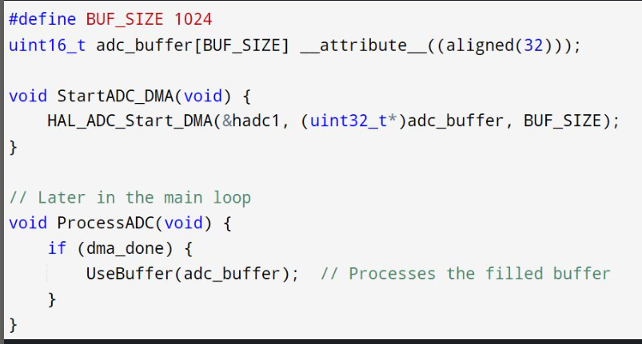

-----

You are debugging a rare system crash on a Cortex-M4 based embedded board. The crash happens randomly under high-frequency sensor interrupts. Here’s the relevant code:

𝗔𝘀𝘀𝘂𝗺𝗲:
🧠 data_sum is read in the main() loop occasionally.
🧠 Interrupts are not disabled during the read or write of data_sum.

𝗪𝗵𝗮𝘁 𝗶𝘀 𝘁𝗵𝗲 𝗺𝗼𝘀𝘁 𝗹𝗶𝗸𝗲𝗹𝘆 𝗰𝗮𝘂𝘀𝗲 𝗼𝗳 𝘁𝗵𝗲 𝗰𝗿𝗮𝘀𝗵 𝗼𝗿 𝘂𝗻𝗲𝘅𝗽𝗲𝗰𝘁𝗲𝗱 𝘃𝗮𝗹𝘂𝗲𝘀 𝗶𝗻 𝗱𝗮𝘁𝗮_𝘀𝘂𝗺?
A) data_sum is not marked const and gets overwritten by optimizer.
B) data_sum is volatile but not static, leading to undefined behavior.
C) The increment operation on data_sum is not atomic, and may be interrupted mid-update.
D) ClearSensorInterrupt() is placed after updating data_sum, which delays ISR completion.

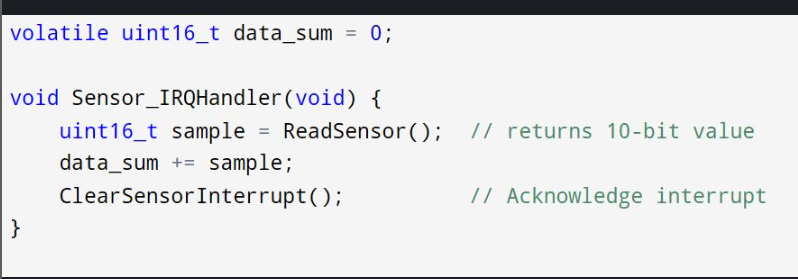

-----

Consider the following code intended to configure a control register mapped to a specific hardware address:

𝗪𝗵𝗮𝘁 𝗶𝘀 𝘁𝗵𝗲 𝗺𝗼𝘀𝘁 𝗱𝗮𝗻𝗴𝗲𝗿𝗼𝘂𝘀 𝗮𝗻𝗱 𝘀𝘂𝗯𝘁𝗹𝗲 𝗯𝘂𝗴 𝘁𝗵𝗮𝘁 𝗰𝗮𝗻 𝗼𝗰𝗰𝘂𝗿 𝘄𝗶𝘁𝗵 𝘁𝗵𝗶𝘀 𝗰𝗼𝗱𝗲 𝗼𝗻 𝗰𝗲𝗿𝘁𝗮𝗶𝗻 𝗲𝗺𝗯𝗲𝗱𝗱𝗲𝗱 𝘀𝘆𝘀𝘁𝗲𝗺𝘀?

A) Bitfield writes may cause a bus fault if the struct is not aligned to 32-bit boundary.
B) Bitfield access might generate a full-byte read-modify-write, corrupting neighboring bits.
C) Bitfield access causes the compiler to optimize out writes to volatile.
D) Bitfields should always be declared as unsigned int, not uint8_t.

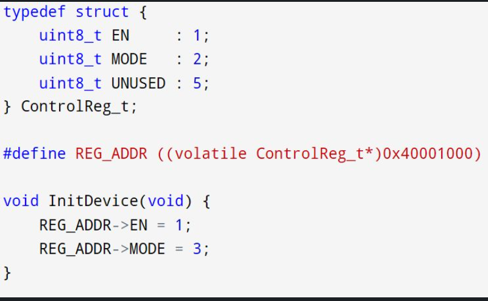

-----
You are working on a bare-metal embedded system (no RTOS, no standard library), and the following code is part of your main application file:

𝗪𝗵𝗮𝘁 𝗶𝘀 𝘁𝗵𝗲 𝗺𝗼𝘀𝘁 𝗮𝗰𝗰𝘂𝗿𝗮𝘁𝗲 𝗿𝗲𝗮𝘀𝗼𝗻 𝘄𝗵𝘆 𝗘𝗿𝗿𝗼𝗿𝗛𝗮𝗻𝗱𝗹𝗲𝗿() 𝗺𝗶𝗴𝗵𝘁 𝗯𝗲 𝗰𝗮𝗹𝗹𝗲𝗱 𝗱𝘂𝗿𝗶𝗻𝗴 𝗻𝗼𝗿𝗺𝗮𝗹 𝗼𝗽𝗲𝗿𝗮𝘁𝗶𝗼𝗻 𝗼𝗻 𝗰𝗲𝗿𝘁𝗮𝗶𝗻 𝘁𝗼𝗼𝗹𝗰𝗵𝗮𝗶𝗻𝘀 𝗼𝗿 𝗰𝗼𝗻𝗳𝗶𝗴𝘂𝗿𝗮𝘁𝗶𝗼𝗻𝘀?

A) buffer1 is not initialized because it resides in the .bss section, which is not cleared at startup.
B) buffer2 is static and thus placed in .data, but .data isn’t initialized without a C library.
C) buffer1 is an automatic variable and its contents are undefined at startup.
D) The startup code must manually clear .bss, or these arrays may retain garbage values on boot.

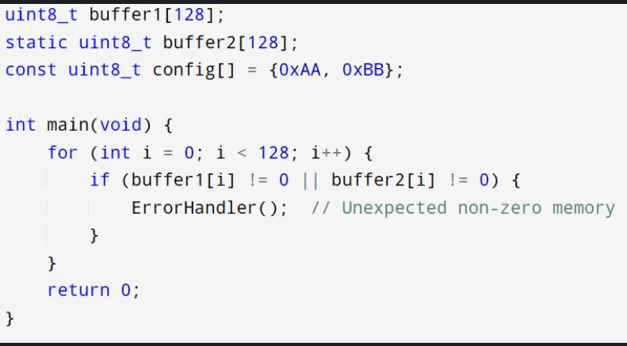
-----

In a safety-critical embedded system with no dynamic memory allocation allowed, consider the following code used in an interrupt handler context:

𝗪𝗵𝗮𝘁 𝗶𝘀 𝘁𝗵𝗲 𝗺𝗼𝘀𝘁 𝗰𝗿𝗶𝘁𝗶𝗰𝗮𝗹 𝗶𝘀𝘀𝘂𝗲 𝗶𝗻 𝘁𝗵𝗲 𝗮𝗯𝗼𝘃𝗲 𝗰𝗼𝗱𝗲 𝗳𝗿𝗼𝗺 𝗮 𝗹𝗼𝘄-𝗹𝗲𝘃𝗲𝗹 𝗲𝗺𝗯𝗲𝗱𝗱𝗲𝗱 𝘀𝘆𝘀𝘁𝗲𝗺𝘀 𝗿𝗲𝗹𝗶𝗮𝗯𝗶𝗹𝗶𝘁𝘆 𝘀𝘁𝗮𝗻𝗱𝗽𝗼𝗶𝗻𝘁?
 A. volatile keyword is unnecessary; it causes inefficient code.
 B. flag may be missed due to race condition between ISR and main loop.
 C. flag = 0; should be placed inside the ISR, not the main loop.
 D. The if (flag) check must be replaced with an atomic compare-and-clear operation.

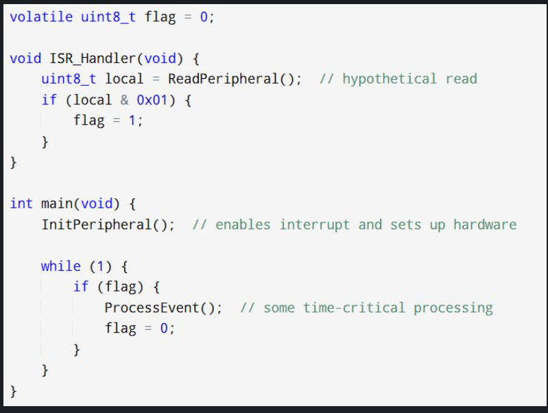

-----

What will this print?
 A) SPI Init
 B) TX: Hello
 C) SPI Init, TX: Hello
 D) Compiler Error

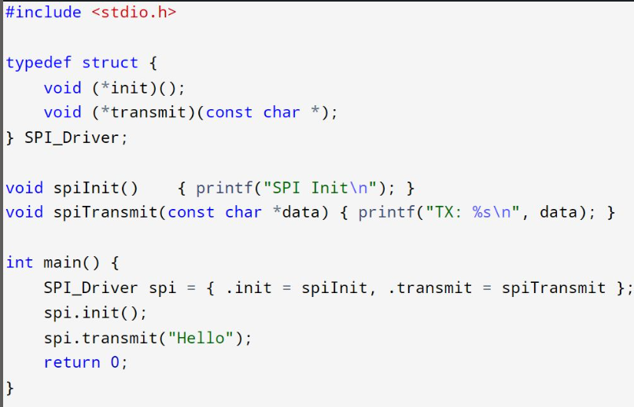

-----

What will this print?
 A) Init
 B) Run
 C) Shutdown
 D) Compiler Error
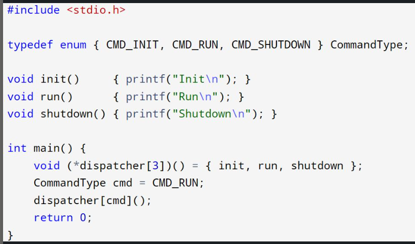

-----
What will this print?
 A) Start Command
 B) Stop Command
 C) 0
 D) Compiler Error

 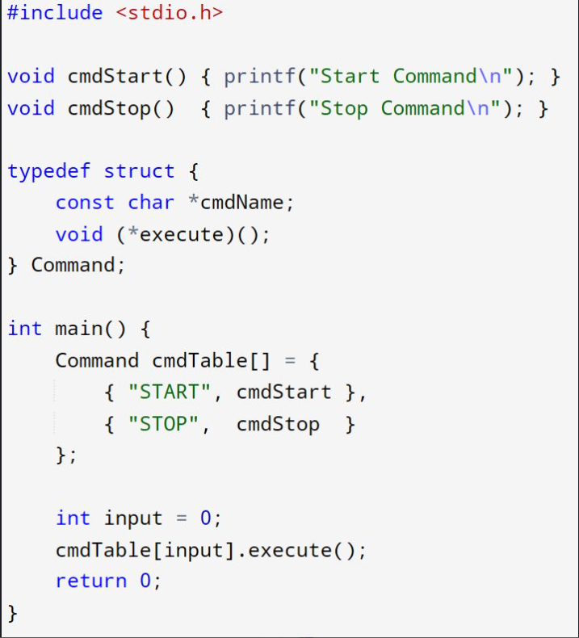

-----

What will this print?
 A) Nothing
 B) Callback
 C) Data Received
 D) Compiler Error

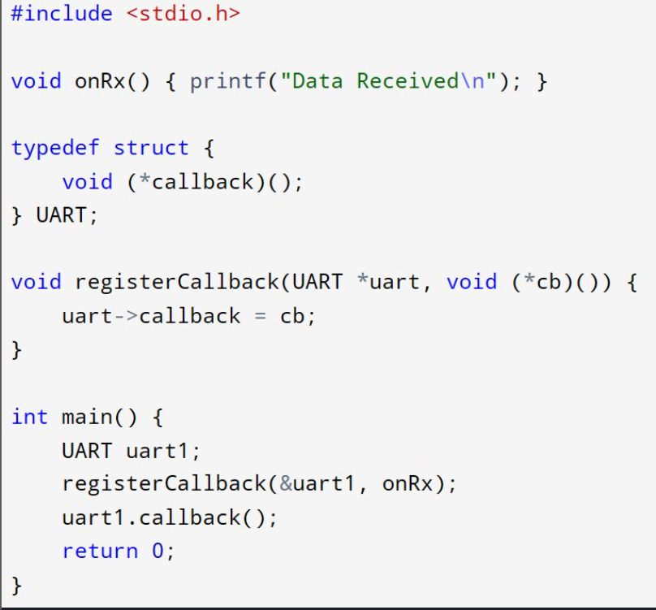
-----

What will this print?
 A) IDLE
 B) ACTIVE
 C) 1
 D) Compiler Error

 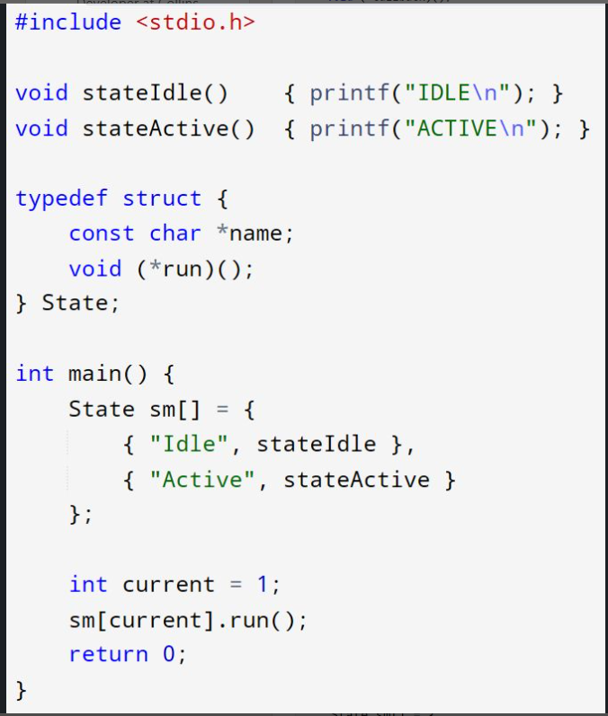

-----
What will this print?
 A) 4
 B) 5
 C) 6
 D) Compiler error

 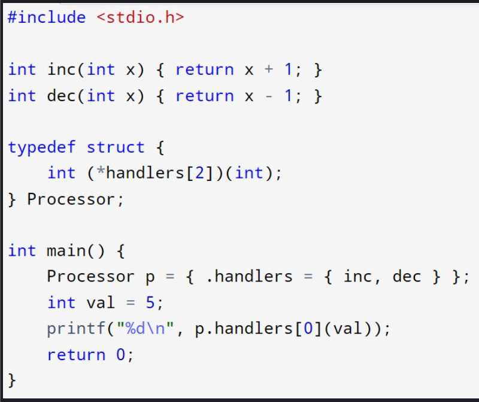

-----

What will this print?
 A) 5
 B) 10
 C) 25
 D) Compiler error

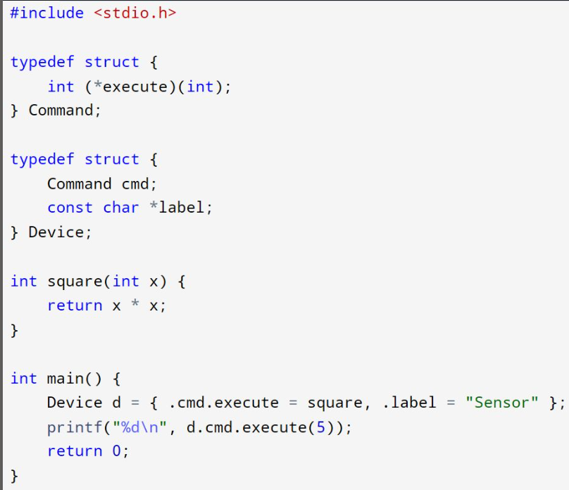

-----
What will this print?
 A) 14
 B) 6
 C) -6
 D) Compiler error

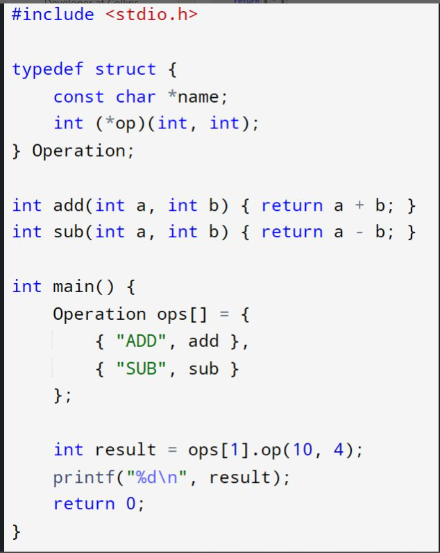
-----
What will this program print?
 A) 7
 B) 14
 C) 101
 D) Compiler error

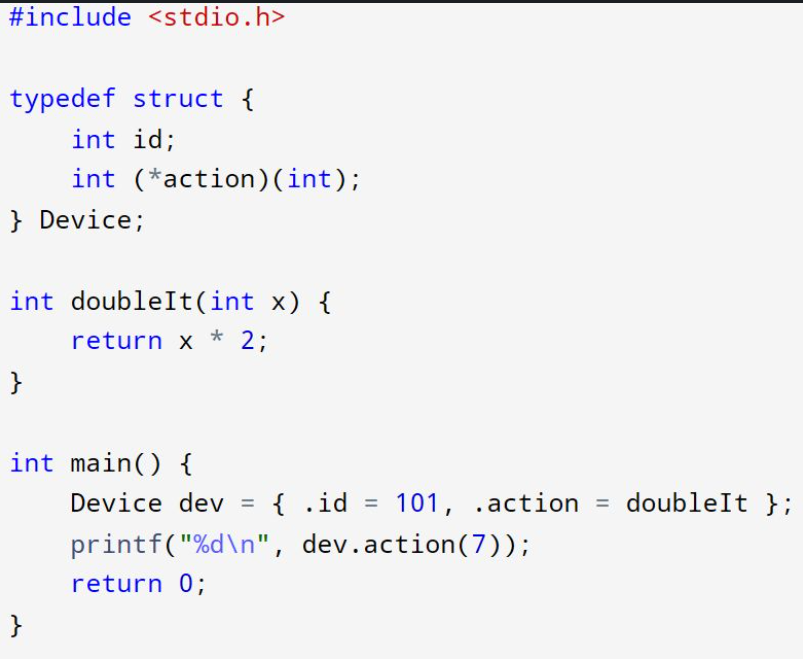
-----
What will print this code?
 A) 6
 B) 12
 C) Compiler Error
 D) Garbage value

 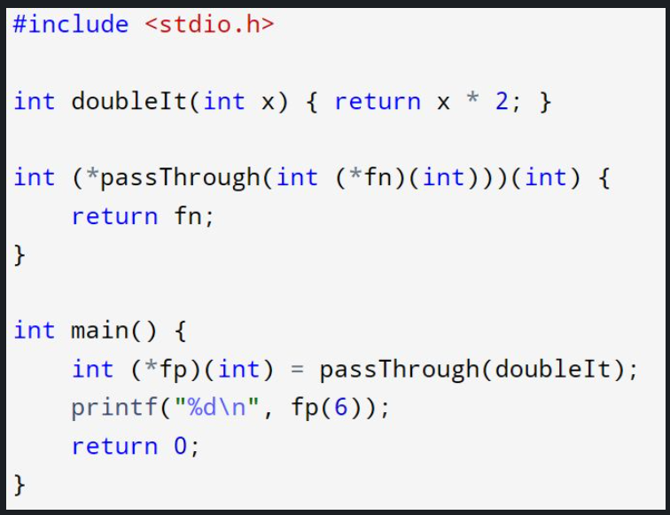

-----

What will this print?
 A) 5
 B) 8
 C) 10
 D) Compiler Error

 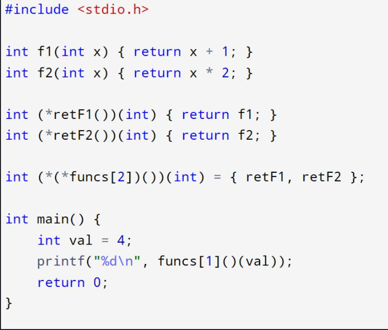

-----

What will this print?
 A) 5
 B) 10
 C) Compiler Error
 D) Segmentation Fault

 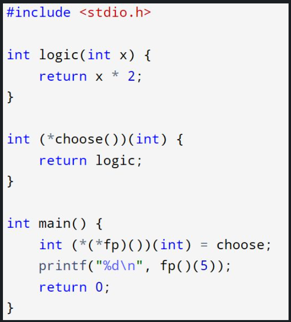

-----

What will this print?
 A) 9
 B) 20
 C) 10
 D) Compiler error

 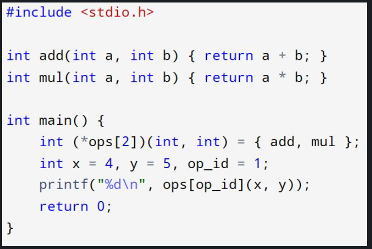

-----

What will this print?
 A) Start
 B) Stop
 C) Reset
 D) Compiler Error

 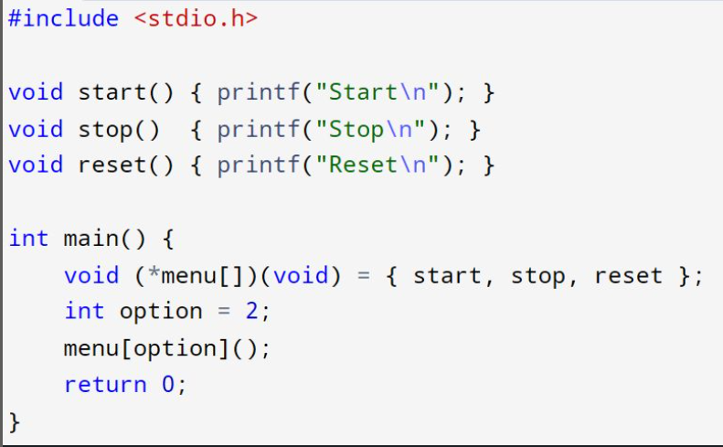

-----

What will this print?
 A) Hi!
 B) Compiler Error
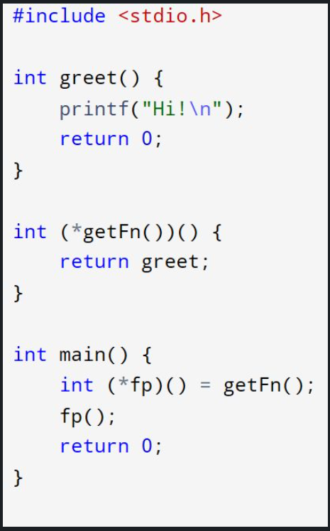

-----

What will this print?
 A) Nothing
 B) Clicked!
 C) Compiler Error
 D) Segmentation Fault

 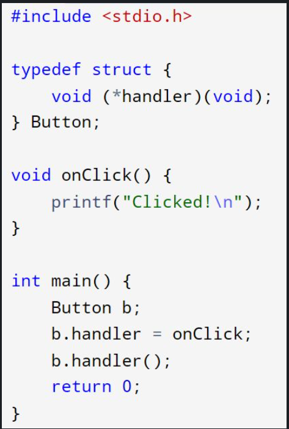
-----
What will this print?
 A) 10
 B) 20
 C) 30
 D) Compiler Error

 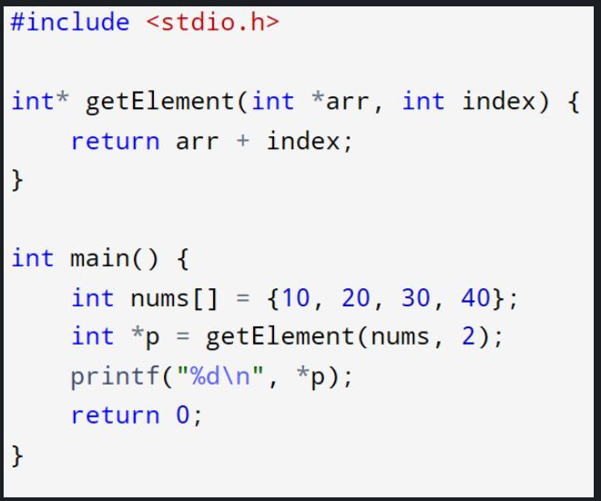

-----

What will this print?
 A) Hi
 B) Bye
 C) Hi, Bye
 D) Compiler Error

 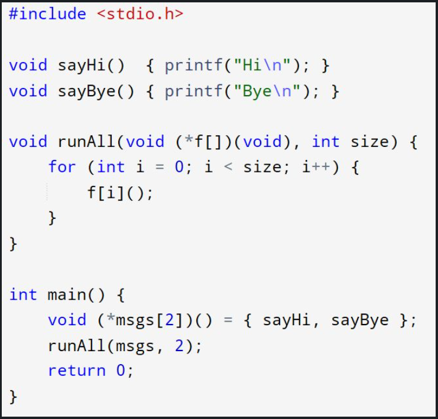

-----
What will this print?
 A) Timer Interrupt
 B) UART Interrupt
 C) Default Handler
 D) Compiler Error
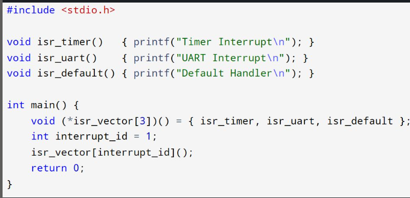

-----
What will this program print?
 A) Nothing
 B) Button Pressed!
 C) Compiler Error
 D) Segmentation Fault

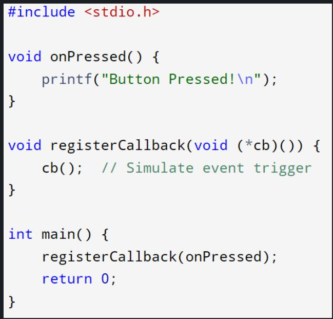

-----
What will this print?
 A) 7
 B) 12
 C) 19
 D) Compiler error
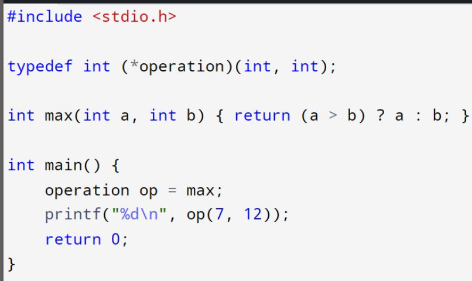

-----
What will this print?
 A) 7
 B) 13
 C) 3
 D) Compiler error

-----
What will this print?
 A) 36
 B) 12
 C) 6
 D) Compiler error


-----
What will this program print?
 A) 7
 B) 12
 C) 34
 D) Compiler error


-----
What will this print?
 A) 0xE3
 B) 0xC3
 C) 0xA3
 D) 0xFF


-----
What will this print?
 A) 3
 B) 4
 C) 5
 D) 6


-----

What will this print?
A) 0xBA
 B) 0xAB
 C) 0xCD
 D) 0x56


-----
What will be printed?
 A) 0x08
 B) 0x80
 C) 0xA8
 D) 0x10

-----
What will this print?
 A) 0x03
 B) 0x02
 C) 0x01
 D) 0x03


-----
What will this print?
 A) 0x15
 B) 0x05
 C) 0x0A
 D) 0x11


-----

What will this print?
 A) 0xB2
 B) 0xBA
 C) 0xAA
 D) 0xA2

 

-----
What will this print?
 A) 8
 B) 4
 C) 12
 D) 0


-----
What will be the output?
A) 1 0
B) 0 1
C) 1 1
D) 0 0


-----
What will this print?
 A) 0xF0
 B) 0x00
 C) 0xFF
 D) 0x0F

-----
What will be printed?
 A) 0x04
 B) 0x05
 C) 0x0A
 D) 0x0F


-----
What will be printed?
 A) 0x66
 B) 0x7E
 C) 0x5A
 D) 0x3C


-----
What will this program print?
 A) 0
 B) UINT_MAX
 C) Undefined behavior
 D) Compiler error


-----
What will this program print?
 A) INT_MIN (usually -2147483648)
 B) INT_MAX
 C) Undefined behavior
 D) Compiler error


-----
What will be printed?
 A) 0x00
 B) 0xF7
 C) 0x7F
 D) 0x77


-----
Assume ISR() is triggered asynchronously (like from a hardware interrupt). What is the purpose of the volatile keyword in this code?
 A) It disables interrupts inside the loop
 B) It prevents optimization of flag == 0 check
 C) It guarantees atomic access to flag
 D) It makes flag read-only from main()

-----
What will this code print?
 A) 6
 B) 7
 C) Undefined behavior
 D) Compiler error


-----

What will this print on a 64-bit system?
 A) 5
 B) 8
 C) 6
 D) 4
 

-----
What is the result when this code runs?
 A) Prints 42
 B) Compiler error
 C) Prints garbage or crashes
 D) Prints 0


-----
What will this program print?
 A) Equal
 B) Not Equal
 C) Compiler error
 D) Undefined behavior


-----
What will be the output?
 A) 1 2 3 1 2
 B) 1 2 3 4 5
 C) 3 2 1 5 4
 D) 1 2 3 3 2

-----
On a typical 32-bit system with default alignment, what will this print?
 A) 1
 B) 2
 C) 4
 D) 8


-----
What is the output?
 A) 5 6
 B) 6 5
 C) Undefined behavior
 D) Compiler error

-----

What will happen when this code is compiled and run?
 A) Prints 30
 B) Prints 20
 C) Compiler error at *ptr = 30;
 D) Compiler error at ptr = &y;

-----
Assuming little-endian architecture (like most x86 systems), what will this print?
 A) A
 B) B
 C) C
 D) D


-----
What will this code print on a 32-bit system?
 A) 1
 B) 2147483648
 C) 0
 D) Undefined behavior


-----

What will print this code and why?

-----

What will print this code?


-----

-----

-----

-----

-----

-----

-----

-----

-----

-----

-----

-----

-----

-----

-----

-----

-----

-----

-----

-----

-----

-----

-----

-----

-----

-----

-----

-----

-----

-----

-----

-----

-----

-----

-----

-----

-----

-----

-----

-----

-----

-----

-----

-----

-----

-----

-----

-----

-----

-----

-----

-----

-----

-----

-----

-----

-----

-----

-----

-----

-----

⏱️ 𝘏𝘢𝘳𝘥𝘸𝘢𝘳𝘦 𝘛𝘪𝘮𝘦𝘳-𝘉𝘢𝘴𝘦𝘥 𝘚𝘤𝘩𝘦𝘥𝘶𝘭𝘪𝘯𝘨 𝘞𝘪𝘵𝘩𝘰𝘶𝘵 𝘙𝘛𝘖𝘚 – 𝘚𝘤𝘢𝘭𝘢𝘣𝘭𝘦 𝘚𝘰𝘧𝘵𝘸𝘢𝘳𝘦 𝘛𝘪𝘮𝘦𝘳𝘴
🔹 𝙎𝙘𝙚𝙣𝙖𝙧𝙞𝙤:
You're developing a bare-metal embedded application and need to implement 10 independent software timers — for things like LED blinking, timeout handling, debounce logic, periodic polling, etc.
 But… you only have one hardware timer, and no RTOS.

⚡ 𝙌𝙪𝙚𝙨𝙩𝙞𝙤𝙣:
👉 How do you build a scalable and efficient multi-timer scheduler using just one hardware timer in bare metal?

🤔 Ever implemented your own scheduler like this?
 💬 Share your improvements, gotchas, or test setup in the comments!

 https://www.linkedin.com/pulse/hardware-timer-based-scheduling-without-rtos-scalable-uttam-basu-enxgc/?trackingId=hqmvdotbFGWlrIf9XyoG9g%3D%3D

-----
🧠 𝘌𝘮𝘣𝘦𝘥𝘥𝘦𝘥 𝘔𝘶𝘭𝘵𝘪-𝘊𝘰𝘳𝘦 𝘚𝘺𝘴𝘵𝘦𝘮 𝘋𝘦𝘴𝘪𝘨𝘯 𝘊𝘩𝘢𝘭𝘭𝘦𝘯𝘨𝘦 – 𝘚𝘢𝘧𝘦 𝘏𝘞 𝘈𝘤𝘤𝘦𝘴𝘴

🔹 𝙎𝙘𝙚𝙣𝙖𝙧𝙞𝙤:
 You’re working on a dual-core microcontroller (e.g., Cortex-M7 + M4) where both cores need access to the same I²C peripheral — say for EEPROM, sensor communication, or PMIC control.

⚡ 𝙌𝙪𝙚𝙨𝙩𝙞𝙤𝙣:
👉 How do you safely virtualize or serialize I²C hardware access between two cores to avoid collisions, race conditions, and bus corruption?

✅ 𝘼𝙣𝙨𝙬𝙚𝙧: Multi-Core Peripheral Arbitration Techniques

🔐 𝟭. 𝙃𝙖𝙧𝙙𝙬𝙖𝙧𝙚-𝙇𝙤𝙘𝙠𝙚𝙙 𝘼𝙘𝙘𝙚𝙨𝙨 (Mutex via SEM/IWDG/IPCC)
Use hardware semaphores (if supported, like STM32H7 HSEM)
Core A locks the peripheral using HSEM->RLR, performs transaction, and then releases
Ensures atomic access — ideal for bare-metal or light RTOS systems

📬 𝟮. 𝙈𝙖𝙨𝙩𝙚𝙧/𝙎𝙡𝙖𝙫𝙚 𝘾𝙤𝙧𝙚 𝙈𝙤𝙙𝙚𝙡
Designate Core A as the master owner of I²C
Core B sends requests via IPC mechanism (e.g., RPMsg, shared memory flag, or interrupt)
Core A serializes I²C access on behalf of both

✅ Advantages:
Centralized state machine
Easier arbitration
Safer for non-reentrant I²C drivers

💡 𝟯. 𝙎𝙤𝙛𝙩𝙬𝙖𝙧𝙚 𝙈𝙪𝙩𝙚𝙭 + 𝙎𝙝𝙖𝙧𝙚𝙙 𝙈𝙚𝙢𝙤𝙧𝙮
Implement a memory-mapped lock variable (e.g., spinlock)
Use atomic test-and-set (LDREX/STREX or exclusive access)
Both cores check and acquire before touching I²C

⚠️ Be cautious:
Needs strong memory barriers (DMB, DSB)
Race conditions may still occur without careful design

📚 𝟰. 𝙈𝙪𝙡𝙩𝙞𝙘𝙤𝙧𝙚 𝙍𝙏𝙊𝙎 𝙎𝙮𝙣𝙘𝙝𝙧𝙤𝙣𝙞𝙯𝙖𝙩𝙞𝙤𝙣
If both cores run an RTOS (e.g., FreeRTOS SMP or Zephyr):
Use inter-core binary semaphores or event groups
Abstract I²C behind a message queue or remote API call

🧠 𝙍𝙚𝙘𝙤𝙢𝙢𝙚𝙣𝙙𝙚𝙙 𝘼𝙥𝙥𝙧𝙤𝙖𝙘𝙝:
✅ If only one core can handle I²C efficiently:
 → Use Core A as gatekeeper, Core B communicates via shared request queue
✅ If both cores must access directly:
 → Use hardware semaphore (HSEM/IPCC) with atomic locks and timeouts

🧪 Test Scenario:
Simulate simultaneous access (e.g., both cores start read/write at boot)
Check for data loss, corrupted ACK/NACK, or bus lockup
Use logic analyzer to observe I²C transaction integrity

👀 Have you dealt with multi-core peripheral sharing in a real-world system?
💬 Drop your method below — or your biggest bug story! 💣

-----

🛠️ 𝙀𝙢𝙗𝙚𝙙𝙙𝙚𝙙 𝙎𝙮𝙨𝙩𝙚𝙢𝙨 𝙄𝙣𝙩𝙚𝙧𝙫𝙞𝙚𝙬 𝘾𝙝𝙖𝙡𝙡𝙚𝙣𝙜𝙚 – 𝙊𝙏𝘼 𝘽𝙤𝙤𝙩𝙡𝙤𝙖𝙙𝙚𝙧 𝘿𝙚𝙨𝙞𝙜𝙣
🔹 𝙎𝙘𝙚𝙣𝙖𝙧𝙞𝙤:
You’re implementing an embedded bootloader with support for Over-the-Air (OTA) firmware updates. The system must be:
🔁 𝙁𝙖𝙞𝙡-𝙨𝙖𝙛𝙚 (no brick on power loss)
🔄 𝘾𝙖𝙥𝙖𝙗𝙡𝙚 𝙤𝙛 𝙧𝙤𝙡𝙡𝙗𝙖𝙘𝙠 to last working image
💾 𝙈𝙞𝙣𝙞𝙢𝙞𝙯𝙞𝙣𝙜 𝙛𝙡𝙖𝙨𝙝 𝙬𝙚𝙖𝙧 for long-term reliability

⚡ 𝙌𝙪𝙚𝙨𝙩𝙞𝙤𝙣:
 👉 𝙃𝙤𝙬 𝙬𝙤𝙪𝙡𝙙 𝙮𝙤𝙪 𝙞𝙢𝙥𝙡𝙚𝙢𝙚𝙣𝙩 𝙖 𝙛𝙖𝙞𝙡-𝙨𝙖𝙛𝙚 𝙛𝙞𝙧𝙢𝙬𝙖𝙧𝙚 𝙪𝙥𝙙𝙖𝙩𝙚 𝙬𝙞𝙩𝙝 𝙧𝙤𝙡𝙡𝙗𝙖𝙘𝙠 𝙖𝙣𝙙 𝙢𝙞𝙣𝙞𝙢𝙖𝙡 𝙛𝙡𝙖𝙨𝙝 𝙬𝙚𝙖𝙧?

✅ 𝘼𝙣𝙨𝙬𝙚𝙧:
𝘿𝙚𝙨𝙞𝙜𝙣𝙞𝙣𝙜 𝙖 𝙁𝙖𝙞𝙡-𝙎𝙖𝙛𝙚 𝙊𝙏𝘼 𝘽𝙤𝙤𝙩𝙡𝙤𝙖𝙙𝙚𝙧 𝙬𝙞𝙩𝙝 𝙍𝙤𝙡𝙡𝙗𝙖𝙘𝙠 & 𝙁𝙡𝙖𝙨𝙝 𝙒𝙚𝙖𝙧 𝙊𝙥𝙩𝙞𝙢𝙞𝙯𝙖𝙩𝙞𝙤𝙣

🔧 𝟭. 𝙁𝙡𝙖𝙨𝙝 𝙇𝙖𝙮𝙤𝙪𝙩 𝙎𝙩𝙧𝙖𝙩𝙚𝙜𝙮
+----------------------------+
|   Bootloader      |
+----------------------------+
|  App Slot A (Active)   |
+----------------------------+
|  App Slot B (OTA Slot)  |
+----------------------------+
|  Metadata / Status    |
+----------------------------+

✅ Use dual slots: A (active), B (update)
✅ Reserve a small metadata section for:
 🟢Slot pointer
 🟢Version info
 🟢CRC/validity flags

📶 𝟮. 𝙊𝙏𝘼 𝙐𝙥𝙙𝙖𝙩𝙚 𝙒𝙤𝙧𝙠𝙛𝙡𝙤𝙬
🆕 Download image to inactive slot (B)
✅ Validate with CRC/SHA checksum
📝 Mark B as "ready to boot" in metadata
🔁 Bootloader boots into B on next reset
🟢 App B must confirm successful run (via GPIO/watchdog)
✅ If healthy → mark B as permanent
🔙 If unhealthy → revert to A, retry/update later

🔐 𝟯. 𝙃𝙖𝙣𝙙𝙡𝙚 𝙋𝙤𝙬𝙚𝙧-𝙇𝙤𝙨𝙨 𝙎𝙖𝙛𝙚𝙩𝙮
Never erase Slot A before verifying Slot B
Metadata updates must be atomic or use dual buffering
Bootloader must always reside in protected flash

📉 𝟰. 𝙈𝙞𝙣𝙞𝙢𝙞𝙯𝙚 𝙁𝙡𝙖𝙨𝙝 𝙒𝙚𝙖𝙧
Use circular metadata buffers
Flip bits only once (1 → 0)
Avoid erasing same sector repeatedly
Consider simple wear leveling

💡 𝘽𝙤𝙣𝙪𝙨: 𝙎𝙚𝙘𝙪𝙧𝙚 𝙊𝙏𝘼
Validate firmware with digital signature (ECDSA)
Store public key in bootloader for verification
Prevent unsigned/malicious firmware from executing

🧠 𝙎𝙪𝙢𝙢𝙖𝙧𝙮 𝘾𝙝𝙚𝙘𝙠𝙡𝙞𝙨𝙩:
✔️ Dual slots (A/B)
 ✔️ CRC & metadata validation
 ✔️ Trial boot logic
 ✔️ Atomic metadata updates
 ✔️ Flash wear awareness
 ✔️ Secure boot optionality

-----

-----

-----

-----
🔹 𝑬𝒎𝒃𝒆𝒅𝒅𝒆𝒅 𝑺𝒚𝒔𝒕𝒆𝒎𝒔 𝑺𝒄𝒆𝒏𝒂𝒓𝒊𝒐 🔹
 You need to ensure reliable communication between multiple nodes over CAN bus.
How would you ensure reliable communication between nodes?

-----

🔹 𝑬𝒎𝒃𝒆𝒅𝒅𝒆𝒅 𝑺𝒚𝒔𝒕𝒆𝒎𝒔 𝑺𝒄𝒆𝒏𝒂𝒓𝒊𝒐 🔹
You have a mechanical pushbutton that generates multiple false triggers due to noise.
What's your preferred method for debouncing a pushbutton in software?

---

🔹 𝑬𝒎𝒃𝒆𝒅𝒅𝒆𝒅 𝑺𝒚𝒔𝒕𝒆𝒎𝒔 𝑺𝒄𝒆𝒏𝒂𝒓𝒊𝒐 🔹
 You're working with a microcontroller without a DMA controller and need to copy a large block of memory quickly.
How would you speed up memory copying without DMA?

---

🔹 𝑬𝒎𝒃𝒆𝒅𝒅𝒆𝒅 𝑺𝒚𝒔𝒕𝒆𝒎𝒔 𝑺𝒄𝒆𝒏𝒂𝒓𝒊𝒐 🔹
 You only have one hardware timer capable of generating PWM signals.
How would you generate two independent PWM signals at different frequencies and duty cycles with just one timer?

---

🔹 Embedded Systems Scenario 🔹
 You're using a 16-bit timer that overflows every 65 ms, but you need to measure much longer durations.
How would you extend the timer to reliably measure long periods without losing precision?

---

