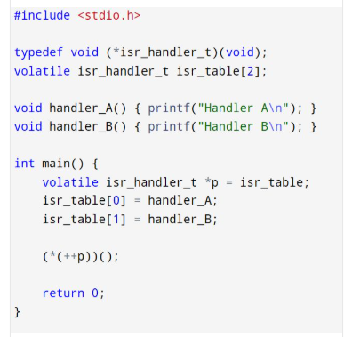
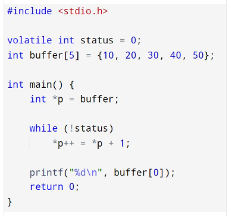

-----

-----

-----

-----

-----

-----

-----

## 🔹 𝑬𝒎𝒃𝒆𝒅𝒅𝒆𝒅 𝑺𝒚𝒔𝒕𝒆𝒎𝒔 𝑪𝒉𝒂𝒍𝒍𝒆𝒏𝒈𝒆 94 🔹
Interrupt Latency in ARM Cortex-M

#### 🔹 𝗦𝗰𝗲𝗻𝗮𝗿𝗶𝗼:
> You need precise interrupt timing.

#### ⚡ 𝗤𝘂𝗲𝘀𝘁𝗶𝗼𝗻:
> What contributes to interrupt latency on Cortex-M?
 How can you minimize it?

-----
## 🔹 𝑬𝒎𝒃𝒆𝒅𝒅𝒆𝒅 𝑺𝒚𝒔𝒕𝒆𝒎𝒔 𝑪𝒉𝒂𝒍𝒍𝒆𝒏𝒈𝒆 93 🔹
Memory Barriers in ARM

#### 🔹 𝗦𝗰𝗲𝗻𝗮𝗿𝗶𝗼:
> You’re doing multi-core shared memory communication.

#### ⚡ 𝗤𝘂𝗲𝘀𝘁𝗶𝗼𝗻:
> What are DMB, DSB, and ISB in ARM?
When and why would you use them?
-----

## 🔹 𝑬𝒎𝒃𝒆𝒅𝒅𝒆𝒅 𝑺𝒚𝒔𝒕𝒆𝒎𝒔 𝑪𝒉𝒂𝒍𝒍𝒆𝒏𝒈𝒆 92 🔹
Thumb vs ARM Mode

#### 🔹 𝗦𝗰𝗲𝗻𝗮𝗿𝗶𝗼:
> You’re debugging code on a Cortex-M4.

#### ⚡ 𝗤𝘂𝗲𝘀𝘁𝗶𝗼𝗻:
> What’s the difference between ARM and Thumb instruction sets?
How does the processor switch between them?

-----
## 🔹 𝑬𝒎𝒃𝒆𝒅𝒅𝒆𝒅 𝑺𝒚𝒔𝒕𝒆𝒎𝒔 𝑪𝒉𝒂𝒍𝒍𝒆𝒏𝒈𝒆 91 🔹
ARM Exception Levels (EL)

#### 🔹 𝗦𝗰𝗲𝗻𝗮𝗿𝗶𝗼:
> You're working with ARMv8-A in a secure application.

#### ⚡ 𝗤𝘂𝗲𝘀𝘁𝗶𝗼𝗻:
> What are the different Exception Levels (EL0–EL3)?
How do they map to OS kernel, user apps, and secure monitors?
-----
## 🔹 𝑬𝒎𝒃𝒆𝒅𝒅𝒆𝒅 𝑺𝒚𝒔𝒕𝒆𝒎𝒔 𝑪𝒉𝒂𝒍𝒍𝒆𝒏𝒈𝒆 90 🔹
Peripheral Access Abstraction

#### 🔹 𝗦𝗰𝗲𝗻𝗮𝗿𝗶𝗼:
> You want to write reusable SPI code across multiple MCUs.

#### ⚡ 𝗤𝘂𝗲𝘀𝘁𝗶𝗼𝗻:
> How do you abstract hardware register access without losing performance?
Would you use function pointers, macros, or CMSIS?

-----
## 🔹 𝑬𝒎𝒃𝒆𝒅𝒅𝒆𝒅 𝑺𝒚𝒔𝒕𝒆𝒎𝒔 𝑪𝒉𝒂𝒍𝒍𝒆𝒏𝒈𝒆 89 🔹
Preemption vs Cooperative Scheduling

#### 🔹 𝗦𝗰𝗲𝗻𝗮𝗿𝗶𝗼:
> Your RTOS supports both cooperative and preemptive models.

#### ⚡ 𝗤𝘂𝗲𝘀𝘁𝗶𝗼𝗻:
> When is cooperative scheduling actually preferable in embedded systems?
-----
## 🔹 𝑬𝒎𝒃𝒆𝒅𝒅𝒆𝒅 𝑺𝒚𝒔𝒕𝒆𝒎𝒔 𝑪𝒉𝒂𝒍𝒍𝒆𝒏𝒈𝒆 88 🔹
RTOS Deadlock Condition

#### 🔹 𝗦𝗰𝗲𝗻𝗮𝗿𝗶𝗼:
> Two tasks wait for each other’s semaphores.

#### ⚡ 𝗤𝘂𝗲𝘀𝘁𝗶𝗼𝗻:
> How would you analyze and fix an RTOS deadlock scenario?
-----
## 🔹 𝑬𝒎𝒃𝒆𝒅𝒅𝒆𝒅 𝑺𝒚𝒔𝒕𝒆𝒎𝒔 𝑪𝒉𝒂𝒍𝒍𝒆𝒏𝒈𝒆 87 🔹
Reducing Firmware Size

#### 🔹 𝗦𝗰𝗲𝗻𝗮𝗿𝗶𝗼:
> Your firmware exceeds flash limit.

#### ⚡ 𝗤𝘂𝗲𝘀𝘁𝗶𝗼𝗻:
> How do you reduce code size in embedded C?
Which compiler flags or techniques help the most?
-----
## 🔹 𝑬𝒎𝒃𝒆𝒅𝒅𝒆𝒅 𝑺𝒚𝒔𝒕𝒆𝒎𝒔 𝑪𝒉𝒂𝒍𝒍𝒆𝒏𝒈𝒆 86 🔹
Checksum vs CRC

#### 🔹 𝗦𝗰𝗲𝗻𝗮𝗿𝗶𝗼:
> You’re verifying Flash integrity after boot.

#### ⚡ 𝗤𝘂𝗲𝘀𝘁𝗶𝗼𝗻:
> Would you use a checksum or CRC?
Why might CRC-16/32 be preferred in embedded apps?
-----

## 🚀 UNDERSTANDING THE BASICS OF RTOS (REAL-TIME OPERATING SYSTEM)

If you're working in embedded systems or planning to, understanding how an RTOS works is essential. It plays a critical role in systems where timing, predictability, and reliability are key.

Here are the core concepts:

🧠 WHAT IS AN RTOS?
A Real-Time Operating System is designed to run applications with precise timing and high reliability. It ensures operations happen in a predictable and timely manner.

🔑 KEY FEATURES OF AN RTOS:
✅ Multitasking with deterministic behavior
✅ Priority-based task scheduling (preemptive or cooperative)
✅ Inter-task communication (semaphores, queues, mailboxes)
✅ Fast interrupt handling
✅ Real-time clocks and timers

🛠 COMMON APPLICATIONS:
🚗 Automotive systems
🏥 Medical devices
🤖 Robotics
🌐 IoT and smart devices
🏭 Industrial automation

📦 POPULAR RTOS OPTIONS:
FreeRTOS
Zephyr
VxWorks
RTEMS
Micrium OS

RTOS enables reliable real-time performance in systems that can't afford delays. If you’re building time-sensitive applications, RTOS knowledge is a must-have.

💬 Are you currently using an RTOS or exploring one? Let’s connect and share your thoughts!

👉 FOLLOW ME for more insights into embedded systems, real-time development, and firmware architecture.
💡 COMMENT BELOW which RTOS topic you'd like me to cover next!

-----
## 🔹 𝑬𝒎𝒃𝒆𝒅𝒅𝒆𝒅 𝑺𝒚𝒔𝒕𝒆𝒎𝒔 𝑪𝒉𝒂𝒍𝒍𝒆𝒏𝒈𝒆 85 🔹
Retargeting printf() to UART

#### 🔹 𝗦𝗰𝗲𝗻𝗮𝗿𝗶𝗼:
> You want to use printf() over UART in a bare-metal app.

#### ⚡ 𝗤𝘂𝗲𝘀𝘁𝗶𝗼𝗻:
> How do you implement _write() and retarget stdout to UART?

-----
## 🔹 𝑬𝒎𝒃𝒆𝒅𝒅𝒆𝒅 𝑺𝒚𝒔𝒕𝒆𝒎𝒔 𝑪𝒉𝒂𝒍𝒍𝒆𝒏𝒈𝒆 84 🔹
Peripheral Clock Gating

#### 🔹 𝗦𝗰𝗲𝗻𝗮𝗿𝗶𝗼:
> You're optimizing power by disabling unused peripherals.

#### ⚡ 𝗤𝘂𝗲𝘀𝘁𝗶𝗼𝗻:
> How do you manage peripheral clock gating in runtime safely?
What could go wrong if you disable a peripheral too early?

-----
## 🔹 𝑬𝒎𝒃𝒆𝒅𝒅𝒆𝒅 𝑺𝒚𝒔𝒕𝒆𝒎𝒔 𝑪𝒉𝒂𝒍𝒍𝒆𝒏𝒈𝒆 83 🔹
Cross-Core Communication (AMP)

#### 🔹 𝗦𝗰𝗲𝗻𝗮𝗿𝗶𝗼:
> Two different MCUs (or cores) share memory.

#### ⚡ 𝗤𝘂𝗲𝘀𝘁𝗶𝗼𝗻:
> How do you build a lock-free mailbox or protocol between cores?
Would you use memory fences or spinlocks?
-----
## 🔹 𝑬𝒎𝒃𝒆𝒅𝒅𝒆𝒅 𝑺𝒚𝒔𝒕𝒆𝒎𝒔 𝑪𝒉𝒂𝒍𝒍𝒆𝒏𝒈𝒆 82 🔹
Memory Leak in Embedded C

#### 🔹 𝗦𝗰𝗲𝗻𝗮𝗿𝗶𝗼:
> Your system slows over time despite no dynamic memory use.

#### ⚡ 𝗤𝘂𝗲𝘀𝘁𝗶𝗼𝗻:
> Can you still have a memory leak?
What causes pseudo-leaks in static/bare-metal systems?
-----
## 🔹 𝑬𝒎𝒃𝒆𝒅𝒅𝒆𝒅 𝑺𝒚𝒔𝒕𝒆𝒎𝒔 𝑪𝒉𝒂𝒍𝒍𝒆𝒏𝒈𝒆 81 🔹
ISR and Main Code Reentrancy

#### 🔹 𝗦𝗰𝗲𝗻𝗮𝗿𝗶𝗼:
> A shared buffer is accessed in both ISR and main.

#### ⚡ 𝗤𝘂𝗲𝘀𝘁𝗶𝗼𝗻:
> How do you make your function reentrant or interrupt-safe?
Would you use __disable_irq() or atomic flags?
-----
## 🔹 𝑬𝒎𝒃𝒆𝒅𝒅𝒆𝒅 𝑺𝒚𝒔𝒕𝒆𝒎𝒔 𝑪𝒉𝒂𝒍𝒍𝒆𝒏𝒈𝒆 80 🔹
Bare-Metal Profiling

#### 🔹 𝗦𝗰𝗲𝗻𝗮𝗿𝗶𝗼:
> You want to measure execution time of functions without affecting performance.

#### ⚡ 𝗤𝘂𝗲𝘀𝘁𝗶𝗼𝗻:
> How would you do cycle-accurate profiling on Cortex-M?
Can you use DWT cycle counter?
-----
## 🔹 𝑬𝒎𝒃𝒆𝒅𝒅𝒆𝒅 𝑺𝒚𝒔𝒕𝒆𝒎𝒔 𝑪𝒉𝒂𝒍𝒍𝒆𝒏𝒈𝒆 79 🔹
RTOS Stack Overflow Detection

#### 🔹 𝗦𝗰𝗲𝗻𝗮𝗿𝗶𝗼:
> A FreeRTOS task causes a system fault.

#### ⚡ 𝗤𝘂𝗲𝘀𝘁𝗶𝗼𝗻:
> How do you detect stack overflows in FreeRTOS?
What config macros and handlers help?
-----
## 🔹 𝑬𝒎𝒃𝒆𝒅𝒅𝒆𝒅 𝑺𝒚𝒔𝒕𝒆𝒎𝒔 𝑪𝒉𝒂𝒍𝒍𝒆𝒏𝒈𝒆 78 🔹
Startup Initialization Order

#### 🔹 𝗦𝗰𝗲𝗻𝗮𝗿𝗶𝗼:
> Your peripherals behave erratically at startup.

#### ⚡ 𝗤𝘂𝗲𝘀𝘁𝗶𝗼𝗻:
> How do you guarantee system initialization order (e.g., clocks → GPIO → peripherals)?
Where do you place critical init code: reset vector, SystemInit(), or main()?
-----
## 🔹 𝑬𝒎𝒃𝒆𝒅𝒅𝒆𝒅 𝑺𝒚𝒔𝒕𝒆𝒎𝒔 𝑪𝒉𝒂𝒍𝒍𝒆𝒏𝒈𝒆 77 🔹
Memory-Mapped FIFO

#### 🔹 𝗦𝗰𝗲𝗻𝗮𝗿𝗶𝗼:
> Your UART has a 16-byte hardware FIFO buffer.

#### ⚡ 𝗤𝘂𝗲𝘀𝘁𝗶𝗼𝗻:
> How do you efficiently read from and refill this buffer in C?
What if it's memory-mapped with no status flags?
-----
## 🔹 𝑬𝒎𝒃𝒆𝒅𝒅𝒆𝒅 𝑺𝒚𝒔𝒕𝒆𝒎𝒔 𝑪𝒉𝒂𝒍𝒍𝒆𝒏𝒈𝒆 76 🔹
Cache Management

#### 🔹 𝗦𝗰𝗲𝗻𝗮𝗿𝗶𝗼:
> Your system uses a Cortex-M7 with instruction/data cache enabled.

#### ⚡ 𝗤𝘂𝗲𝘀𝘁𝗶𝗼𝗻:
> How do you handle DMA memory consistency with the CPU cache?
When should you invalidate or clean the cache?
-----
## 🔹 𝑬𝒎𝒃𝒆𝒅𝒅𝒆𝒅 𝑺𝒚𝒔𝒕𝒆𝒎𝒔 𝑪𝒉𝒂𝒍𝒍𝒆𝒏𝒈𝒆 75 🔹
Measuring Interrupt Jitter

#### 🔹 𝗦𝗰𝗲𝗻𝗮𝗿𝗶𝗼:
> A timer ISR is expected every 100 µs, but there's occasional timing variation.

#### ⚡ 𝗤𝘂𝗲𝘀𝘁𝗶𝗼𝗻:
> How do you measure and analyze interrupt jitter?
What tools or trace methods would you use?

-----

What is a coherent and non-coherent transaction?

-----

## 🔹 𝑬𝒎𝒃𝒆𝒅𝒅𝒆𝒅 𝑺𝒚𝒔𝒕𝒆𝒎𝒔 𝑪𝒉𝒂𝒍𝒍𝒆𝒏𝒈𝒆 74 🔹
RTOS Tick Granularity

#### 🔹 𝗦𝗰𝗲𝗻𝗮𝗿𝗶𝗼:
> FreeRTOS tick rate is set to 1 ms, but a task needs 100 µs resolution.

#### ⚡ 𝗤𝘂𝗲𝘀𝘁𝗶𝗼𝗻:
> How would you implement high-resolution delays or timeouts beyond the tick rate?
-----

## 🔹 𝑬𝒎𝒃𝒆𝒅𝒅𝒆𝒅 𝑺𝒚𝒔𝒕𝒆𝒎𝒔 𝑪𝒉𝒂𝒍𝒍𝒆𝒏𝒈𝒆 73 🔹
Zero-Copy Communication

#### 🔹 𝗦𝗰𝗲𝗻𝗮𝗿𝗶𝗼:
> Data is transferred from peripheral to network stack.

#### ⚡ 𝗤𝘂𝗲𝘀𝘁𝗶𝗼𝗻:
> What is zero-copy buffering?
How do you implement it with DMA and stack layering in C?

-----

## 🔹 𝑬𝒎𝒃𝒆𝒅𝒅𝒆𝒅 𝑺𝒚𝒔𝒕𝒆𝒎𝒔 𝑪𝒉𝒂𝒍𝒍𝒆𝒏𝒈𝒆 72 🔹
Time Synchronization in Distributed Nodes

#### 🔹 𝗦𝗰𝗲𝗻𝗮𝗿𝗶𝗼:
> Multiple microcontrollers need to sample data at the exact same time.

#### ⚡ 𝗤𝘂𝗲𝘀𝘁𝗶𝗼𝗻:
> How do you ensure time synchronization without RTC?
Would you use GPIO pulse, CAN timestamp, or custom protocol?

-----
## 🔹 𝑬𝒎𝒃𝒆𝒅𝒅𝒆𝒅 𝑺𝒚𝒔𝒕𝒆𝒎𝒔 𝑪𝒉𝒂𝒍𝒍𝒆𝒏𝒈𝒆 71 🔹
ECC Memory Handling

#### 🔹 𝗦𝗰𝗲𝗻𝗮𝗿𝗶𝗼:
> Your MCU uses ECC-enabled Flash or RAM.

#### ⚡ 𝗤𝘂𝗲𝘀𝘁𝗶𝗼𝗻:
> What happens during a single-bit error?
How do you detect, correct, and log ECC faults in embedded C?

-----
## 🔹 𝑬𝒎𝒃𝒆𝒅𝒅𝒆𝒅 𝑺𝒚𝒔𝒕𝒆𝒎𝒔 𝑪𝒉𝒂𝒍𝒍𝒆𝒏𝒈𝒆 70 🔹
Boot Time Optimization

#### 🔹 𝗦𝗰𝗲𝗻𝗮𝗿𝗶𝗼:
> You want to reduce system boot-up time.

#### ⚡ 𝗤𝘂𝗲𝘀𝘁𝗶𝗼𝗻:
> Which steps during boot can be parallelized, deferred, or skipped?
Would you load peripherals lazily?

-----
## 🔹 𝑬𝒎𝒃𝒆𝒅𝒅𝒆𝒅 𝑺𝒚𝒔𝒕𝒆𝒎𝒔 𝑪𝒉𝒂𝒍𝒍𝒆𝒏𝒈𝒆 69 🔹
Inter-Task Communication in RTOS

#### 🔹 𝗦𝗰𝗲𝗻𝗮𝗿𝗶𝗼:
> Task A produces data, Task B consumes it.

#### ⚡ 𝗤𝘂𝗲𝘀𝘁𝗶𝗼𝗻:
> Would you use queues, semaphores, or event groups?
What’s the trade-off between efficiency and complexity?
-----
## 🔹 𝑬𝒎𝒃𝒆𝒅𝒅𝒆𝒅 𝑺𝒚𝒔𝒕𝒆𝒎𝒔 𝑪𝒉𝒂𝒍𝒍𝒆𝒏𝒈𝒆 68 🔹
Secure Firmware Update

#### 🔹 𝗦𝗰𝗲𝗻𝗮𝗿𝗶𝗼:
> You support OTA firmware updates.

#### ⚡ 𝗤𝘂𝗲𝘀𝘁𝗶𝗼𝗻:
> How do you validate firmware integrity before executing it?
What’s your approach to rollback on failure?
-----
## 🔹 𝑬𝒎𝒃𝒆𝒅𝒅𝒆𝒅 𝑺𝒚𝒔𝒕𝒆𝒎𝒔 𝑪𝒉𝒂𝒍𝒍𝒆𝒏𝒈𝒆 67 🔹
RTOS Hook Functions

#### 🔹 𝗦𝗰𝗲𝗻𝗮𝗿𝗶𝗼:
> You want to trace task switching and runtime stats.

#### ⚡ 𝗤𝘂𝗲𝘀𝘁𝗶𝗼𝗻:
> How do you use vApplicationIdleHook() or vApplicationTickHook() in FreeRTOS?
What care should be taken when using them?

-----

## 🔹 𝑬𝒎𝒃𝒆𝒅𝒅𝒆𝒅 𝑺𝒚𝒔𝒕𝒆𝒎𝒔 𝑪𝒉𝒂𝒍𝒍𝒆𝒏𝒈𝒆 66 🔹
Atomic Operations Without Locks

#### 🔹 𝗦𝗰𝗲𝗻𝗮𝗿𝗶𝗼:
> A shared flag is modified by ISR and main loop.

#### ⚡ 𝗤𝘂𝗲𝘀𝘁𝗶𝗼𝗻:
> How do you ensure atomicity without disabling interrupts?
 Can you use CMSIS core instructions like __LDREX/__STREX?

-----
## 🔹 𝑬𝒎𝒃𝒆𝒅𝒅𝒆𝒅 𝑺𝒚𝒔𝒕𝒆𝒎𝒔 𝑪𝒉𝒂𝒍𝒍𝒆𝒏𝒈𝒆 65 🔹
Real-Time Logging Strategy

#### 🔹 𝗦𝗰𝗲𝗻𝗮𝗿𝗶𝗼:
> You want to log debug data without affecting timing.

#### ⚡ 𝗤𝘂𝗲𝘀𝘁𝗶𝗼𝗻:
> How do you implement real-time logging?
 Would you use ring buffers, UART DMA, or deferred processing?

-----
## 🔹 𝑬𝒎𝒃𝒆𝒅𝒅𝒆𝒅 𝑺𝒚𝒔𝒕𝒆𝒎𝒔 𝑪𝒉𝒂𝒍𝒍𝒆𝒏𝒈𝒆 64 🔹
Misaligned Memory Access

#### 🔹 𝗦𝗰𝗲𝗻𝗮𝗿𝗶𝗼:
> You copy data using pointer arithmetic.

#### ⚡ 𝗤𝘂𝗲𝘀𝘁𝗶𝗼𝗻:
> What happens on architectures that don’t support unaligned access (e.g., Cortex-M0)?
How do you prevent hard faults due to misalignment?

-----
## 🔹 𝑬𝒎𝒃𝒆𝒅𝒅𝒆𝒅 𝑺𝒚𝒔𝒕𝒆𝒎𝒔 𝑪𝒉𝒂𝒍𝒍𝒆𝒏𝒈𝒆 63 🔹
Dual Buffering for Display

#### 🔹 𝗦𝗰𝗲𝗻𝗮𝗿𝗶𝗼:
> You want to update a graphical display without flickering.

#### ⚡ 𝗤𝘂𝗲𝘀𝘁𝗶𝗼𝗻:
> How do you implement double buffering?
What synchronization is required between frame draw and display refresh?
-----
## 🔹 𝑬𝒎𝒃𝒆𝒅𝒅𝒆𝒅 𝑺𝒚𝒔𝒕𝒆𝒎𝒔 𝑪𝒉𝒂𝒍𝒍𝒆𝒏𝒈𝒆 62 🔹
RTOS Task Stack Sizing

#### 🔹 𝗦𝗰𝗲𝗻𝗮𝗿𝗶𝗼:
> You're deploying multiple tasks on FreeRTOS.

#### ⚡ 𝗤𝘂𝗲𝘀𝘁𝗶𝗼𝗻:
> How do you decide the correct stack size per task?
 What tools or patterns help monitor or prevent stack overflows?
-----
## 🔹 𝑬𝒎𝒃𝒆𝒅𝒅𝒆𝒅 𝑺𝒚𝒔𝒕𝒆𝒎𝒔 𝑪𝒉𝒂𝒍𝒍𝒆𝒏𝒈𝒆 61 🔹
Memory Corruption Debugging

#### 🔹 𝗦𝗰𝗲𝗻𝗮𝗿𝗶𝗼:
> Your system crashes after a buffer is modified.

#### ⚡ 𝗤𝘂𝗲𝘀𝘁𝗶𝗼𝗻:
> How do you trace and debug memory corruption in a bare-metal system?
 Would you use a memory fence or sentinel bytes?
-----
## 🔹 𝑬𝒎𝒃𝒆𝒅𝒅𝒆𝒅 𝑺𝒚𝒔𝒕𝒆𝒎𝒔 𝑪𝒉𝒂𝒍𝒍𝒆𝒏𝒈𝒆 60 🔹
RTOS Priority Inversion

#### 🔹 𝗦𝗰𝗲𝗻𝗮𝗿𝗶𝗼:
> A low-priority task holds a mutex needed by a high-priority task.

#### ⚡ 𝗤𝘂𝗲𝘀𝘁𝗶𝗼𝗻:
> How do you detect and solve priority inversion?
 What is priority inheritance?
-----
## 🔹 𝑬𝒎𝒃𝒆𝒅𝒅𝒆𝒅 𝑺𝒚𝒔𝒕𝒆𝒎𝒔 𝑪𝒉𝒂𝒍𝒍𝒆𝒏𝒈𝒆 59 🔹
Linker Script Placement

#### 🔹 𝗦𝗰𝗲𝗻𝗮𝗿𝗶𝗼:
> You want to store a lookup table in Flash but align it on a specific boundary.

#### ⚡ 𝗤𝘂𝗲𝘀𝘁𝗶𝗼𝗻:
> How do you place that section via a linker script in GCC?
 What does .section, KEEP(), and ALIGN() mean?

-----

## 🔹 𝑬𝒎𝒃𝒆𝒅𝒅𝒆𝒅 𝑺𝒚𝒔𝒕𝒆𝒎𝒔 𝑪𝒉𝒂𝒍𝒍𝒆𝒏𝒈𝒆 58 🔹
DMA Circular Mode for ADC

#### 🔹 𝗦𝗰𝗲𝗻𝗮𝗿𝗶𝗼:
> You continuously sample ADC data with DMA.

#### ⚡ 𝗤𝘂𝗲𝘀𝘁𝗶𝗼𝗻:
> How do you use DMA in circular mode to stream ADC data?
 How do you detect and process half/full buffer transfer events?

-----
## 🔹 𝑬𝒎𝒃𝒆𝒅𝒅𝒆𝒅 𝑺𝒚𝒔𝒕𝒆𝒎𝒔 𝑪𝒉𝒂𝒍𝒍𝒆𝒏𝒈𝒆 57 🔹
Bare-Metal Fault Handler Design

#### 🔹 𝗦𝗰𝗲𝗻𝗮𝗿𝗶𝗼:
> Your microcontroller enters HardFault unexpectedly.

#### ⚡ 𝗤𝘂𝗲𝘀𝘁𝗶𝗼𝗻:
> How would you extract the faulting instruction and CPU state?
 Would you write a custom HardFault_Handler()?

-----
## 🔹 𝑬𝒎𝒃𝒆𝒅𝒅𝒆𝒅 𝑺𝒚𝒔𝒕𝒆𝒎𝒔 𝑪𝒉𝒂𝒍𝒍𝒆𝒏𝒈𝒆 56 🔹
Nested Interrupt Safety

#### 🔹 𝗦𝗰𝗲𝗻𝗮𝗿𝗶𝗼:
> Your MCU supports interrupt nesting.

#### ⚡ 𝗤𝘂𝗲𝘀𝘁𝗶𝗼𝗻:
> How do you enable safe nested interrupts?
 What happens if a high-priority ISR preempts a low-priority one accessing shared data?

-----

## 🔹 𝑬𝒎𝒃𝒆𝒅𝒅𝒆𝒅 𝑺𝒚𝒔𝒕𝒆𝒎𝒔 𝑪𝒉𝒂𝒍𝒍𝒆𝒏𝒈𝒆 55 🔹
RTOS Tickless Mode

#### 🔹 𝗦𝗰𝗲𝗻𝗮𝗿𝗶𝗼:
> You want to minimize power in a system using FreeRTOS.

#### ⚡ 𝗤𝘂𝗲𝘀𝘁𝗶𝗼𝗻:
> What is tickless idle mode in RTOS?
 How does it improve power consumption, and what are the challenges when enabling it?

-----
Can you delete the tail node of a singly linked list in O(1) time if only given a pointer to that node?

-----
## 🔹 𝑬𝒎𝒃𝒆𝒅𝒅𝒆𝒅 𝑺𝒚𝒔𝒕𝒆𝒎𝒔 𝑪𝒉𝒂𝒍𝒍𝒆𝒏𝒈𝒆 54 🔹
Detecting Stack Usage at Runtime

#### 🔹 𝗦𝗰𝗲𝗻𝗮𝗿𝗶𝗼:
> You’re unsure how much stack space your task actually uses.

#### ⚡ 𝗤𝘂𝗲𝘀𝘁𝗶𝗼𝗻:
> How can you track stack usage in a bare-metal environment?
Would you use a canary method or runtime check?

-----

## 🔹 𝑬𝒎𝒃𝒆𝒅𝒅𝒆𝒅 𝑺𝒚𝒔𝒕𝒆𝒎𝒔 𝑪𝒉𝒂𝒍𝒍𝒆𝒏𝒈𝒆 53 🔹
RTOS Context Switching Deep Dive

#### 🔹 𝗦𝗰𝗲𝗻𝗮𝗿𝗶𝗼:
> You’re building or analyzing an RTOS from scratch.

#### ⚡ 𝗤𝘂𝗲𝘀𝘁𝗶𝗼𝗻:
> What is context switching?
How does the RTOS save and restore registers safely across tasks?

-----
## 🔹 𝑬𝒎𝒃𝒆𝒅𝒅𝒆𝒅 𝑺𝒚𝒔𝒕𝒆𝒎𝒔 𝑪𝒉𝒂𝒍𝒍𝒆𝒏𝒈𝒆 52 🔹
Startup Code Debugging

#### 🔹 𝗦𝗰𝗲𝗻𝗮𝗿𝗶𝗼:
> Your microcontroller seems stuck before main() executes.

#### ⚡ 𝗤𝘂𝗲𝘀𝘁𝗶𝗼𝗻:
> How do you debug startup code, vector table, or linker script issues?
What signs indicate a bad memory initialization?

-----

## 🔹 𝑬𝒎𝒃𝒆𝒅𝒅𝒆𝒅 𝑺𝒚𝒔𝒕𝒆𝒎𝒔 𝑪𝒉𝒂𝒍𝒍𝒆𝒏𝒈𝒆 51 🔹
Polling vs Interrupt Tradeoff

#### 🔹 𝗦𝗰𝗲𝗻𝗮𝗿𝗶𝗼:
> You can either poll a flag or handle it via an interrupt.

#### ⚡ 𝗤𝘂𝗲𝘀𝘁𝗶𝗼𝗻:
> When is polling better than interrupts in embedded systems?
What criteria do you use to choose?

-----
## 🔹 𝑬𝒎𝒃𝒆𝒅𝒅𝒆𝒅 𝑺𝒚𝒔𝒕𝒆𝒎𝒔 𝑪𝒉𝒂𝒍𝒍𝒆𝒏𝒈𝒆 50 🔹
Modular Driver Design

#### 🔹 𝗦𝗰𝗲𝗻𝗮𝗿𝗶𝗼:
> You're writing reusable drivers for multiple hardware platforms.

#### ⚡ 𝗤𝘂𝗲𝘀𝘁𝗶𝗼𝗻:
> How would you design your drivers to be hardware-agnostic and testable?
Would you use function pointers or HAL (hardware abstraction layers)?

-----
## 🔹 𝑬𝒎𝒃𝒆𝒅𝒅𝒆𝒅 𝑺𝒚𝒔𝒕𝒆𝒎𝒔 𝑪𝒉𝒂𝒍𝒍𝒆𝒏𝒈𝒆 49 🔹
Interrupt-Driven UART RX Ring Buffer

#### 🔹 𝗦𝗰𝗲𝗻𝗮𝗿𝗶𝗼:
> Your UART RX is interrupt-driven with a ring buffer.

#### ⚡ 𝗤𝘂𝗲𝘀𝘁𝗶𝗼𝗻:
> How do you prevent data overwrite or overflow in high-throughput scenarios?
 How do you synchronize between ISR and main loop?

-----
## 🔹 𝑬𝒎𝒃𝒆𝒅𝒅𝒆𝒅 𝑺𝒚𝒔𝒕𝒆𝒎𝒔 𝑪𝒉𝒂𝒍𝒍𝒆𝒏𝒈𝒆 48 🔹
Bootloader Design

#### 🔹 𝗦𝗰𝗲𝗻𝗮𝗿𝗶𝗼:
> You want to add firmware update capability via UART.

#### ⚡ 𝗤𝘂𝗲𝘀𝘁𝗶𝗼𝗻:
> How would you structure your bootloader and application regions?
How do you ensure atomicity and safety during updates?

-----
## 🔹 𝑬𝒎𝒃𝒆𝒅𝒅𝒆𝒅 𝑺𝒚𝒔𝒕𝒆𝒎𝒔 𝑪𝒉𝒂𝒍𝒍𝒆𝒏𝒈𝒆 47 🔹
Efficient Lookup Table Usage

#### 🔹 𝗦𝗰𝗲𝗻𝗮𝗿𝗶𝗼:
> You need fast access to precomputed math values (e.g., sine or CRC).

#### ⚡ 𝗤𝘂𝗲𝘀𝘁𝗶𝗼𝗻:
> How do you implement and store a lookup table efficiently in C?
 What’s the trade-off between size and speed?

-----

## 🔹 𝑬𝒎𝒃𝒆𝒅𝒅𝒆𝒅 𝑺𝒚𝒔𝒕𝒆𝒎𝒔 𝑪𝒉𝒂𝒍𝒍𝒆𝒏𝒈𝒆 46 🔹
I2C Bus Lockup Recovery

#### 🔹 𝗦𝗰𝗲𝗻𝗮𝗿𝗶𝗼:
> Your I2C bus hangs occasionally due to a slave holding SDA low.

#### ⚡ 𝗤𝘂𝗲𝘀𝘁𝗶𝗼𝗻:
> How can you recover a stuck I2C bus in firmware?
 Would toggling SCL help?

-----

## 🧠 𝘌𝘮𝘣𝘦𝘥𝘥𝘦𝘥 𝘔𝘶𝘭𝘵𝘪-𝘊𝘰𝘳𝘦 𝘚𝘺𝘴𝘵𝘦𝘮 𝘋𝘦𝘴𝘪𝘨𝘯 𝘊𝘩𝘢𝘭𝘭𝘦𝘯𝘨𝘦 – 𝘚𝘢𝘧𝘦 𝘏𝘞 𝘈𝘤𝘤𝘦𝘴𝘴

🔹 𝙎𝙘𝙚𝙣𝙖𝙧𝙞𝙤:
 You’re working on a dual-core microcontroller (e.g., Cortex-M7 + M4) where both cores need access to the same I²C peripheral — say for EEPROM, sensor communication, or PMIC control.

#### ⚡ 𝙌𝙪𝙚𝙨𝙩𝙞𝙤𝙣:
> 👉 How do you safely virtualize or serialize I²C hardware access between two cores to avoid collisions, race conditions, and bus corruption?

✅ 𝘼𝙣𝙨𝙬𝙚𝙧: Multi-Core Peripheral Arbitration Techniques

🔐 𝟭. 𝙃𝙖𝙧𝙙𝙬𝙖𝙧𝙚-𝙇𝙤𝙘𝙠𝙚𝙙 𝘼𝙘𝙘𝙚𝙨𝙨 (Mutex via SEM/IWDG/IPCC)
Use hardware semaphores (if supported, like STM32H7 HSEM)
Core A locks the peripheral using HSEM->RLR, performs transaction, and then releases
Ensures atomic access — ideal for bare-metal or light RTOS systems

📬 𝟮. 𝙈𝙖𝙨𝙩𝙚𝙧/𝙎𝙡𝙖𝙫𝙚 𝘾𝙤𝙧𝙚 𝙈𝙤𝙙𝙚𝙡
Designate Core A as the master owner of I²C
Core B sends requests via IPC mechanism (e.g., RPMsg, shared memory flag, or interrupt)
Core A serializes I²C access on behalf of both

✅ Advantages:
Centralized state machine
Easier arbitration
Safer for non-reentrant I²C drivers

💡 𝟯. 𝙎𝙤𝙛𝙩𝙬𝙖𝙧𝙚 𝙈𝙪𝙩𝙚𝙭 + 𝙎𝙝𝙖𝙧𝙚𝙙 𝙈𝙚𝙢𝙤𝙧𝙮
Implement a memory-mapped lock variable (e.g., spinlock)
Use atomic test-and-set (LDREX/STREX or exclusive access)
Both cores check and acquire before touching I²C

⚠️ Be cautious:
Needs strong memory barriers (DMB, DSB)
Race conditions may still occur without careful design

📚 𝟰. 𝙈𝙪𝙡𝙩𝙞𝙘𝙤𝙧𝙚 𝙍𝙏𝙊𝙎 𝙎𝙮𝙣𝙘𝙝𝙧𝙤𝙣𝙞𝙯𝙖𝙩𝙞𝙤𝙣
If both cores run an RTOS (e.g., FreeRTOS SMP or Zephyr):
Use inter-core binary semaphores or event groups
Abstract I²C behind a message queue or remote API call

🧠 𝙍𝙚𝙘𝙤𝙢𝙢𝙚𝙣𝙙𝙚𝙙 𝘼𝙥𝙥𝙧𝙤𝙖𝙘𝙝:
✅ If only one core can handle I²C efficiently:
 → Use Core A as gatekeeper, Core B communicates via shared request queue
✅ If both cores must access directly:
 → Use hardware semaphore (HSEM/IPCC) with atomic locks and timeouts

🧪 Test Scenario:
Simulate simultaneous access (e.g., both cores start read/write at boot)
Check for data loss, corrupted ACK/NACK, or bus lockup
Use logic analyzer to observe I²C transaction integrity

👀 Have you dealt with multi-core peripheral sharing in a real-world system?
💬 Drop your method below — or your biggest bug story! 💣

-----
## 🛠️ 𝙀𝙢𝙗𝙚𝙙𝙙𝙚𝙙 𝙎𝙮𝙨𝙩𝙚𝙢𝙨 𝙄𝙣𝙩𝙚𝙧𝙫𝙞𝙚𝙬 𝘾𝙝𝙖𝙡𝙡𝙚𝙣𝙜𝙚 – 𝙊𝙏𝘼 𝘽𝙤𝙤𝙩𝙡𝙤𝙖𝙙𝙚𝙧 𝘿𝙚𝙨𝙞𝙜𝙣
🔹 𝙎𝙘𝙚𝙣𝙖𝙧𝙞𝙤:
You’re implementing an embedded bootloader with support for Over-the-Air (OTA) firmware updates. The system must be:
🔁 𝙁𝙖𝙞𝙡-𝙨𝙖𝙛𝙚 (no brick on power loss)
🔄 𝘾𝙖𝙥𝙖𝙗𝙡𝙚 𝙤𝙛 𝙧𝙤𝙡𝙡𝙗𝙖𝙘𝙠 to last working image
💾 𝙈𝙞𝙣𝙞𝙢𝙞𝙯𝙞𝙣𝙜 𝙛𝙡𝙖𝙨𝙝 𝙬𝙚𝙖𝙧 for long-term reliability

#### ⚡ 𝙌𝙪𝙚𝙨𝙩𝙞𝙤𝙣:
 > 👉 𝙃𝙤𝙬 𝙬𝙤𝙪𝙡𝙙 𝙮𝙤𝙪 𝙞𝙢𝙥𝙡𝙚𝙢𝙚𝙣𝙩 𝙖 𝙛𝙖𝙞𝙡-𝙨𝙖𝙛𝙚 𝙛𝙞𝙧𝙢𝙬𝙖𝙧𝙚 𝙪𝙥𝙙𝙖𝙩𝙚 𝙬𝙞𝙩𝙝 𝙧𝙤𝙡𝙡𝙗𝙖𝙘𝙠 𝙖𝙣𝙙 𝙢𝙞𝙣𝙞𝙢𝙖𝙡 𝙛𝙡𝙖𝙨𝙝 𝙬𝙚𝙖𝙧?

✅ 𝘼𝙣𝙨𝙬𝙚𝙧:
𝘿𝙚𝙨𝙞𝙜𝙣𝙞𝙣𝙜 𝙖 𝙁𝙖𝙞𝙡-𝙎𝙖𝙛𝙚 𝙊𝙏𝘼 𝘽𝙤𝙤𝙩𝙡𝙤𝙖𝙙𝙚𝙧 𝙬𝙞𝙩𝙝 𝙍𝙤𝙡𝙡𝙗𝙖𝙘𝙠 & 𝙁𝙡𝙖𝙨𝙝 𝙒𝙚𝙖𝙧 𝙊𝙥𝙩𝙞𝙢𝙞𝙯𝙖𝙩𝙞𝙤𝙣

🔧 𝟭. 𝙁𝙡𝙖𝙨𝙝 𝙇𝙖𝙮𝙤𝙪𝙩 𝙎𝙩𝙧𝙖𝙩𝙚𝙜𝙮
+----------------------------+
|   Bootloader      |
+----------------------------+
|  App Slot A (Active)   |
+----------------------------+
|  App Slot B (OTA Slot)  |
+----------------------------+
|  Metadata / Status    |
+----------------------------+

✅ Use dual slots: A (active), B (update)
✅ Reserve a small metadata section for:
 🟢Slot pointer
 🟢Version info
 🟢CRC/validity flags

📶 𝟮. 𝙊𝙏𝘼 𝙐𝙥𝙙𝙖𝙩𝙚 𝙒𝙤𝙧𝙠𝙛𝙡𝙤𝙬
🆕 Download image to inactive slot (B)
✅ Validate with CRC/SHA checksum
📝 Mark B as "ready to boot" in metadata
🔁 Bootloader boots into B on next reset
🟢 App B must confirm successful run (via GPIO/watchdog)
✅ If healthy → mark B as permanent
🔙 If unhealthy → revert to A, retry/update later

🔐 𝟯. 𝙃𝙖𝙣𝙙𝙡𝙚 𝙋𝙤𝙬𝙚𝙧-𝙇𝙤𝙨𝙨 𝙎𝙖𝙛𝙚𝙩𝙮
Never erase Slot A before verifying Slot B
Metadata updates must be atomic or use dual buffering
Bootloader must always reside in protected flash

📉 𝟰. 𝙈𝙞𝙣𝙞𝙢𝙞𝙯𝙚 𝙁𝙡𝙖𝙨𝙝 𝙒𝙚𝙖𝙧
Use circular metadata buffers
Flip bits only once (1 → 0)
Avoid erasing same sector repeatedly
Consider simple wear leveling

💡 𝘽𝙤𝙣𝙪𝙨: 𝙎𝙚𝙘𝙪𝙧𝙚 𝙊𝙏𝘼
Validate firmware with digital signature (ECDSA)
Store public key in bootloader for verification
Prevent unsigned/malicious firmware from executing

🧠 𝙎𝙪𝙢𝙢𝙖𝙧𝙮 𝘾𝙝𝙚𝙘𝙠𝙡𝙞𝙨𝙩:
✔️ Dual slots (A/B)
 ✔️ CRC & metadata validation
 ✔️ Trial boot logic
 ✔️ Atomic metadata updates
 ✔️ Flash wear awareness
 ✔️ Secure boot optionality

👀 Have you ever implemented a production-grade OTA bootloader?
💬 Share your approach or flash map sketch in the comments!

-----

-----
## 🔹 𝑬𝒎𝒃𝒆𝒅𝒅𝒆𝒅 𝑺𝒚𝒔𝒕𝒆𝒎𝒔 𝑪𝒉𝒂𝒍𝒍𝒆𝒏𝒈𝒆 45 🔹
SPI Driver Implementation

#### 🔹 𝗦𝗰𝗲𝗻𝗮𝗿𝗶𝗼:
> You’re interfacing a microcontroller with a SPI-based sensor.

#### ⚡ 𝗤𝘂𝗲𝘀𝘁𝗶𝗼𝗻:
> How would you write a non-blocking SPI driver in C?
 How do you handle chip-select and buffer overflows?

-----

## 🔹 𝑬𝒎𝒃𝒆𝒅𝒅𝒆𝒅 𝑺𝒚𝒔𝒕𝒆𝒎𝒔 𝑪𝒉𝒂𝒍𝒍𝒆𝒏𝒈𝒆 44 🔹
Interrupt Latency Optimization

#### 🔹 𝗦𝗰𝗲𝗻𝗮𝗿𝗶𝗼:
> A critical ISR must respond in <10 µs.

#### ⚡ 𝗤𝘂𝗲𝘀𝘁𝗶𝗼𝗻:
> What steps would you take to reduce interrupt latency?
How does system design (e.g., nested interrupts, instruction pipeline) affect this?

-----

## 🔹 𝑬𝒎𝒃𝒆𝒅𝒅𝒆𝒅 𝑺𝒚𝒔𝒕𝒆𝒎𝒔 𝑪𝒉𝒂𝒍𝒍𝒆𝒏𝒈𝒆 43 🔹
Stack Overflow in Embedded C

#### 🔹 𝗦𝗰𝗲𝗻𝗮𝗿𝗶𝗼:
> The device resets unpredictably after adding a new feature.

#### ⚡ 𝗤𝘂𝗲𝘀𝘁𝗶𝗼𝗻:
> How can a stack overflow manifest in a bare-metal system?
 What tools or strategies help detect and prevent this?

-----

## 🔹 𝑬𝒎𝒃𝒆𝒅𝒅𝒆𝒅 𝑺𝒚𝒔𝒕𝒆𝒎𝒔 𝑪𝒉𝒂𝒍𝒍𝒆𝒏𝒈𝒆 42 🔹
Memory-Mapped Register Access

#### 🔹 𝗦𝗰𝗲𝗻𝗮𝗿𝗶𝗼:
> You're accessing a register using a pointer to a fixed memory address.

#### ⚡ 𝗤𝘂𝗲𝘀𝘁𝗶𝗼𝗻:
> How do you define a register in C using a pointer?
 Why is volatile critical here?

-----

## 🔹 𝑬𝒎𝒃𝒆𝒅𝒅𝒆𝒅 𝑺𝒚𝒔𝒕𝒆𝒎𝒔 𝑪𝒉𝒂𝒍𝒍𝒆𝒏𝒈𝒆 41 🔹
GPIO Debounce Logic with Timers

#### 🔹 𝗦𝗰𝗲𝗻𝗮𝗿𝗶𝗼:
> You’re using a timer peripheral to debounce mechanical buttons.

#### ⚡ 𝗤𝘂𝗲𝘀𝘁𝗶𝗼𝗻:
> How do you structure your code so the button logic isn’t impacted by noisy edges?
 What debounce timeout is commonly effective?

-----
No 40 
-----

## 🔹 𝑬𝒎𝒃𝒆𝒅𝒅𝒆𝒅 𝑺𝒚𝒔𝒕𝒆𝒎𝒔 𝑪𝒉𝒂𝒍𝒍𝒆𝒏𝒈𝒆 39 🔹
Watchdog Misuse

#### 🔹 𝗦𝗰𝗲𝗻𝗮𝗿𝗶𝗼:
> Your system occasionally resets even when functioning correctly.

#### ⚡ 𝗤𝘂𝗲𝘀𝘁𝗶𝗼𝗻:
> Could this be a watchdog issue?
How do you design watchdog logic to detect real faults vs false positives?

-----

## 🔹 𝑬𝒎𝒃𝒆𝒅𝒅𝒆𝒅 𝑺𝒚𝒔𝒕𝒆𝒎𝒔 𝑪𝒉𝒂𝒍𝒍𝒆𝒏𝒈𝒆 38 🔹
Bare-Metal Task Scheduling

#### 🔹 𝗦𝗰𝗲𝗻𝗮𝗿𝗶𝗼:
> You’re not using an RTOS. You need to run multiple time-sensitive tasks.

#### ⚡ 𝗤𝘂𝗲𝘀𝘁𝗶𝗼𝗻:
> How would you build a simple cooperative task scheduler in C?
What limitations should be considered?

-----

## 🔹 𝑬𝒎𝒃𝒆𝒅𝒅𝒆𝒅 𝑺𝒚𝒔𝒕𝒆𝒎𝒔 𝑪𝒉𝒂𝒍𝒍𝒆𝒏𝒈𝒆 37 🔹

#### 🔹 𝗦𝗰𝗲𝗻𝗮𝗿𝗶𝗼:
> A global flag is written in an ISR and read in the main loop.

#### ⚡ 𝗤𝘂𝗲𝘀𝘁𝗶𝗼𝗻:
> How can this simple scenario lead to a race condition?
 How do you make this communication safe?
-----
## 🔹 𝑬𝒎𝒃𝒆𝒅𝒅𝒆𝒅 𝑺𝒚𝒔𝒕𝒆𝒎𝒔 𝑪𝒉𝒂𝒍𝒍𝒆𝒏𝒈𝒆 36 🔹

#### 🔹 𝗦𝗰𝗲𝗻𝗮𝗿𝗶𝗼:
> You’re writing an interrupt service routine for a UART receive event.

#### ⚡ 𝗤𝘂𝗲𝘀𝘁𝗶𝗼𝗻:
> What should you avoid doing inside an ISR?
 What design patterns help keep ISRs short and safe?

-----

## 🔹 𝑬𝒎𝒃𝒆𝒅𝒅𝒆𝒅 𝑺𝒚𝒔𝒕𝒆𝒎𝒔 𝑪𝒉𝒂𝒍𝒍𝒆𝒏𝒈𝒆 35 🔹

#### 🔹 𝗦𝗰𝗲𝗻𝗮𝗿𝗶𝗼:
> You need to control and access multiple 1-bit hardware flags (e.g., 8 digital IOs).

#### ⚡ 𝗤𝘂𝗲𝘀𝘁𝗶𝗼𝗻:
> Would you use bitfields or bitmasks?
What are the pros and cons of each approach in terms of portability, performance, and compiler behavior?

-----

## 🔹 𝑬𝒎𝒃𝒆𝒅𝒅𝒆𝒅 𝑺𝒚𝒔𝒕𝒆𝒎𝒔 𝑪𝒉𝒂𝒍𝒍𝒆𝒏𝒈𝒆 34 🔹

#### 🔹  𝗦𝗰𝗲𝗻𝗮𝗿𝗶𝗼:
 > You’re reading a hardware register (e.g., GPIO, ADC result) inside a loop.

#### ⚡ 𝗤𝘂𝗲𝘀𝘁𝗶𝗼𝗻:
 > Why should the pointer to that register be declared volatile?
 What issues arise if volatile is omitted in embedded systems?

-----

## 🔧 𝗘𝗺𝗯𝗲𝗱𝗱𝗲𝗱 𝗣𝘂𝘇𝘇𝗹𝗲 𝗼𝗳 𝘁𝗵𝗲 𝗪𝗲𝗲𝗸 — 𝗢𝗻𝗹𝘆 𝗳𝗼𝗿 𝗘𝗻𝗴𝗶𝗻𝗲𝗲𝗿𝘀 𝗪𝗵𝗼 𝗦𝗽𝗲𝗮𝗸 𝗖 𝗙𝗹𝘂𝗲𝗻𝘁𝗹𝘆! 💥
Can you trace exactly what this code does? 👀👇

💡 𝗤𝘂𝗲𝘀𝘁𝗶𝗼𝗻:
 𝗪𝗵𝗮𝘁 𝘄𝗶𝗹𝗹 𝘁𝗵𝗶𝘀 𝗰𝗼𝗱𝗲 𝗼𝘂𝘁𝗽𝘂𝘁 — 𝗮𝗻𝗱 𝘄𝗵𝘆?
 A) Handler A
 B) Handler B
 C) Crashes at runtime
 D) Compiler error due to volatile

🧠 𝗧𝗵𝗶𝘀 𝗽𝘂𝘇𝘇𝗹𝗲 𝘁𝗼𝘂𝗰𝗵𝗲𝘀 𝗼𝗻:
💥 Arrays of volatile function pointers (ISR tables, anyone?)
💥 Pointer arithmetic and operator precedence
💥 Subtle dereference + function call syntax
💥 Real-world embedded concepts (think: startup code, vector tables)

✅ Follow Uttam Basu for daily challenges based on real bugs, deep system design, and embedded engineering war stories.

💬 Drop your answer below — and explain why, not just what!

-----
## 🚨 𝗘𝗺𝗯𝗲𝗱𝗱𝗲𝗱 𝗘𝗻𝗴𝗶𝗻𝗲𝗲𝗿𝘀 — 𝗖𝗮𝗻 𝗬𝗼𝘂 𝗦𝗽𝗼𝘁 𝘁𝗵𝗲 𝗧𝗿𝗮𝗽?
🧠 𝘃𝗼𝗹𝗮𝘁𝗶𝗹𝗲 + 𝗣𝗼𝗶𝗻𝘁𝗲𝗿𝘀 + 𝗛𝗮𝗿𝗱𝘄𝗮𝗿𝗲-𝗹𝗶𝗸𝗲 𝗕𝗲𝗵𝗮𝘃𝗶𝗼𝗿 🔍

⚠️ Assume status is updated by an external hardware interrupt.

📌 𝗤𝘂𝗲𝘀𝘁𝗶𝗼𝗻:
What will this code print when status is eventually set to 1 by hardware?
Why is volatile used here?
What happens if the compiler optimizes too aggressively?
What could go wrong on high-speed microcontrollers or with instruction pipelining?

💬 Real Embedded Insight:
This is the kind of trap that causes random failures in production — and it doesn’t show up in simulation. 😬

👇 Comment with your analysis and reasoning.
 Think beyond just the output — think real hardware.
 Follow me (Uttam Basu) if you're serious about embedded mastery.

-----

## 🔹 𝑬𝒎𝒃𝒆𝒅𝒅𝒆𝒅 𝑺𝒚𝒔𝒕𝒆𝒎𝒔 𝑪𝒉𝒂𝒍𝒍𝒆𝒏𝒈𝒆 33 🔹
You need to transfer large blocks of sensor data from peripheral to RAM without CPU involvement to free up processing time.

𝑯𝒆𝒓𝒆'𝒔 𝒕𝒉𝒆 𝒔𝒊𝒕𝒖𝒂𝒕𝒊𝒐𝒏:
▶️ The system should continue running while data transfer happens in the background.

𝑻𝒉𝒆 𝒄𝒉𝒂𝒍𝒍𝒆𝒏𝒈𝒆:
#### ⚡ How would you configure and use DMA in C for efficient data transfer?
> How would you ensure data consistency during and after transfer?
Would you use interrupt-driven DMA completion or polling?
How would you manage multi-buffering for continuous data streams?

Let’s talk about DMA best practices! 👇

-----
## 🔹 𝑬𝒎𝒃𝒆𝒅𝒅𝒆𝒅 𝑺𝒚𝒔𝒕𝒆𝒎𝒔 𝑪𝒉𝒂𝒍𝒍𝒆𝒏𝒈𝒆 32 🔹
You are writing firmware for a complex device with multiple modes (e.g., idle, active, error handling, shutdown).

𝑯𝒆𝒓𝒆'𝒔 𝒕𝒉𝒆 𝒔𝒊𝒕𝒖𝒂𝒕𝒊𝒐𝒏:
▶️ You want the code to be modular, scalable, and easy to debug.

𝑻𝒉𝒆 𝒄𝒉𝒂𝒍𝒍𝒆𝒏𝒈𝒆:
#### ⚡ How would you design and implement a clean state machine architecture in C?
> Would you use function pointers, switch-cases, or lookup tables?
How would you manage transitions and unexpected events?
How would you keep it testable and modular for future expansion?

Let’s dive into state machine design! 👇

-----

## 🔹 𝑬𝒎𝒃𝒆𝒅𝒅𝒆𝒅 𝑺𝒚𝒔𝒕𝒆𝒎𝒔 𝑪𝒉𝒂𝒍𝒍𝒆𝒏𝒈𝒆 31 🔹
You need to implement a non-blocking communication buffer between your microcontroller and a serial device.

𝑯𝒆𝒓𝒆'𝒔 𝒕𝒉𝒆 𝒔𝒊𝒕𝒖𝒂𝒕𝒊𝒐𝒏:
▶️ Incoming data can arrive at any time, and you must handle it efficiently without losing any bytes.

𝑻𝒉𝒆 𝒄𝒉𝒂𝒍𝒍𝒆𝒏𝒈𝒆:

#### ⚡ How would you implement a circular (ring) buffer in C?
> How would you handle buffer overflow?
How would you make it thread-safe if interrupts or multiple tasks are involved?
How would you implement peek, pop, and push operations efficiently?

Let’s talk about buffer management! 👇

-----
## 🔹 𝑬𝒎𝒃𝒆𝒅𝒅𝒆𝒅 𝑺𝒚𝒔𝒕𝒆𝒎𝒔 𝑪𝒉𝒂𝒍𝒍𝒆𝒏𝒈𝒆 30 🔹
You are designing a battery-powered IoT device that must survive as long as possible on limited energy.

𝑯𝒆𝒓𝒆'𝒔 𝒕𝒉𝒆 𝒔𝒊𝒕𝒖𝒂𝒕𝒊𝒐𝒏:
▶️ The device should wake up periodically (every 10 minutes), collect sensor data, transmit it, and go back to sleep.

𝑻𝒉𝒆 𝒄𝒉𝒂𝒍𝒍𝒆𝒏𝒈𝒆:
#### ⚡ How would you manage low power modes in C?
> Would you use deep sleep or stop modes?
How would you manage wake-up sources (e.g., RTC alarm, external interrupt)?
What key steps would you take to minimize active time and maximize sleep time?

Let’s explore low-power embedded design! 👇

-----
## 🔹 𝑬𝒎𝒃𝒆𝒅𝒅𝒆𝒅 𝑺𝒚𝒔𝒕𝒆𝒎𝒔 𝑪𝒉𝒂𝒍𝒍𝒆𝒏𝒈𝒆 29 🔹
You are dealing with mechanical buttons which are noisy (they "bounce") when pressed or released.

𝑯𝒆𝒓𝒆'𝒔 𝒕𝒉𝒆 𝒔𝒊𝒕𝒖𝒂𝒕𝒊𝒐𝒏:
 ▶️ You need to implement button debounce purely in software without using hardware filters.

𝑻𝒉𝒆 𝒄𝒉𝒂𝒍𝒍𝒆𝒏𝒈𝒆:
#### ⚡ How would you implement a reliable debounce algorithm in C?
> Would you use timer-based filtering or state machines?
How would you tune debounce timing for different types of buttons?
How would you design for both press and release detection?

Let's talk about button debouncing strategies!

-----
## 🔹 𝑬𝒎𝒃𝒆𝒅𝒅𝒆𝒅 𝑺𝒚𝒔𝒕𝒆𝒎𝒔 𝑪𝒉𝒂𝒍𝒍𝒆𝒏𝒈𝒆 28 🔹
Imagine your system has multiple interrupt sources (e.g., UART, Timer, ADC), and all can trigger around the same time.

𝑯𝒆𝒓𝒆'𝒔 𝒕𝒉𝒆 𝒔𝒊𝒕𝒖𝒂𝒕𝒊𝒐𝒏:
 ▶️ UART interrupt must be serviced within 1 ms, Timer within 5 ms, and ADC within 10 ms.

𝑻𝒉𝒆 𝒄𝒉𝒂𝒍𝒍𝒆𝒏𝒈𝒆:
#### ⚡ How would you prioritize and manage these interrupts in C?
> Would you use nested interrupts?
How would you prevent interrupt starvation?
How do you decide which ISR should be preempted and which should not?

Let’s discuss interrupt handling and prioritization!

-----

## 🔹 𝑬𝒎𝒃𝒆𝒅𝒅𝒆𝒅 𝑺𝒚𝒔𝒕𝒆𝒎𝒔 𝑪𝒉𝒂𝒍𝒍𝒆𝒏𝒈𝒆 27 🔹
You’re interfacing with an RTC module to keep track of time in your embedded system, and you need to implement accurate timekeeping for the system.

𝑯𝒆𝒓𝒆'𝒔 𝒕𝒉𝒆 𝒔𝒊𝒕𝒖𝒂𝒕𝒊𝒐𝒏:
▶️ The RTC needs to be synchronized with the system clock and set the current time during startup, then update every second.

𝑻𝒉𝒆 𝒄𝒉𝒂𝒍𝒍𝒆𝒏𝒈𝒆:
#### ⚡ How would you implement the RTC interface in C?
> What protocol would you use (e.g., I2C, SPI)?
How would you sync the RTC with the system time?
How would you handle time rollover and leap years?

Let’s talk about RTC interfacing! 👇

-----

## 🔹 𝑬𝒎𝒃𝒆𝒅𝒅𝒆𝒅 𝑺𝒚𝒔𝒕𝒆𝒎𝒔 𝑪𝒉𝒂𝒍𝒍𝒆𝒏𝒈𝒆 26 🔹
You need to implement a watchdog timer to prevent the system from getting stuck in an infinite loop or crash.

𝑯𝒆𝒓𝒆'𝒔 𝒕𝒉𝒆 𝒔𝒊𝒕𝒖𝒂𝒕𝒊𝒐𝒏:
▶️ The system should reset itself if it’s stuck in an error state for more than 2 seconds, but during normal operation, it should continually reset the watchdog to keep the system running.

𝑻𝒉𝒆 𝒄𝒉𝒂𝒍𝒍𝒆𝒏𝒈𝒆:
#### ⚡ How would you implement the watchdog timer in C?
> How would you set up and reset the watchdog timer in the code?
What strategies would you use to ensure the system resets gracefully in case of failure?
How would you avoid false resets while keeping the watchdog active?

Let’s talk about watchdog timers! 👇

-----

## 🔹 𝑬𝒎𝒃𝒆𝒅𝒅𝒆𝒅 𝑺𝒚𝒔𝒕𝒆𝒎𝒔 𝑪𝒉𝒂𝒍𝒍𝒆𝒏𝒈𝒆 25 🔹
You need to implement CRC to check for data integrity in a system where communication between devices is error-prone.

𝑯𝒆𝒓𝒆'𝒔 𝒕𝒉𝒆 𝒔𝒊𝒕𝒖𝒂𝒕𝒊𝒐𝒏:
▶️ You have to compute the CRC32 checksum of a block of data to detect errors before transmission.

𝑻𝒉𝒆 𝒄𝒉𝒂𝒍𝒍𝒆𝒏𝒈𝒆:
#### ⚡ How would you implement the CRC32 algorithm in C?
> What steps would you follow to compute the CRC?
Would you optimize the algorithm for speed or memory usage?
How would you handle polynomial selection and lookup tables for efficient calculation?

Let’s discuss CRC implementation in embedded systems! 👇

-----
## 🔹 𝑬𝒎𝒃𝒆𝒅𝒅𝒆𝒅 𝑺𝒚𝒔𝒕𝒆𝒎𝒔 𝑪𝒉𝒂𝒍𝒍𝒆𝒏𝒈𝒆 24 🔹
You need to pack multiple smaller data values (e.g., 4-bit) into a single 32-bit word for storage or transmission to optimize bandwidth or memory usage.

𝑯𝒆𝒓𝒆'𝒔 𝒕𝒉𝒆 𝒔𝒊𝒕𝒖𝒂𝒕𝒊𝒐𝒏:
▶️ You have 8 sensors, each returning an 4-bit value, and you want to store them in a single 32-bit word.

𝑻𝒉𝒆 𝒄𝒉𝒂𝒍𝒍𝒆𝒏𝒈𝒆:
#### ⚡ How would you pack these sensor values into a single 32-bit word using bitwise > operations?
What bitwise operators would you use (e.g., shift, OR)?
How would you unpack the 32-bit word back into individual sensor values?
What considerations would you have for endianness when transmitting or storing the packed data?

Let’s talk about data packing and unpacking! 👇

-----
## 🔹 𝑬𝒎𝒃𝒆𝒅𝒅𝒆𝒅 𝑺𝒚𝒔𝒕𝒆𝒎𝒔 𝑪𝒉𝒂𝒍𝒍𝒆𝒏𝒈𝒆 23 🔹
You are developing a time-sensitive application on a microcontroller where accurate timing is crucial, and you have no access to an RTOS.

𝑯𝒆𝒓𝒆'𝒔 𝒕𝒉𝒆 𝒔𝒊𝒕𝒖𝒂𝒕𝒊𝒐𝒏:
▶️ You need to implement a 1 ms delay using a delay loop, but you need to ensure the delay is as accurate as possible, without using hardware timers or interrupts.

𝑻𝒉𝒆 𝒄𝒉𝒂𝒍𝒍𝒆𝒏𝒈𝒆:
#### ⚡ How would you implement a precise delay loop in C?
> How would you calculate the exact number of iterations required for 1 ms?
What are the limitations of using a delay loop, and how would you mitigate them?
How would you ensure that the delay remains accurate across different compiler optimizations?

Let’s talk about timing without hardware! 👇
-----
## 🔹 𝑬𝒎𝒃𝒆𝒅𝒅𝒆𝒅 𝑺𝒚𝒔𝒕𝒆𝒎𝒔 𝑪𝒉𝒂𝒍𝒍𝒆𝒏𝒈𝒆 22 🔹
Imagine you’re working with an embedded system without an operating system (bare-metal). You need to manage memory for multiple buffers used for different tasks.

𝑯𝒆𝒓𝒆'𝒔 𝒕𝒉𝒆 𝒔𝒊𝒕𝒖𝒂𝒕𝒊𝒐𝒏:
▶️ You need to allocate and deallocate memory for buffers dynamically, ensuring efficient memory usage without any memory leaks or fragmentation.

𝑻𝒉𝒆 𝒄𝒉𝒂𝒍𝒍𝒆𝒏𝒈𝒆:
#### ⚡ How would you implement dynamic memory allocation without an OS?
> Would you use a simple heap or memory pool?
How would you avoid fragmentation?
What strategies would you use to efficiently manage the memory in a bare-metal environment?

Let’s talk about manual memory management in embedded systems! 👇

---

## 🔹 𝑬𝒎𝒃𝒆𝒅𝒅𝒆𝒅 𝑺𝒚𝒔𝒕𝒆𝒎𝒔 𝑪𝒉𝒂𝒍𝒍𝒆𝒏𝒈𝒆 21 🔹
You are working with a microcontroller that lacks a floating-point unit (FPU), and you need to perform some real-time mathematical calculations.

𝑯𝒆𝒓𝒆'𝒔 𝒕𝒉𝒆 𝒔𝒊𝒕𝒖𝒂𝒕𝒊𝒐𝒏:
 ▶️ You need to calculate multiplications and divisions of numbers with decimal points, such as (5.75 × 3.2), but using only integers.

𝑻𝒉𝒆 𝒄𝒉𝒂𝒍𝒍𝒆𝒏𝒈𝒆:
#### ⚡ How would you implement fixed-point arithmetic in C for this scenario?
> What data structure or algorithm would you use?
How would you handle precision loss in the calculations?
How would you optimize for performance on a resource-constrained system?

Let’s discuss fixed-point arithmetic in embedded systems! 👇

-----
## 🔹 𝑬𝒎𝒃𝒆𝒅𝒅𝒆𝒅 𝑺𝒚𝒔𝒕𝒆𝒎𝒔 𝑪𝒉𝒂𝒍𝒍𝒆𝒏𝒈𝒆 20 🔹
You need to control multiple GPIO pins for a project using bit manipulation, and you have a register that controls 8 pins.

𝑯𝒆𝒓𝒆'𝒔 𝒕𝒉𝒆 𝒔𝒊𝒕𝒖𝒂𝒕𝒊𝒐𝒏:
 ▶️ You need to set pins 0, 2, 4, and 7 to high and pins 1, 3, 5, and 6 to low using bit manipulation in C.

𝑻𝒉𝒆 𝒄𝒉𝒂𝒍𝒍𝒆𝒏𝒈𝒆:
 #### ⚡ How would you manipulate the register bits to achieve this configuration?
> What C techniques would you use to set and clear individual bits?
How would you ensure portability across different architectures?

Let’s talk bit manipulation! 👇

-----

## 🔹 𝑬𝒎𝒃𝒆𝒅𝒅𝒆𝒅 𝑺𝒚𝒔𝒕𝒆𝒎𝒔 𝑪𝒉𝒂𝒍𝒍𝒆𝒏𝒈𝒆 19 🔹
You’re working with a battery-powered embedded system and need to minimize power consumption while maintaining functionality.

𝑯𝒆𝒓𝒆'𝒔 𝒕𝒉𝒆 𝒔𝒊𝒕𝒖𝒂𝒕𝒊𝒐𝒏:
 ▶️ The system needs to wake up on an interrupt, process data, and return to sleep mode. The current challenge is ensuring that the power consumption remains as low as possible during sleep mode.

𝑻𝒉𝒆 𝒄𝒉𝒂𝒍𝒍𝒆𝒏𝒈𝒆:
#### ⚡ How would you implement low-power sleep modes in C?
> How would you configure the microcontroller’s sleep modes?
What is the most efficient way to wake up from interrupts while minimizing power usage?
How would you optimize peripherals like ADC, timers, and UART to work in low-power mode?

Let’s discuss low-power strategies! 👇

-----

## 🔹 𝑬𝒎𝒃𝒆𝒅𝒅𝒆𝒅 𝑺𝒚𝒔𝒕𝒆𝒎𝒔 𝑪𝒉𝒂𝒍𝒍𝒆𝒏𝒈𝒆 18 🔹
You are tasked with implementing a bootloader for a microcontroller to support firmware updates.

𝑯𝒆𝒓𝒆'𝒔 𝒕𝒉𝒆 𝒔𝒊𝒕𝒖𝒂𝒕𝒊𝒐𝒏:
 ▶️ The system should check for the latest firmware update on startup. If an update is found, it should flash the new firmware to the system.

𝑻𝒉𝒆 𝒄𝒉𝒂𝒍𝒍𝒆𝒏𝒈𝒆:
#### ⚡ How would you design the bootloader in C to perform a safe firmware update?
> How would you check for an update on startup?
How would you handle integrity checks (e.g., checksum, CRC) of the firmware?
What strategies would you use to prevent bricking the system in case of an update failure?

Let’s dive into bootloader design! 👇

-----

## 🔹 𝑬𝒎𝒃𝒆𝒅𝒅𝒆𝒅 𝑺𝒚𝒔𝒕𝒆𝒎𝒔 𝑪𝒉𝒂𝒍𝒍𝒆𝒏𝒈𝒆 17 🔹
You have a DMA controller available in your microcontroller. Your task is to move data from one memory location to another without CPU involvement.

𝑯𝒆𝒓𝒆'𝒔 𝒕𝒉𝒆 𝒔𝒊𝒕𝒖𝒂𝒕𝒊𝒐𝒏:
 ▶️ The data size is large (e.g., 1 MB) and the transfer needs to happen as efficiently as possible.

𝑻𝒉𝒆 𝒄𝒉𝒂𝒍𝒍𝒆𝒏𝒈𝒆:
#### ⚡ How would you set up and control the DMA transfer?
> How would you configure the DMA controller for the transfer?
What considerations would you take into account for data integrity and completion notification?
How would you prevent data corruption in case of errors?

Let’s discuss DMA transfer techniques! 👇
-----

## 🔹 𝑬𝒎𝒃𝒆𝒅𝒅𝒆𝒅 𝑺𝒚𝒔𝒕𝒆𝒎𝒔 𝑪𝒉𝒂𝒍𝒍𝒆𝒏𝒈𝒆 16 🔹
You need to implement a real-time scheduling algorithm for multiple tasks, each with different periodicities, on a microcontroller using C.

𝑯𝒆𝒓𝒆'𝒔 𝒕𝒉𝒆 𝒔𝒊𝒕𝒖𝒂𝒕𝒊𝒐𝒏:
 ▶️ Task 1: Needs to run every 10 ms (high priority)
 ▶️ Task 2: Needs to run every 50 ms (low priority)
 ▶️ Task 3: Needs to run every 100 ms (medium priority)

𝑻𝒉𝒆 𝒄𝒉𝒂𝒍𝒍𝒆𝒏𝒈𝒆:
 #### ⚡ How would you implement an efficient real-time task scheduler in C?
> What data structure would you use?
How would you ensure that the highest priority tasks are executed on time?
How do you handle task synchronization?

Let’s talk real-time scheduling! 👇

-----

## 🔹 𝑬𝒎𝒃𝒆𝒅𝒅𝒆𝒅 𝑺𝒚𝒔𝒕𝒆𝒎𝒔 𝑪𝒉𝒂𝒍𝒍𝒆𝒏𝒈𝒆 15 🔹
You are working on a system with limited RAM (e.g., 256 KB) and need to implement a circular buffer for UART communication.

𝑯𝒆𝒓𝒆'𝒔 𝒕𝒉𝒆 𝒔𝒊𝒕𝒖𝒂𝒕𝒊𝒐𝒏:
▶️ You need to store incoming data from the UART port, process it in real-time, and make sure the system doesn’t run out of memory.

𝑻𝒉𝒆 𝒄𝒉𝒂𝒍𝒍𝒆𝒏𝒈𝒆:
#### ⚡ How would you implement a circular buffer efficiently?
> What data structure would you use for optimal memory usage?
How would you ensure no data loss when the buffer is full?
How would you prevent memory fragmentation?

Let’s discuss buffer management in embedded systems! 👇

-----

## 🔹 𝑬𝒎𝒃𝒆𝒅𝒅𝒆𝒅 𝑺𝒚𝒔𝒕𝒆𝒎𝒔 𝑪𝒉𝒂𝒍𝒍𝒆𝒏𝒈𝒆 14 🔹
You have a microcontroller with limited resources, and you're handling interrupts for multiple peripherals such as a timer, UART, and GPIO.

𝑯𝒆𝒓𝒆'𝒔 𝒕𝒉𝒆 𝒔𝒊𝒕𝒖𝒂𝒕𝒊𝒐𝒏:
 ▶️ You need to ensure quick response times for the timer interrupt but also handle other interrupts without missing data.

𝑻𝒉𝒆 𝒄𝒉𝒂𝒍𝒍𝒆𝒏𝒈𝒆:
 #### ⚡ What techniques would you use to efficiently handle interrupts in a > resource-constrained environment?
Nested interrupts?
Interrupt service routine (ISR) optimization?
Is there a way to minimize interrupt latency?

Let’s hear your interrupt handling strategies! 👇

-----
## 🔹 𝑬𝒎𝒃𝒆𝒅𝒅𝒆𝒅 𝑺𝒚𝒔𝒕𝒆𝒎𝒔 𝑪𝒉𝒂𝒍𝒍𝒆𝒏𝒈𝒆 13 🔹
Imagine you're working with a high-speed ADC on an embedded system, where you need to sample multiple analog channels at different rates. The microcontroller doesn't have a DMA controller.

𝑯𝒆𝒓𝒆'𝒔 𝒕𝒉𝒆 𝒔𝒊𝒕𝒖𝒂𝒕𝒊𝒐𝒏:
 ▶️ Channel 1: Samples every 10 ms
 ▶️ Channel 2: Samples every 50 ms
 ▶️ Channel 3: Samples every 100 ms

𝑻𝒉𝒆 𝒄𝒉𝒂𝒍𝒍𝒆𝒏𝒈𝒆:
 #### ⚡ How would you implement a highly efficient ADC sampling system without DMA?
> Use a combination of software and interrupts?
Optimize interrupt priority and ADC conversion time?
How would you implement channel multiplexing to minimize the sampling time for each channel?

Let’s discuss ADC optimization! 👇

-----

## 🔹 𝑬𝒎𝒃𝒆𝒅𝒅𝒆𝒅 𝑺𝒚𝒔𝒕𝒆𝒎𝒔 𝑪𝒉𝒂𝒍𝒍𝒆𝒏𝒈𝒆 12 🔹
Imagine you're working with a multi-core processor in an embedded system.
 Your application requires high performance, and you need to utilize both cores effectively.

𝑯𝒆𝒓𝒆'𝒔 𝒕𝒉𝒆 𝒔𝒊𝒕𝒖𝒂𝒕𝒊𝒐𝒏:
 ▶️ Core 1 is handling time-sensitive tasks (sensor readings, ADC sampling, real-time control loops).
 ▶️ Core 2 is handling non-time-critical tasks (data processing, communication, logging).

𝑻𝒉𝒆 𝒄𝒉𝒂𝒍𝒍𝒆𝒏𝒈𝒆:
 🚀 How would you design the software to take full advantage of both cores?
Task partitioning strategy?
How would you handle inter-core communication?
Use of memory consistency protocols (cache coherency)?
How would you manage synchronization and avoid race conditions?

Let’s discuss multi-core optimization! 👇

-----
## 🔹 𝑬𝒎𝒃𝒆𝒅𝒅𝒆𝒅 𝑺𝒚𝒔𝒕𝒆𝒎𝒔 𝑪𝒉𝒂𝒍𝒍𝒆𝒏𝒈𝒆 11 🔹
Imagine you're working with CAN bus communication in a distributed embedded system.
 You need to implement reliable data transmission between multiple nodes.

𝑯𝒆𝒓𝒆'𝒔 𝒕𝒉𝒆 𝒔𝒊𝒕𝒖𝒂𝒕𝒊𝒐𝒏:
 ▶️ Node 1 is sending sensor data to Node 2 every 100 ms.
 ▶️ Node 2 needs to acknowledge the received data before sending a command to Node 3.
 ▶️ Node 3 needs to send a response to Node 1 within 50 ms.

𝑻𝒉𝒆 𝒄𝒉𝒂𝒍𝒍𝒆𝒏𝒈𝒆:
 #### ⚡ How would you design the CAN bus communication to meet the timing constraints?
> Use CAN filters to minimize data collisions?
Prioritize messages using CAN IDs?
How would you handle message acknowledgment and retries?

Let’s talk CAN bus strategies! 👇

-----

## 🔹 𝑬𝒎𝒃𝒆𝒅𝒅𝒆𝒅 𝑺𝒚𝒔𝒕𝒆𝒎𝒔 𝑪𝒉𝒂𝒍𝒍𝒆𝒏𝒈𝒆 10 🔹
Imagine you're working with an RTOS (Real-Time Operating System) on a microcontroller.
 You have to manage five different tasks with varying priorities.

𝑯𝒆𝒓𝒆'𝒔 𝒕𝒉𝒆 𝒔𝒊𝒕𝒖𝒂𝒕𝒊𝒐𝒏:
 ▶️ Task 1: High priority, needs to run every 50 ms
 ▶️ Task 2: Medium priority, needs to run every 100 ms
 ▶️ Task 3: Low priority, needs to run every 500 ms
 ▶️ Task 4: Low priority, needs to run every 1 second
 ▶️ Task 5: High priority, needs to run every 200 ms

𝑻𝒉𝒆 𝒄𝒉𝒂𝒍𝒍𝒆𝒏𝒈𝒆:
 🧠 How would you design the scheduling strategy?
Preemptive or cooperative scheduling?
How would you avoid task starvation?
How would you balance the task execution time?

Let’s hear your thoughts on RTOS task management! 👇

-----

## 🔹 𝑬𝒎𝒃𝒆𝒅𝒅𝒆𝒅 𝑺𝒚𝒔𝒕𝒆𝒎𝒔 𝑪𝒉𝒂𝒍𝒍𝒆𝒏𝒈𝒆 9 🔹
Imagine your system uses:
 🔘 A simple pushbutton connected to a GPIO pin.

𝑯𝒆𝒓𝒆'𝒔 𝒕𝒉𝒆 𝒔𝒊𝒕𝒖𝒂𝒕𝒊𝒐𝒏:
 ▶️ Due to mechanical noise, the button generates multiple false triggers during a single press.

𝑻𝒉𝒆 𝒄𝒉𝒂𝒍𝒍𝒆𝒏𝒈𝒆:
 🛡️ How would you implement a reliable software debounce strategy?
Simple delay after first edge?
State machine approach?
Timer-based validation?
What’s your favorite debounce method? 👇

-----
## 🔹 𝑬𝒎𝒃𝒆𝒅𝒅𝒆𝒅 𝑺𝒚𝒔𝒕𝒆𝒎𝒔 𝑪𝒉𝒂𝒍𝒍𝒆𝒏𝒈𝒆 8 🔹
Imagine you are working on a microcontroller without a DMA controller.
 📚 You need to copy a large block of memory (e.g., a frame buffer) from one region to another very fast.

𝑯𝒆𝒓𝒆'𝒔 𝒕𝒉𝒆 𝒔𝒊𝒕𝒖𝒂𝒕𝒊𝒐𝒏:
 ▶️ The CPU must handle the memory transfer directly.

𝑻𝒉𝒆 𝒄𝒉𝒂𝒍𝒍𝒆𝒏𝒈𝒆:
 🚀 What techniques would you use to speed up memory copying without DMA?
Word-aligned access?
Loop unrolling?
Assembly optimization?

Drop your performance tips! 👇

-----

🔹𝑬𝒎𝒃𝒆𝒅𝒅𝒆𝒅 𝑺𝒚𝒔𝒕𝒆𝒎𝒔 𝑪𝒉𝒂𝒍𝒍𝒆𝒏𝒈𝒆 7 🔹
Suppose your microcontroller has:
 ⚙️ Only one hardware timer capable of PWM generation.

𝑯𝒆𝒓𝒆'𝒔 𝒕𝒉𝒆 𝒔𝒊𝒕𝒖𝒂𝒕𝒊𝒐𝒏:
 ▶️ You need to generate two independent PWM outputs at different frequencies and duty cycles.

𝑻𝒉𝒆 𝒄𝒉𝒂𝒍𝒍𝒆𝒏𝒈𝒆:
 🎛️ How would you produce two PWM signals using only one timer?
Manually toggle pins in interrupt routines?
Use software PWM?
Combine compare channels cleverly?

Let’s discuss creative solutions! 👇

-----

## 🔹 𝑬𝒎𝒃𝒆𝒅𝒅𝒆𝒅 𝑺𝒚𝒔𝒕𝒆𝒎𝒔 𝑪𝒉𝒂𝒍𝒍𝒆𝒏𝒈𝒆 6 🔹
Imagine you're using a 16-bit hardware timer clocked at a high frequency (let's say 1 MHz).
 🔢 The timer overflows every ~65 ms.

𝑯𝒆𝒓𝒆'𝒔 𝒕𝒉𝒆 𝒔𝒊𝒕𝒖𝒂𝒕𝒊𝒐𝒏:
 ▶️ You need to measure long durations — several minutes accurately.

𝑻𝒉𝒆 𝒄𝒉𝒂𝒍𝒍𝒆𝒏𝒈𝒆:
 🕒 How would you extend the timer to reliably measure long periods without losing precision?
Use overflow counters?
Chain multiple timers?
Scale down the clock?

-----

## 🔹 𝑬𝒎𝒃𝒆𝒅𝒅𝒆𝒅 𝑺𝒚𝒔𝒕𝒆𝒎𝒔 𝑪𝒉𝒂𝒍𝒍𝒆𝒏𝒈𝒆 5 🔹
Imagine you're working with:
 🔎 An ADC (Analog-to-Digital Converter) that can sample at most 1 channel at a time.
 🎯 You need to sample 4 different sensors — each requiring different sampling rates.

𝑯𝒆𝒓𝒆'𝒔 𝒕𝒉𝒆 𝒔𝒄𝒆𝒏𝒂𝒓𝒊𝒐:
 ▶️ Sensor 1 needs fast sampling (every 1 ms),
 ▶️ Sensor 2 every 10 ms,
 ▶️ Sensor 3 every 100 ms,
 ▶️ Sensor 4 every 1 second.

𝑻𝒉𝒆 𝒄𝒉𝒂𝒍𝒍𝒆𝒏𝒈𝒆:
 🧠 How would you manage ADC sampling without missing any sensor's timing requirement?
Timer interrupts?
Software counters?
Prioritized scheduling?

Let's see your creative solutions! 👇

---
🔹𝑬𝒎𝒃𝒆𝒅𝒅𝒆𝒅 𝑺𝒚𝒔𝒕𝒆𝒎𝒔 𝑪𝒉𝒂𝒍𝒍𝒆𝒏𝒈𝒆 4 🔹
Imagine you have a microcontroller with:
 🛠️ 16 GPIO pins, but
 #### ⚡ Only 1 shared interrupt line for all GPIOs.
> 
𝑯𝒆𝒓𝒆'𝒔 𝒕𝒉𝒆 𝒔𝒄𝒆𝒏𝒂𝒓𝒊𝒐:
 ▶️ Multiple pins can trigger interrupts at the same time — and you need to quickly identify which pins caused the interrupt.

𝑻𝒉𝒆 𝒄𝒉𝒂𝒍𝒍𝒆𝒏𝒈𝒆:
 🎯 How would you efficiently detect which GPIO(s) triggered the interrupt?
Poll input states?
Use special status registers?
Prioritize pins?

---

## 🔹 𝑬𝒎𝒃𝒆𝒅𝒅𝒆𝒅 𝑺𝒚𝒔𝒕𝒆𝒎𝒔 𝑪𝒉𝒂𝒍𝒍𝒆𝒏𝒈𝒆 3 🔹
Imagine you're designing a battery-powered IoT sensor.
 🔋 Power consumption must be ultra-low — the device needs to last 5 years on a coin cell!

𝑯𝒆𝒓𝒆'𝒔 𝒕𝒉𝒆 𝒔𝒄𝒆𝒏𝒂𝒓𝒊𝒐:
 ▶️ You need to wake up once every minute, read a sensor, send a small data packet, then go back to sleep.

𝑻𝒉𝒆 𝒄𝒉𝒂𝒍𝒍𝒆𝒏𝒈𝒆:
 🌙 How would you design the sleep/wakeup strategy?
Would you use a watchdog timer?
RTC wakeup?
External interrupt trigger?
Curious to hear your ultra-low-power tricks! 👇

---

## 🔹 𝑬𝒎𝒃𝒆𝒅𝒅𝒆𝒅 𝑺𝒚𝒔𝒕𝒆𝒎𝒔 𝑪𝒉𝒂𝒍𝒍𝒆𝒏𝒈𝒆 2🔹
Imagine you're working with a microcontroller that gives you only:
 🔧 One UART hardware block, and
 🔄 One DMA channel.

𝑯𝒆𝒓𝒆'𝒔 𝒕𝒉𝒆 𝒔𝒄𝒆𝒏𝒂𝒓𝒊𝒐:
 ▶️ You need to transmit and receive data simultaneously over UART (full-duplex communication).
 #### ⚡ DMA must handle the transfers automatically without CPU intervention.
> 
𝑻𝒉𝒆 𝒄𝒉𝒂𝒍𝒍𝒆𝒏𝒈𝒆:
 🚀 How would you design the DMA and UART setup to manage both TX and RX efficiently with only one DMA channel?

Would you:
Use circular buffers?
Alternate between TX and RX dynamically?
Something smarter?

## 🔹 𝑬𝒎𝒃𝒆𝒅𝒅𝒆𝒅 𝑺𝒚𝒔𝒕𝒆𝒎𝒔 𝑪𝒉𝒂𝒍𝒍𝒆𝒏𝒈𝒆 🔹
 You are managing 5 tasks with varying priorities in an RTOS system.
How would you design the scheduling strategy to meet the constraints?

